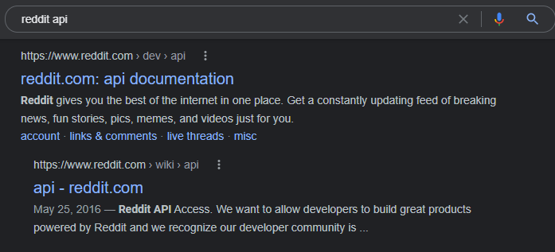

## Introduction to API Reconnaissance

How an API is meant to be consumed will determine how easily it can be found.

- `Public APIs` are meant to be easily found and used by end-users. Public APIs may be entirely public without authentication or be meant for use by authenticated users. Authentication for a public API primarily depends on the sensitivity of the data that is handled. If a public API only handles public information then there is no need for authentication, in most other instances authentication will be required. Public APIs are meant to be consumed by end-users. In order to facilitate this, API providers share documentation that serves as an instruction manual for a given API. This documentation should be end-user friendly and relatively straightforward to find.

- `Partner APIs` are intended to be used exclusively by partners of the provider. These might be harder to find if you are not a partner. Partner APIs may be documented, but documentation is often limited to the partner.

- `Private APIs` are intended for use, privately, within an organization. These APIs are often documented less than partner APIS, if at all, and if any documentation exists it is even harder to find. 

In all instances where API documentation is unavailable, we will need to know `how to reverse engineer API requests`.

---

## Web API Indicators

`APIs meant for consumer use are meant to be easily discovered`. Typically, the API provider will market their API to developers who want to be consumers. So, it will often be very easy to find APIs, just by using a web application as an end-user. The goal here is to find APIs to attack and this can be accomplished by discovering the API itself or the API documentation. If you can find the target's API and documentation as an end-user then mission accomplished, you have successfully discovered an API.

- Another way to find an API provided by a target is to look around the target's landing page. Look through `a landing page for links to API` or `development portal`. When searching for APIs there are several signs that will indicate that you have discovered the existence of a web API. Be on the lookout for obvious URL naming schemes:

```
https://target-name.com/api/v1 

https://api.target-name.com/v1 
```

- Another indicator of `web APIs is the HTTP request and response headers`. The use of `JSON or XML` can be a good indicator that you have discovered an API. HTTP Request and Response Headers containing `"Content-Type: application/json, application/xml"`

## Passive Reconnaissance

`Passive API Reconnaissance` is the act of obtaining `information` about a `target` `without directly interacting` with the target’s systems. When you take this approach, your goal is to find and document `public information` about your target’s attack surface.

Typically, passive reconnaissance leverages `open-source intelligence (OSINT)`, which is data collected from publicly available sources. You will be on the hunt for `API endpoints, exposed credentials, version information, API documentation, and information about the API’s business purpose`.

### Google Dorking

Even without any `Dorking techniques`, finding an API as an end-user could be as easy as a `quick search`.



However, sometimes you may not get the exact results you were hoping for. If you are getting too many irrelevant results then you could deploy some `Google Dorking techniques` to more effectively discover APIs.

| Google Dorking Query                                    | Expected Result                                                                                               |
| ------------------------------------------------------- | ------------------------------------------------------------------------------------------------------------- |
| inurl:"/wp-json/wp/v2/users"                            | Finds all publicly available WordPress API user directories.                                                  |
| intitle:"index.of" intext:"api.txt"                     | Finds publicly available API key files.                                                                       |
| inurl:"/api/v1" intext:"index of /"                     | Finds potentially interesting API directories.                                                                |
| ext:php inurl:"api.php?action="                         | Finds all sites with a XenAPI SQL injection vulnerability. (Query from 2016 with currently ~141,000 results.) |
| intitle:"index of" api_key OR "api key" OR apiKey -pool | Lists potentially exposed API keys (favorite query).                                                          |

### GitDorking

Regardless of whether your target performs its own development, it’s worth checking `GitHub (www.github.com)` for sensitive information disclosure. `Developers use GitHub to collaborate on software projects`. Searching GitHub for OSINT could reveal your target’s API capabilities, documentation, and secrets, such as API keys, passwords, and tokens, which could prove useful during an attack. Similar to Google Dorking, with GitHub, you can specify parameters like:

- filename:swagger.json
- extension: .json

### TruffleHog 

`TruffleHog` is a great tool for `automatically discovering exposed secrets`. You can simply use the following Docker run to initiate a TruffleHog scan of your target's Github.

Example - 
```bash
sudo docker run -it -v "$PWD:/pwd" trufflesecurity/trufflehog:latest github --org=target-name
```

For additional information check out [Trufflehog](https://github.com/trufflesecurity/trufflehog).

### Shodan

Shodan is the `go-to search engine` for `devices accessible from the internet`. Shodan regularly scans the `entire IPv4 address space` for systems with `open ports` and makes their collected information public on `https://shodan.io`.

The following table shows some useful Shodan queries.

| Shodan Query                     | Purpose                                                                                                                                                                         |
| -------------------------------- | ------------------------------------------------------------------------------------------------------------------------------------------------------------------------------- |
| `hostname:"targetname.com"`      | Performs a basic Shodan search for the target’s domain name. Often used as a foundation for more specific queries.                                                              |
| `content-type: application/json` | Filters results to those endpoints that respond with JSON, commonly used by APIs.                                                                                               |
| `content-type: application/xml`  | Filters results to endpoints serving XML, useful for discovering XML-based APIs.                                                                                                |
| `200 OK`                         | Refines the search to endpoints that have returned a successful HTTP 200 response. Note: Some APIs may still return 300 or 400 status if the request is not properly formatted. |
| `wp-json`                        | Finds web applications utilizing the WordPress API, indicating a WordPress backend.                                                                                             |


### The Wayback Machine

The Wayback Machine is an `archive of various web pages over time`. This is great for passive API reconnaissance because this allows you to check out `historical changes` to your target.

If, for example, the target once advertised a partner API on their landing page, but now hides it behind an authenticated portal, then you might be able to spot that change using the Wayback Machine. Another use case would be to see changes to existing API documentation. If the API has not been managed well over time, then there is a chance that you could find retired endpoints that still exist even though the API provider believes them to be retired. These are known as Zombie APIs. Zombie APIs fall under the Improper Assets Management vulnerability on the OWASP API Security Top 10 list. Finding and comparing historical snapshots of API documentation can simplify testing for Improper Assets Management.

## Active Reconnaissance

Active reconnaissance is the process of interacting directly with the target primarily through the use of scanning. We will use our recon to search for our target's APIs and any useful information.

During this process you will be scanning systems, enumerating open ports, and finding ports that have services using HTTP.

### Nmap

Nmap is a `powerful tool for scanning ports, searching for vulnerabilities, enumerating services, and discovering live hosts`. For API discovery, you should run `two Nmap scans` in particular: `general detection and all port`. The Nmap `general detection` scan `uses default scripts (-sC)` and `service enumeration (-sV) against a target` and then saves the output in `three formats` for later review (-oX for XML, -oN for Nmap, -oG for greppable, or -oA for all three):

```bash
$ nmap -sC -sV [target address or network range] -oA nameofoutput
```

The Nmap all-port scan will quickly check all 65,535 TCP ports for running services, application versions, and host operating system in use:

```bash
$ nmap -p- [target address] -oA allportscan
```

As soon as the general detection scan begins returning results, kick off the all-port scan. Then begin your hands-on analysis of the results. You’ll most likely discover APIs by looking at the results related to HTTP traffic and other indications of web servers. Typically, you’ll find these running on ports 80 and 443, but an API can be hosted on all sorts of different ports. Once you discover a web server, you can perform HTTP enumeration using a Nmap NSE script (use -p to specify which ports you'd like to test).

```bash
$ nmap -sV --script=http-enum <target> -p 80,443,8000,8080
```

### OWASP Amass

OWASP Amass is a `command-line tool` that can map a `target’s external network by collecting OSINT from over 55 different sources`. You can set it to perform `passive or active scans`. If you choose the active option, Amass will collect information directly from the target by requesting its certificate information. Otherwise, it collects data from search engines (such as Google, Bing, and HackerOne), SSL certificate sources (such as GoogleCT, Censys, and FacebookCT), search APIs (such as Shodan, AlienVault, Cloudflare, and GitHub), and the web archive Wayback.

```bash
$ amass enum -active -d target-name.com | grep api
```
This scan could reveal many unique API subdomains, including legacy-api.target-name.com. An API endpoint named legacy could be of particular interest because it seems to indicate an improper asset management vulnerability.

Amass has several useful command-line options. Use the intel command to collect SSL certificates, search reverse Whois records, and find ASN IDs associated with your target. Start by providing the command with target IP addresses

```bash
$ amass intel -addr [target IP addresses]
```

If this scan is successful, it will provide you with domain names. These domains can then be passed to intel with the whois option to perform a reverse Whois lookup:

```bash
$ amass intel -d [target domain] –whois
```

This could give you a ton of results. Focus on the interesting results that relate to your target organization. Once you have a list of interesting domains, upgrade to the enum subcommand to begin enumerating subdomains. If you specify the -passive option, Amass will refrain from directly interacting with your target:

```bash
$ amass enum -passive -d [target domain]
```

The active enum scan will perform much of the same scan as the passive one, but it will add domain name resolution, attempt DNS zone transfers, and grab SSL certificate information:

```bash
$ amass enum -active -d [target domain]
```

To up your game, add the -brute option to brute-force subdomains, -w to specify the API_superlist wordlist, and then the -dir option to send the output to the directory of your choice:

```bash
$ amass enum -active -brute -w /usr/share/wordlists/API_superlist -d [target domain] -dir [directory name]  
```

### Gobuster

Gobuster can be used to `brute-force URIs and DNS subdomains from the command line`. (If you prefer a graphical user interface, check out OWASP’s Dirbuster.) In Gobuster, you can use wordlists for common directories and subdomains to automatically request every item in the wordlist and send them to a web server and filter the interesting server responses. The results generated from Gobuster will provide you with the URL path and the HTTP status response codes. (While you can brute-force URIs with Burp Suite’s Intruder, Burp Community Edition is much slower than Gobuster.)

Whenever you’re using a brute-force tool, you’ll have to balance the size of the wordlist and the length of time needed to achieve results. Kali has directory wordlists stored under `/usr/share/wordlists/dirbuster` that are thorough but will take some time to complete.

Example - 
```bash
$ gobuster dir -u target-name.com:<port> -w /home/kali/api/wordlists/common_apis_160
```

### Kiterunner

`Kiterunner` is an excellent tool that was developed and released by Assetnote. Kiterunner is currently the `best tool available for discovering API endpoints and resources`. While directory brute force tools like Gobuster/Dirbuster/ work to discover URL paths, it typically relies on standard HTTP GET requests. Kiterunner will not only use all HTTP request methods common with APIs (GET, POST, PUT, and DELETE) but also mimic common API path structures. In other words, instead of requesting GET /api/v1/user/create, Kiterunner will try POST /api/v1/user/create, mimicking a more realistic request.

Example - 

You can perform a quick scan of your target’s URL or IP address like this:

```bash
$ kr scan HTTP://127.0.0.1 -w ~/api/wordlists/data/kiterunner/routes-large.kite
```

### DevTools

`DevTools` contains some highly underrated web application hacking tools. The following steps will help you easily and systematically filter through thousands of lines of code in order to find sensitive information in page sources. Begin by opening your target page, and then open *DevTools with F12 or ctr-shift-I*. Adjust the DevTools window until you have enough space to work with. Select the Network tab and then refresh the page (CTRL+R).

