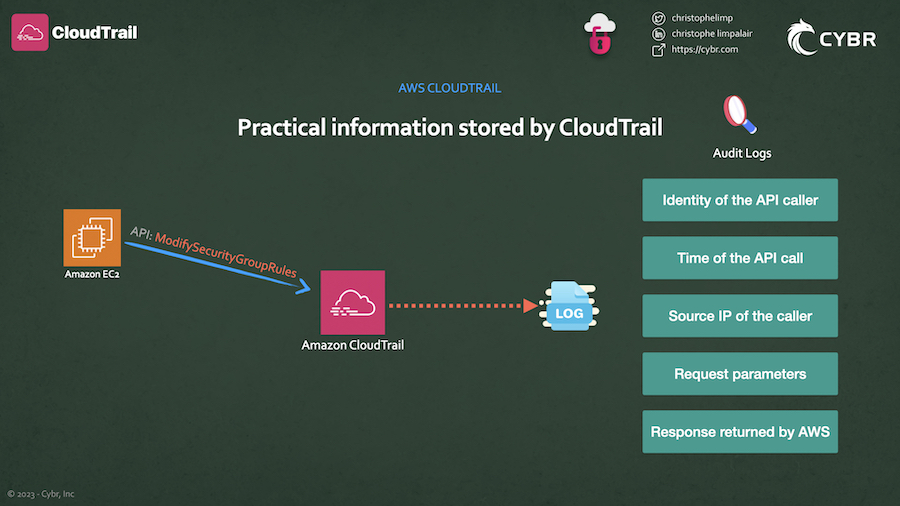
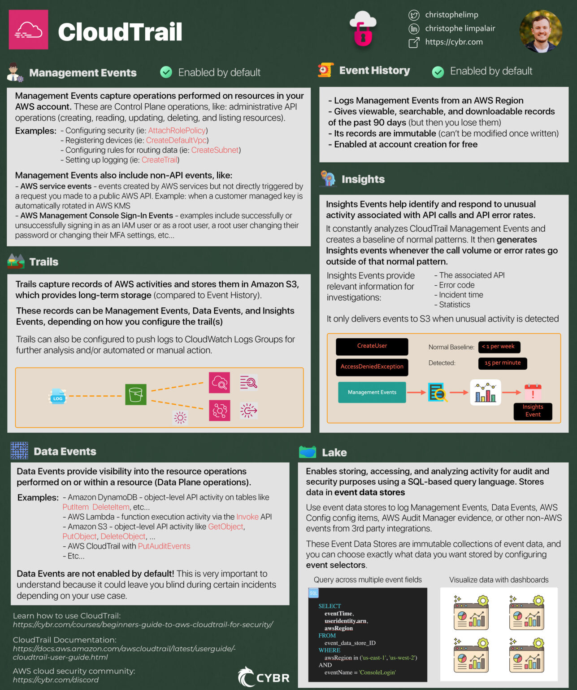
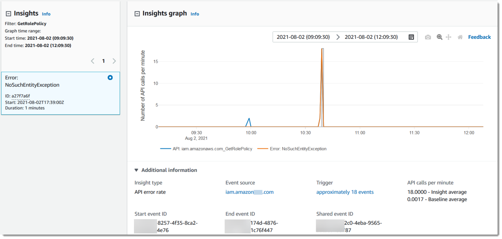
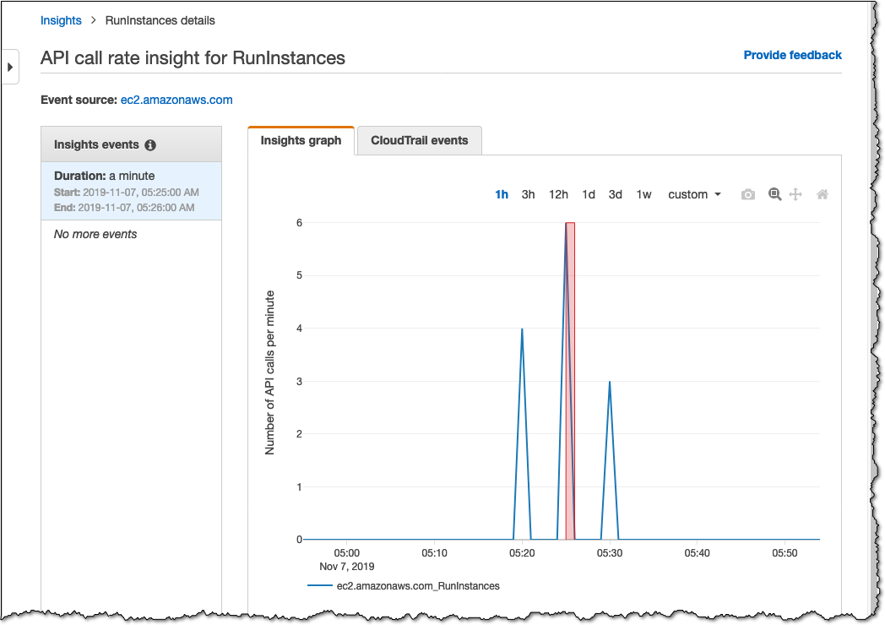
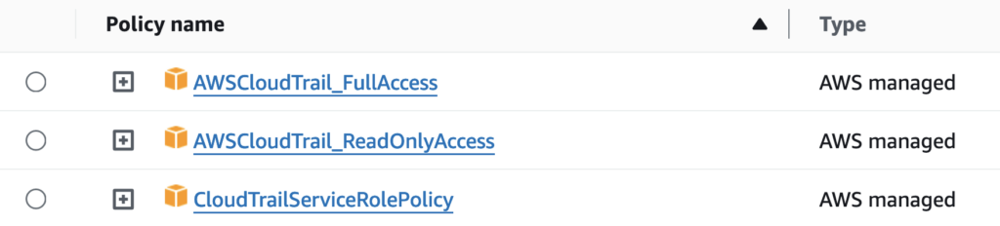
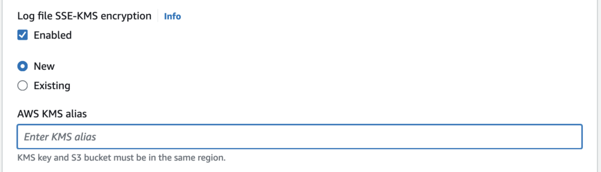

# What is AWS CloudTrail?

With CloudTrail, you can `view, search, download, archive, analyze, and respond` to `account activity` across either a single Region in your account, multiple Regions, or even multiple accounts.



Using Cloudtrail, You can find out information like the:

- Identity of the API caller
- Time of the API call
- Source IP address of the API caller
- Request parameters
- Response elements returned by the AWS service

---

## Types of Events

There’s a very big difference between logging `Management Events`, `Data Events`, and `Insights Events`.

- `Management Events` logging is what’s `enabled by default` when you create an AWS account. It’s helpful, but a lot of people misunderstand and believe that it logs more than it actually does.

---

### Management Events

Management Events capture operations that are performed on resources in your AWS account. This is referred to as `control plane` operations.

A plane is a term used in IT that comes from networking, and it’s used to refer to what layer the operation occurs in.

AWS separates most services into either the `control plane` or the `data plane`.

- The control plane refers to administrative API operations, like creating, reading, updating, deleting, and listing resources.
  
  For example, launching an EC2 instance or creating an S3 bucket is an action in the control plane, and so that would be logged as part of Management Events in CloudTrail.

Management Events can also include non-API events in your AWS account. Non-API events include:

- AWS service events – which are events created by AWS services but not directly triggered by a request you made to a public AWS API. An example of this is when a customer managed key is automatically rotated in AWS KMS [[Source](https://docs.aws.amazon.com/awscloudtrail/latest/userguide/non-api-aws-service-events.html)]

- AWS Management Console sign-in events – examples include successfully or unsuccessfully signing in as an IAM user or as a root user, a root user changing their password or changing their MFA settings, etc… For more examples, please refer to the AWS documentation

---

### Data Events

Data Events, on the other hand, are not enabled by default. Unless you go into the CloudTrail service and configure it to specifically log them, CloudTrail will ignore this data. The reason for this is that AWS charges more for logging this type of data.

Data Events provide visibility into the `resource operations performed on or within a resource`, which is referred to as `data plane` operations. [[Documentation](https://docs.aws.amazon.com/awscloudtrail/latest/userguide/logging-data-events-with-cloudtrail.html#logging-data-events)]

---

### Insights Events

Whereas Management Events and Data Events give the ability to capture data from two different planes, Insights Events helps you identify and respond to unusual activity associated with API calls and API error rates.

It does this by constantly analyzing CloudTrail Management Events, and by creating a baseline of normal patterns, and then generating `Insights events` whenever the `call volume or error rates go outside of that normal pattern`.

For example, if your AWS account normally gets fewer than 1 `AccessDeniedException` errors in a seven-day period on the AWS IAM API call of CreateUser, but then you start logging an average of 15 errors per minute, an Insights Event would get logged at the start of the unusual error rate activity, and then another Insights Event would get logged to `mark the end of the unusual activity`.

Once they are enabled, and CloudTrail detects unusual activity, it will deliver those events to your destination S3 bucket. This is another key difference because Insights event logs will only get delivered when an unusual activity is detected.

You can also view the information from the CloudTrail console, and you can configure CloudTrail to send Insights events to CloudWatch Logs, or you can create a rule in Amazon EventBridge to deliver Insights events. Both of those approaches could be used to generate an email or SMS notification whenever an Insights event is generated so that you can investigate.

---

## 3 Ways of Recording Data 

We’ve just learned about how CloudTrail can log Management, Data, and Insights Events. Now let’s talk about the 3 ways it has to record this data.

The first way is `Event History`, the second is `Trails`, and the third is `CloudTrail Lake`.

---

### Event History

The Event History in CloudTrail is enabled by default when you create your AWS account. This gives you a viewable, searchable, and downloadable record of the past 90 days of management events in an AWS Region.

These records are also immutable, meaning that they can’t be modified by anyone once they’re generated. This is very important as it means you can can trust the data hasn’t been tampered with after it was recorded.

The best part about Event History is that it’s completely free.

---

### Trails

We talked about how Management Events are stored for 90 days in Event History, and you can create a trail to store those Management Events in a more `permanent S3 bucket` instead so that you `don’t lose valuable data after that 90 days`.

Data Events and Insight Events can also be logged by trails if you configure that. So if you are interested in more than just Management Events, creating a trail would be a great way of doing that.

You create an Amazon S3 bucket, and you specify that bucket when you create a new trail, and the service will automatically deliver logs to that bucket.

On top of that, you can optionally send logs to CloudWatch Logs by creating a Log Group, and you can create Amazon EventBridge rules that use information from CloudTrail.

---

### CloudTrail Lake

The third way of recording CloudTrail data is called CloudTrail Lake. Lake is a feature that lets you store, access, and analyze activity for audit and security purposes using a SQL-based query language.

With Lake, the events get stored into what’s called `event data store`, and you can even import existing CloudTrail logs from your S3 buckets into an event data store.

#### Event Data Stores

You can use Event Data Stores to log CloudTrail Management and Data Events, and you can also store AWS Config configuration items, AWS Audit Manager evidence, or other non-AWS events from 3rd party integrations.

These Event Data Stores are immutable collections of event data, and you can choose exactly what data you want stored by configuring what’s called `event selectors`.

An added benefit of using Lake is that it provides integrations which you can use to log and store activity data from outside of AWS. It could be a source from your on-prem VMs and containers, or even SaaS applications.

Once in Lake, you can query the event data using advanced SQL queries across multiple event fields, which is a lot more powerful than what you can do with Event History.

You can also visualize CloudTrail data by creating Lake dashboards, where each dashboard can be made up of multiple widgets that represent a SQL query.

Lake can become a lot expensive for huge databases.

### CloudTrail is not real-time logging

Keep in mind that CloudTrail is not considered to be real-time logging, because AWS says that:

CloudTrail typically delivers events within an average of about 5 minutes of an API call. This time is not guaranteed. [[Source](https://docs.aws.amazon.com/awscloudtrail/latest/userguide/cloudtrail-lake.html)]

---



---

## AWS Cloudtrail Event History Through CLI

Now, to see a list of the latest event, you can type in the command:

```bash
aws cloudtrail lookup-events --max-items 1 --output json
```

*For a list of output fields and what they mean, check out this documentation: https://docs.aws.amazon.com/awscloudtrail/latest/userguide/view-cloudtrail-events-cli.html#view-cloudtrail-events-cli-output-fields*

Instead of specifying a max limit for items returned, we can specify a time range, like this:

```bash
aws cloudtrail lookup-events --start-time <timestamp> --end-time <timestamp>
```

We can also query by using a single attribute, like this:

```bash
aws cloudtrail lookup-events --lookup-attributes AttributeKey=<attribute>,AttributeValue=<string>
```

### Important limitations of Event History

There are a few important facts to keep in mind about Event History:

- When using the AWS Console, you can only view Management Events, not Data Events
- It only stores data for up to 90 days and then you lose that data
- You can only use it to search data from a single account, and it will only return events from a single AWS region
- You can’t query multiple different attributes, so unlike CloudTrail Lake, search-ability is very limited
- You can’t exclude AWS KMS or Amazon RDS Data API events

## AWS Cloudtrail Trails Through CLI

Log file storage follows this path:

```bash
bucket_name/prefix_name/AWSLogs/Account ID/CloudTrail/region/YYYY/MM/DD/file_name.json.gz
```

After downloading this file, we’re now ready to search this file. Let’s start by searching for any and all user identities in this file:

```bash
find . -type f -exec jq '.Records[].userIdentity.arn' {} \\;
```

### Working with CloudWatch Logs and SNS notifications

In the `CloudWatch Dashboard`, head over to `Log Groups` in the menu. You should see your `aws-cloudtrail-logs-...` log group. If we click on it, we should see Log streams that we can click on.

Inside of that, we’ll find the Log events for that Log group, and we can expand each entry for more information.

This information is much more easily digestable, and more importantly, it’s searchable!

Let’s head on over to Amazon SNS, or `Simple Notification Service`.

The first step is to create a `new topic`. You can name this whatever you’d like.

Feel free to look through the other settings but for this we’ll leave everything to the defaults.

When you’re ready, Create Topic.

We then need to Create subscription.

You have access to multiple different protocols. For this, I just want to send emails to my email address, so I’ll select Email and I’ll set the Endpoint to my email address.

Keep in mind that you must confirm your subscription from your inbox. This is to prevent spam. Go ahead and Create subscription and then check your email inbox to confirm.

### CloudWatch Metrics

Back in CloudWatch, make sure you’re looking at your Log groups. Select the `CloudTrail log group`, and click on the `Actions` dropdown menu, then click on `Create metric filter`.

This is where we can decide what to filter for. Oftentimes we’d want to filter for `ERROR or AccessDenied` or something similar to that.

### Cloudwatch Alarms

Click on `All alarms` in the menu, and then `Create alarm`.

Select the `metric` you created — but keep in mind it can take a minute or so for it to show up. If you don’t see it and can’t find it by searching, then refresh until you do.

You can then configure the conditions for the alarm based on a few different factors. For example, you could trigger an alarm whenever there’s an `Anomaly detection`, or whenever it exceeds or is lower than a certain threshold, etc…

## Working with CloudTrail Insights

Insights uses machine learning to automatically analyze write management events from CloudTrail Trails, and it looks for anomalies. It does that by creating baselines of normal, expected behavior, and whenever there’s a significant change from that baseline, it generates an Insight Event.

### Enable Insights on a Trail

- Select your trail, and scroll down until you see a section for Insights events.

- Click on Edit .

- Select Insights Events which will display more options.

- This is where you can decide whether you want to enable this for `API call rate`, `API error rate`, or both.

*Source: https://docs.aws.amazon.com/awscloudtrail/latest/userguide/logging-insights-events-with-cloudtrail.html*




Here we have an Insight Event generated for an `API error rate`.

Someone or something is attempting to use the GetRolePolicy API call, which is an IAM API call an attacker could try to use to get information about the IAM policy associated with a role.




Here’s another example for a different API call of RunInstances. Instead of this being captured from an API error rate, this is captured by API call rate. So if we had only enabled API error rate when configuring our Insights settings earlier, then we would not have seen this type of event being generated.

### Attributions

*Source: https://docs.aws.amazon.com/awscloudtrail/latest/userguide/logging-insights-events-with-cloudtrail.html*

Beyond graphs, we can also view *Attributions* details as we see them in this screenshot.

This page gives us the `Top user identity ARNs` during an event, we also get the `Top user agents` and `Top error codes`, etc…

## Working with CloudTrail Lake

We’ve looked at a few ways of querying our data from CloudTrail, but we’ve seen limitations with each approach. In this lesson, let’s get started with `CloudTrail Lake`.

AWS recommends a 3-step process to get started:

- Create an event data store
- Run SQL queries
- Optionally, add an integration

## Security & Best Practices

1. Monitor CloudTrail itself

It’s important to `monitor the CloudTrail service` and keep a log of changes made to it. `Attackers always want to hide their tracks`, so they may attempt to stop the CloudTrail service or to make other modifications. If that ever happens, you need to not only get notified, but you also need to keep track of those changes.

* StopLogging

*Reference: https://awscli.amazonaws.com/v2/documentation/api/latest/reference/cloudtrail/stop-logging.html*

The first API call that we should be monitoring is the StopLogging call. if an attacker gets ahold of credentials and starts making API calls against your AWS environments, after doing some simple enumeration, they may try to completely stop CloudTrail from logging data.

* DeleteTrail

*Reference: https://awscli.amazonaws.com/v2/documentation/api/latest/reference/cloudtrail/delete-trail.html*

Instead of just trying to stop a trail from logging, an attacker may try to completely delete it.
Again, this is an API call you most likely won’t be using very much if at all, and so it’s the next one I would watch for.

* DeregisterOrganizationDelegatedAdmin

*Reference: https://awscli.amazonaws.com/v2/documentation/api/latest/reference/cloudtrail/deregister-organization-delegated-admin.html*

As a good practice, you should also keep an eye on the call DeregisterOrganizationDelegatedAdmin because this should rarely be happening, especially in your most critical AWS accounts.

If someone is attempting to remove CloudTrail delegated administrator permissions from a member account in an organization, you should definitely be aware of the attempt.

## IAM & CloudTrail

AWS `Identity and Access Management` (or IAM for short), is the service that lets you control `who can be authenticated and authorized to use your AWS resources`, including CloudTrail resources.

If you `don’t get your IAM configurations right`, then you will leave your `CloudTrail deployments vulnerable`. So we need to start there when it comes to securing CloudTrail.

### Managing access to the CloudTrail service

- At the highest level, you will have your `AWS admins` who can *access most or all services and write policies for other users or services*.

- You will then have `service administrators`, who are in charge of CloudTrail resources at your company, and so they will likely have full access (or close it) to the CloudTrail resources.

- Then you have `service users`, who may need to use the CloudTrail service to do their day-to-day jobs, and so the administrator will need to provide them with the least privilege permissions.

When creating policies to grant access to those different types of users, a helpful starting point is to use **AWS-managed policies**, and then modify them to your own custom use case by providing less access.



As you can see, we currently have 3 managed policies including:

- Full Access
- Read Only Access
- Service Role

For `service admins`, you could start with `full access and scale back as needed`.

For `service users`, you could start with `Read Only Access` and add or remove as needed.

### Managing access to CloudTrail logs

Apart from securing the CloudTrail service itself, we also need to secure `CloudTrail logs`.

As we know, these get saved into **Amazon S3**, and so we can use both `IAM policies`, as well as `S3 bucket policies`, to *control* who can `view, modify, or delete those logs`.

AWS recommends this S3 bucket policy:

```json
{
    "Version": "2012-10-17",
    "Statement": [
        {
            "Sid": "AWSCloudTrailAclCheck20150319",
            "Effect": "Allow",
            "Principal": {"Service": "cloudtrail.amazonaws.com"},
            "Action": "s3:GetBucketAcl",
            "Resource": "arn:aws:s3:::myBucketName",
            "Condition": {
                "StringEquals": {
                    "aws:SourceArn": "arn:aws:cloudtrail:region:myAccountID:trail/trailName"
                }
            }
        },
        {
            "Sid": "AWSCloudTrailWrite20150319",
            "Effect": "Allow",
            "Principal": {"Service": "cloudtrail.amazonaws.com"},
            "Action": "s3:PutObject",
            "Resource": "arn:aws:s3:::myBucketName/[optionalPrefix]/AWSLogs/myAccountID/*",
            "Condition": {
                "StringEquals": {
                    "s3:x-amz-acl": "bucket-owner-full-control",
                    "aws:SourceArn": "arn:aws:cloudtrail:region:myAccountID:trail/trailName"
                }
            }
        }
    ]
}
```

This gives permissions to the `CloudTrail service to put objects into that S3 bucket`. Make sure you have a seperate S3 bucket just for collecting these logs, avoid mixing with other data.

This policy by itself, however, `would not grant read permissions to other users, like service users`. Maybe that’s how you want to keep it, because you want to *force service users to read the logs through Lake, the API, or CloudWatch Logs*.

More on IAM - https://docs.aws.amazon.com/awscloudtrail/latest/userguide/security-iam.html

## Log file integrity

The *integrity of logs is extremely important*. If you can’t trust that the logs you are looking at are legitimate logs, then they become nearly useless.

It’s highly recommended that you `enable CloudTrail log file integrity` for any existing trails you have, but this is a feature that’s enabled by default for new trails.

By having it `enabled`, you can tell whether a `log file was deleted, modified, or you can confidently say that it was unmodified` since it was delivered to S3.

## Encryption

When people are talking about CloudTrail encryption, they are usually talking about `encryption for data at-rest`, which means the data that’s stored on AWS’ servers in their data centers.

This type of encryption is important because it helps protect sensitive data from AWS employees being able to access it and see what it is in plaintext, and/or if anyone ever steals the storage drives from those data centers or as they are being discarded after their end of life.

By default, `log files delivered by CloudTrail to S3 are encrypted by server-side encryption using Amazon S3-managed encryption keys`. This is referred to as `SSE-S3`.

AWS instead recommends that you enable `SSE-KMS`, which is short for `server-side encryption using AWS KMS keys`. That way, you are in direct control of the encryption keys being used.

### Enabling SSE-KMS

To use this, you would first` create a KMS key from the AWS KMS service`, and you can `configure CloudTrail to use that key` when you are creating a trail, or after the fact when you edit the trail.



You just need to make sure that `the key and S3 bucket` reside in the `same region`.

## [Checklist] Security Hub Controls for CloudTrail

Understanding these best practices and implementing them in production can be two very different things — especially when you are busy with your day-to-day responsibilities, and as your AWS environments grow in size and complexity.

To help make sure that we follow these best practices let’s take a look at a checklist.

`Security Hub`, if you’re not familiar, is a `service we can enable to assess our AWS environments against security industry standards and best practices`.

7 potential issues with CloudTrail deployments
In this case, by default, Security Hub looks for 7 potential issues with CloudTrail deployments:

- [CloudTrail.1](https://docs.aws.amazon.com/securityhub/latest/userguide/cloudtrail-controls.html#cloudtrail-1) CloudTrail should be enabled and configured with at least one multi-Region trail that includes read and write management events
- [CloudTrail.2](https://docs.aws.amazon.com/securityhub/latest/userguide/cloudtrail-controls.html#cloudtrail-2) CloudTrail should have encryption at-rest enabled
- [CloudTrail.3](https://docs.aws.amazon.com/securityhub/latest/userguide/cloudtrail-controls.html#cloudtrail-3) CloudTrail should be enabled
- [CloudTrail.4](https://docs.aws.amazon.com/securityhub/latest/userguide/cloudtrail-controls.html#cloudtrail-4) CloudTrail log file validation should be enabled
- [CloudTrail.5](https://docs.aws.amazon.com/securityhub/latest/userguide/cloudtrail-controls.html#cloudtrail-5) CloudTrail trails should be integrated with Amazon CloudWatch Logs
- [CloudTrail.6](https://docs.aws.amazon.com/securityhub/latest/userguide/cloudtrail-controls.html#cloudtrail-6) Ensure the S3 bucket used to store CloudTrail logs is not publicly accessible
- [CloudTrail.7](https://docs.aws.amazon.com/securityhub/latest/userguide/cloudtrail-controls.html#cloudtrail-7) Ensure S3 bucket access logging is enabled on the CloudTrail S3 bucket
- [CloudTrail.9](https://docs.aws.amazon.com/securityhub/latest/userguide/cloudtrail-controls.html#cloudtrail-9) CloudTrail trails should be tagged

### Bonus

- [AWS SSK](https://github.com/zoph-io/aws-security-survival-kit/tree/main)
- [AWS Cloudtrail Commands Cheatsheet](../../assets/images/aws-cloudtrail-commands-cheatsheet.png)
- [Notes PDF](../../assets/files/beginners-guide-to-aws-cloudtrail-for-security-ebook.pdf)
- [My Certificate of Completion](../../assets/files/sh1v4ng-Beginner8217s-Guide-to-AWS-CloudTrail-for-Security-Certificate-of-Completion-–-Beginners-Guide-to-AWS-CloudTrail-for-Security-Cybr.pdf)