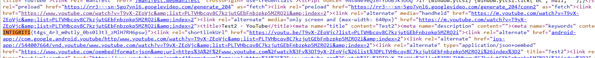

## **Challenge Name: Bob L'éponge**

### **Solves**
- **Solves**: 82  
- **Points**: 100  

### **Description**
I'm an epic hacker and I'm trying to start a YouTube channel to show off my skills! I've been playing around with some of the video settings and stumbled upon a few cool features. Can you find the secret I've hidden?

---

### **Approach**

1. **Initial Observations**:
   - We were given a YouTube video URL to investigate. Watching the video, we determined that there was **no flag directly visible in the video content itself**.

2. **Exploring Additional Elements**:
   - Checked for:
     - **Comments**: No useful information.  
     - **Descriptions**: Empty.  
     - **Subtitles or annotations**: None present.  
   - Navigated to the **channel's main page** to look for additional content.

3. **Discovering the Playlist**:
   - On the channel, we found a playlist named `a playlist`. It contained three videos:
     - `Test`  
     - `Test2`  
     - `Test3` (the one we already had the URL for).

   - Both `Test` and `Test2` were 1 second long, and like `Test3`, they contained no useful information in their **comments, descriptions, or subtitles**.

4. **Missed Opportunity During the Challenge**:
   - After the challenge ended, it was revealed that the flag was **hidden in the metadata of the YouTube page source**.
   - By viewing the page source (`Ctrl + U`) and searching for `INTIGRITI`, the flag was found in the metadata.
   - Crtl + F and search for `INTIGRITI`.

    

5. **Flag Found**:
   ```
   INTIGRITI{t4gs_4r3_m0stly_0bs0l3t3_zMlH7RH6psw}
   ```

---

### **Flag**
```
INTIGRITI{t4gs_4r3_m0stly_0bs0l3t3_zMlH7RH6psw}
```

---