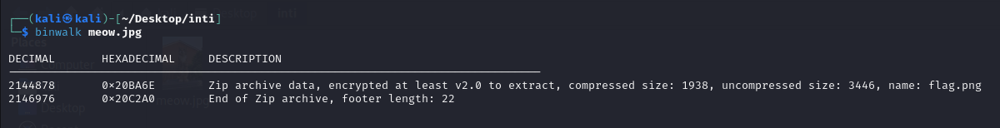
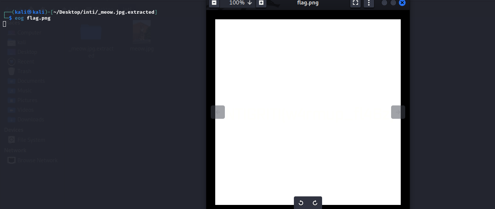
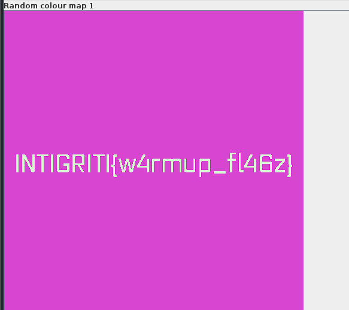

## **Challenge Name: In Plain Sight**

### **Solves**
- **Solves**: 465  
- **Points**: 50  

### **Description**
Barely hidden tbh..

**Attachment**: [meow.jpg](Resources/meow.jpg)

---

### **Approach**

1. **Initial Analysis**:
   - Downloaded the attached image (`meow.jpg`) and opened it. It appeared to be a normal picture of a cat with no visible clues.

2. **Checking Metadata**:
   - Used `exiftool` to inspect the image metadata:
     ```bash
     exiftool meow.jpg
     ```
   - No relevant information was found in the metadata.

3. **Analyzing the File Contents**:
   - Ran the `strings` command to look for hidden text:
     ```bash
     strings meow.jpg
     ```
   - Found two interesting pieces of information:
     - A reference to a file named `flag.png`.
     - A string that resembled a password: `YoullNeverGetThis719482`.

4. **Identifying Hidden Data**:
   - Used `binwalk` to analyze the file for embedded data:
     ```bash
     binwalk meow.jpg
     ```
   - The analysis revealed an embedded archive.

    

5. **Extracting the Archive**:
   - Extracted the hidden archive using `binwalk`:
     ```bash
     binwalk -e meow.jpg
     ```
   - The archive required a password to unlock. Entered the discovered password `YoullNeverGetThis719482`.

6. **Inspecting the Extracted File**:
   - The extracted archive contained a file named `flag.png`. Upon opening it, it appeared to be a solid white image.

    

7. **Using Steganography Tools**:
   - Opened `flag.png` in **Stegsolve**, a tool for analyzing images for hidden data.  
   - Switched through the various color map filters and discovered the flag under the **Random Color Map 1**.

    

8. **Flag Found**:
   ```
   INTIGRITI{w4rmup_fl46z}
   ```

---

### **Flag**
```
INTIGRITI{w4rmup_fl46z}
```

---