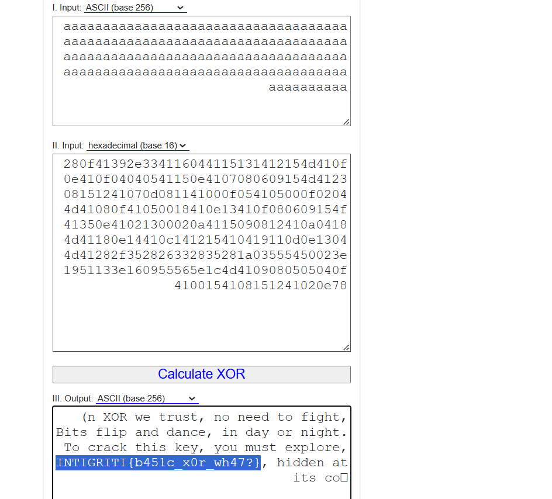

## **Challenge Name: IrORversible**

### **Solves**
- **Solves**: 222  
- **Points**: 50  

### **Description**
So reversible it's practically irreversible.

**Connection**: `nc irrorversible.ctf.intigriti.io 1330`

---

### **Approach**

1. **Initial Observations**:
   - Based on the challenge description, the name suggested that the challenge involved **XOR encryption**.

2. **Testing Input and Observing Output**:
   - Connected to the provided server using `netcat`:
     ```bash
     nc irrorversible.ctf.intigriti.io 1330
     ```
   - Sent a large number of `a` characters (`aaaa...`), and the server responded with a **hexadecimal string**:
     ```
     280f41392e334116044115131412154d410f0e410f04040541150e4107080609154d412308151241070d081141000f054105000f02044d41080f41050018410e13410f080609154f41350e41021300020a4115090812410a04184d41180e14410c141215410419110d0e13044d41282f352826332835281a03555450023e1951133e160955565e1c4d4109080505040f4100154108151241020e78
     ```

3. **XOR Key Analysis**:
   - XOR encryption works by applying the same key to both encrypt and decrypt data. To decipher the response, we needed to determine the key.

4. **Reversing the XOR Operation**:
   - By XORing the hex response with the known input (`aaaa...`), we could reveal the original message (including the flag).
     
     

5. **Flag Extraction**:
   - Decoding the result revealed the flag as part of the original decrypted text.

   **Flag**:
   ```
   INTIGRITI{b451c_x0r_wh47?}
   ```

---

### **Flag**
```
INTIGRITI{b451c_x0r_wh47?}
```

---