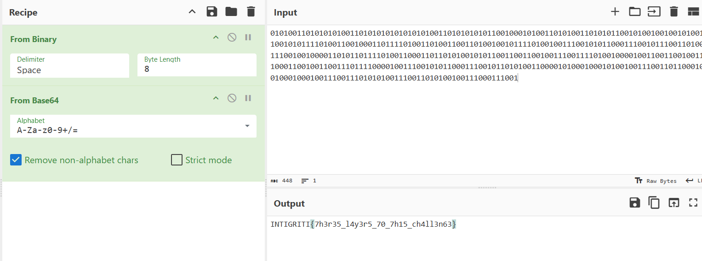

## **Challenge Name: Layers**

### **Solves**
- **Solves**: 126  
- **Points**: 50  

### **Description**
Weird way to encode your data, but OK! 🤷‍♂️

**Attachment**: [layers.zip](Resources/layers.zip)

---

### **Approach**

1. **Initial Steps**:
   - Extracted the provided **layers.zip** file and found several files numbered from 0 to 55.
   - Concatenated all the files from 0 to 55 using the following script:
     ```bash
     for i in {0..55}; do
         cat "$i"
     done
     ```
   - The concatenated output was a long binary string:
     ```
     0011001001001101001110010100111001010010011110000011010101001110010100100101011001110101010011100101011001001110010001000111101001111010011000010110001101110011011001110111001101010110010010000101001101010101010011100100111000111001011001000101011001001010010100110100111001100010011110100011001101100110011010100101010101101010010011100100001001001001011010100101010101100100011010110101001101100110011110100011100101100101010001000110111101010011
     ```
   - Converting the binary string to text didn't make much sense initially:
     ```
     2M9NRx5NRVuNVNDzzacsgsVHSUNN9dVJSNbz3fjUjNBIjUdkSfz9eDoS
     ```

2. **Discovering the Timestamp-based Order**:
   - After some tinkering, it became clear that the files were extracted randomly. I noticed the **timestamps** on the files.
   - The files should be concatenated in order of their **last modification timestamps** (oldest to latest), not based on their filenames.
   - To fix this, ran the following command to list the files by modification time and concatenate them in the correct order:
     ```bash
     ls -ltr | awk '{print $9}' | tail -n +2 | xargs -I{} cat {}
     ```
    

3. **Binary to Text**:
   - After rearranging the files based on their timestamps, the new binary string appeared:
     ```
     0101001101010101001101010101010101010011010101010110010001010011010100110101011001010010010010100110010101111010011001000110111101001101001100110100100101111010010011100101011000111001011100110100111001001000011010110111101001100011011010100101011001100110010011100111101001000010011001100100111000110010011001110111100001001110010101100011100101101010011000010100010001010010011100110110001001000100010011100111010101001110011010100100111000111001
     ```
   - Converting this binary string to **ASCII** text:
     ```
     SU5USUdSSVRJezdoM3IzNV9sNHkzcjVfNzBfN2gxNV9jaDRsbDNuNjN9
     ```

4. **Decoding Base64**:
   - The string looked like **base64** encoded data.
   - Decoded the base64 string to get the flag:
     ```
     INTIGRITI{7h3r35_l4y3r5_70_7h15_ch4ll3n63}
     ```
    
---

### **Flag**
```
INTIGRITI{7h3r35_l4y3r5_70_7h15_ch4ll3n63}
```

---
