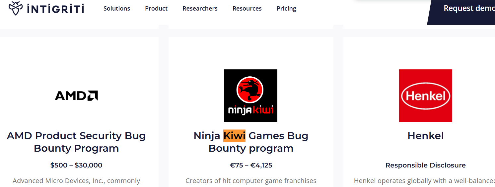

## **Challenge Name: Lost Program**

### **Solves**
- **Solves**: 626  
- **Points**: 50  

### **Description**
I was working on a bug bounty program the other day but I completely forgot the name!! I guess that will teach me not to use emoji notation in future 😩 Anyway, if you could help me find it again, I'd really appreciate it! Here's my notes:

**TODO**: find lots of 😎🐛 on 🥷🥝🎮

**Hint**: flag format = INTIGRITI{company_name}

**URL**: [https://go.intigriti.com/programs](https://go.intigriti.com/programs)

---

### **Approach**

1. **Understanding the Clues**:
   - The emojis in the description seem to reference specific keywords:
     - 😎: Likely referring to something cool or awesome, or possibly related to a "bug."
     - 🐛: This is clearly a bug emoji, referencing a bug bounty program.
     - 🥷: Ninja, possibly referring to a company or a code name associated with ninjas.
     - 🥝🎮: Kiwi and gaming, hinting towards a company related to both.

2. **Searching on Bug Bounty Platform**:
   - The hint suggested searching for these terms on the bug bounty platform.
   - On visiting the [bug bounty page](https://go.intigriti.com/programs), I searched for the term "kiwi" based on the emojis.

3. **Finding the Company**:
   - The search led to the company name **Ninja Kiwi Games**, which matched the hints provided by the emojis.
    

4. **Flag Format**:
   - The flag format was clearly provided as `INTIGRITI{company_name}`.

---

### **Flag**
```
INTIGRITI{Ninja_Kiwi_Games}
```

---