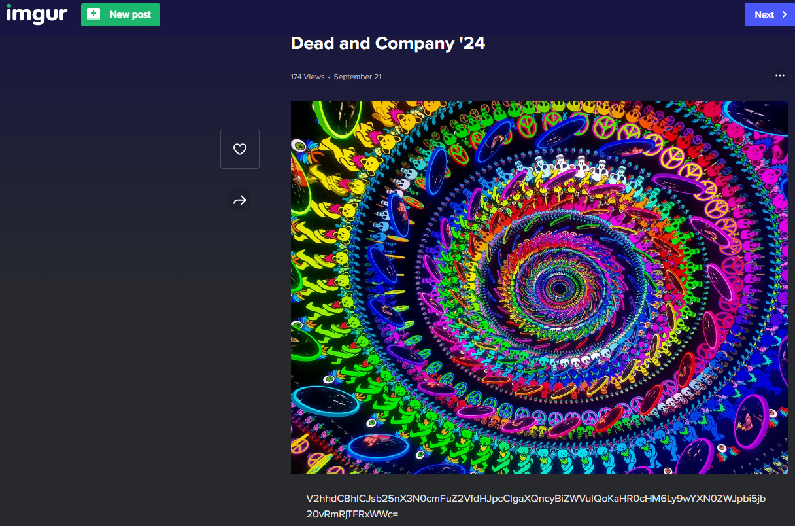
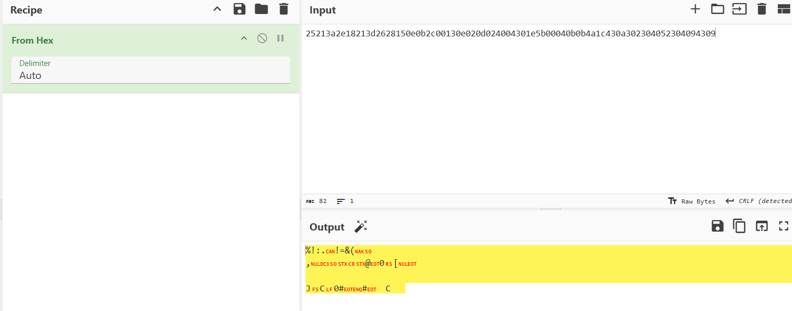
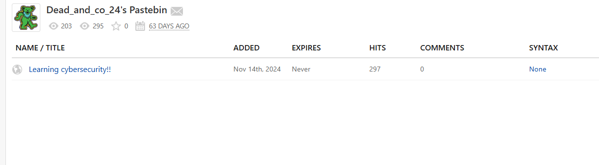
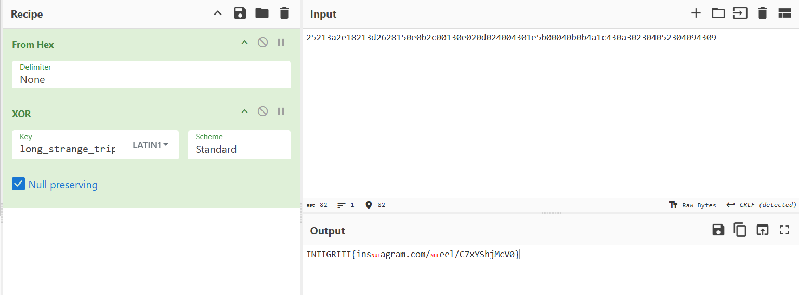

## **Challenge Name: No Comment**

### **Solves**
- **Solves**: 100  
- **Points**: 100  

### **Description**
Or is there? 🤔


### **Attachments** : [ripple.jpg](Resources/ripple.jpg)
---

### **Approach**

1. **ExifTool Analysis**:
   - The first step was using ExifTool to extract metadata from the image. Among the extracted data, the **Comment** field contained a potentially useful string:
     ```
     /a/pq6TgwS
     ```
   - Other metadata such as image size, width, height, and encoding details were present but didn't seem to lead anywhere on their own.

2. **Decoding the Comment**:
   - Initially, I tried various encoding techniques, but nothing seemed to work. Then, I realized that the comment might be a URL. A quick search confirmed that this was indeed the case—it led to an **Imgur** page:
     ```
     https://imgur.com/a/pq6TgwS
     ```


3. **Exploring the Imgur Link**:
   - The Imgur link led to the same image, but with the added bonus of a **Base64**-encoded caption:
     ```
     V2hhdCBhICJsb25nX3N0cmFuZ2VfdHJpcCIgaXQncyBiZWVuIQoKaHR0cHM6Ly9wYXN0ZWJpbi5jb20vRmRjTFRxWWc=
     ```
   
   - Decoding the Base64 string revealed a **Pastebin** link:
     ```
     What a "long_strange_trip" it's been!
     https://pastebin.com/FdcLTqYg
     ```

4. **Visiting Pastebin**:
   - The Pastebin link required a password to access the contents. The clue was hidden in the Imgur caption, and I noticed the phrase **"long_strange_trip"**. I tried it as the password, and it worked, unlocking the Pastebin entry.

   - The Pastebin entry contained a long **hex string**:
     ```
     25213a2e18213d2628150e0b2c00130e020d024004301e5b00040b0b4a1c430a302304052304094309
     ```

   

5. **XOR Decryption**:
   - Initially, I tried converting the hex string, but it didn’t return meaningful data. However, the Pastebin message also contained a public paste which hinted about XOR encryption:
     ```
     I've been learning all about cryptography recently, it's cool you can just XOR data with a password and nobody can recover it!!
     ```
   

   - The XOR operation was applied using the password "long_strange_trip". However, the first attempt didn’t give the correct result.

6. **Using CyberChef**:
   - I used **CyberChef** to perform the XOR decryption. After experimenting with different settings, I ended up with the following recipe:
     [CyberChef XOR Recipe](https://gchq.github.io/CyberChef/#recipe=From_Hex('None')XOR(%7B'option':'Latin1','string':'long_strange_trip'%7D,'Standard',true)&input=MjUyMTNhMmUxODIxM2QyNjI4MTUwZTBiMmMwMDEzMGUwMjBkMDI0MDA0MzAxZTViMDAwNDBiMGI0YTFjNDMwYTMwMjMwNDA1MjMwNDA5NDMwOQ&ieol=CRLF)

7. **Discovering the Flag**:
   - The result from CyberChef looked like a URL from **Instagram Reels**. I filled in the missing parts, which led to the flag:
     ```
     INTIGRITI{instagram.com/reel/C7xYShjMcV0}
     ```

   

---

### **Flag**
```
INTIGRITI{instagram.com/reel/C7xYShjMcV0}
```

---