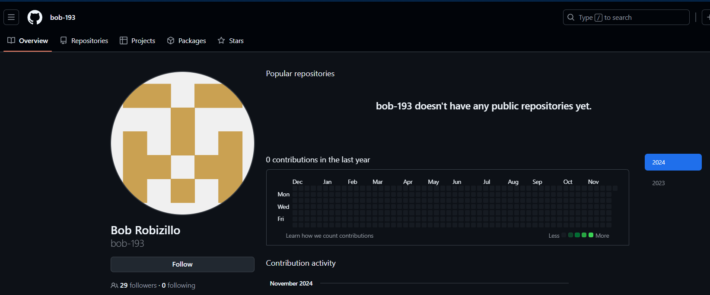
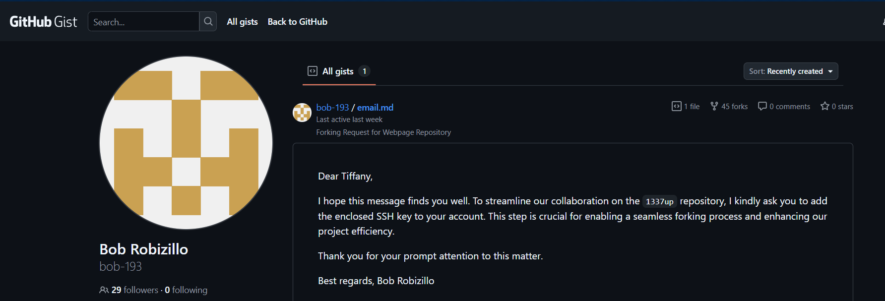
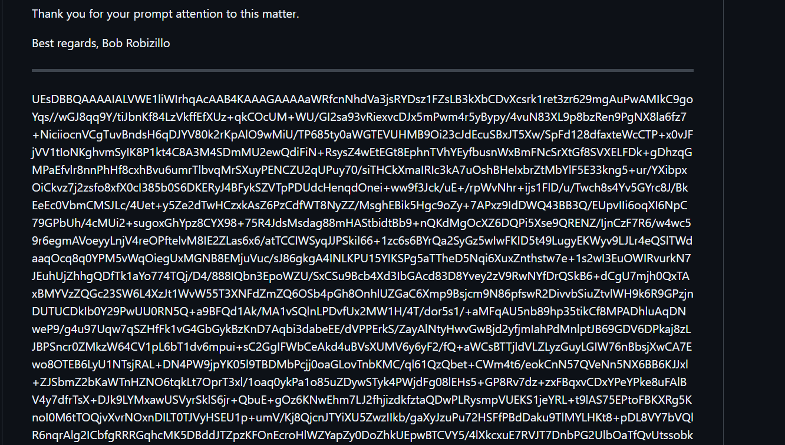
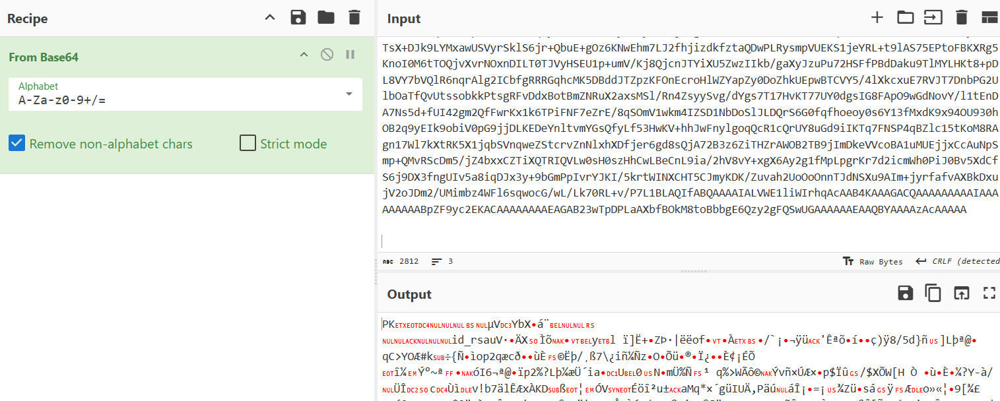
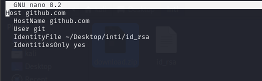

## **Challenge Name: Private GitHub Repository**

### **Solves**
- **Solves**: 143  
- **Points**: 100  

### **Description**
Bob Robizillo created public instructions for Tiffany so she can start working on a new secret project. Can you access the secret repository?

---

### **Approach**

1. **GitHub Profile Exploration**:
   - Started by finding Bob Robizillo's GitHub profile. There were no repositories listed under his account, but we decided to check his gists.
    
   - In the gists, we found an entry labeled `bob-193/email.md`.
    
   

2. **Exploring the Gist**:
   - The `bob-193` gist contained a file named `email.md` with a message to Tiffany:
     ```
     Dear Tiffany,

     I hope this message finds you well. To streamline our collaboration on the 1337up repository, I kindly ask you to add the enclosed SSH key to your account. This step is crucial for enabling a seamless forking process and enhancing our project efficiency.

     Thank you for your prompt attention to this matter.

     Best regards, Bob Robizillo
     ```

    

   - This message included a **Base64** string. I decoded the Base64 string using **CyberChef** and found that it represented a **ZIP file** (identified by the `PK` header).

   - I saved the file as [download.zip](Resources/download.zip).

   

3. **Unzipping the File**:
   - Unzipping the `download.zip` file revealed a file named `id_rsa`, which is an SSH private key.

4. **Setting Up the SSH Key**:
   - Set the correct permissions for the SSH private key with the command:
     ```bash
     chmod 600 id_rsa
     ```

   - Then, modified the GitHub SSH configuration file (`~/.ssh/config`) to use the provided private key for authentication:
     ```bash
     nano ~/.ssh/config
     ```
     Added the following configuration:
     ```bash
     Host github.com
       HostName github.com
       User git
       IdentityFile ~/Desktop/inti/id_rsa
       IdentitiesOnly yes
     ```
    
5. **Authenticating with GitHub**:
   - After setting up the SSH configuration, ran the following command to test the authentication:
     ```bash
     ssh -T git@github.com
     ```
     The response was:
     ```
     Hi nitrofany! You've successfully authenticated, but GitHub does not provide shell access.
     ```

   - This confirmed that the username associated with the SSH key was **nitrofany**.

   

6. **Cloning Tiffany's Repository**:
   - From the email, we knew the repository name was **1337up**.
   - I cloned the repository to my local machine:
     ```bash
     git clone git@github.com:nitrofany/1337up.git
     cd 1337up
     ```

7. **Searching for the Flag**:
   - Ran `git show --all` to see all the commit hashes and examined each commit.
   - One commit showed the creation of the `flag.txt` file, but it was empty.
   - After some time, I found a commit hash `5c18888418fd3f2a9d76cfd278b69c1f7c41ba4f` that led to an interesting URL:
     ```
     url = https://github.com/nitrofany/01189998819991197253
     ```

8. **Cloning the Second Repository**:
   - I cloned the second repository at `01189998819991197253` and navigated to the `flag.md` file.

   

9. **Flag**:
   - The flag inside `flag.md` was:
     ```
     INTIGRITI{9e0121bb8bce15ead3d7f529a81b77b4}
     ```

---

### **Flag**
```
INTIGRITI{9e0121bb8bce15ead3d7f529a81b77b4}
```

---
