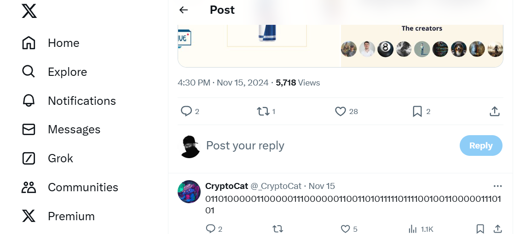
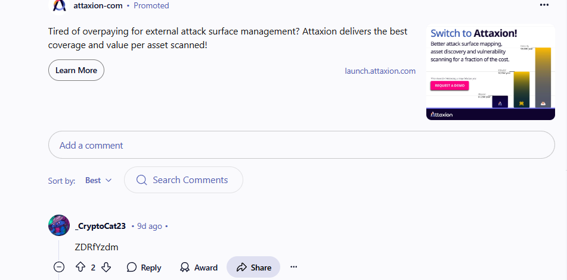
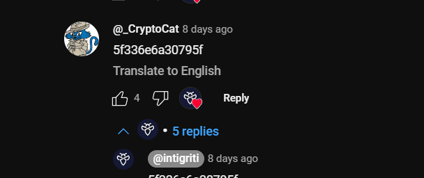

## **Challenge Name: Socials**

### **Solves**
- **Solves**: 387  
- **Points**: 50  

### **Description**
Have a look around our socials, maybe you'll find some flags! Don't forget to hit follow while you're there 🥺

**Flag format**: `INTIGRITI{Twitter+YouTube+Reddit}`

**URL**: [https://linktr.ee/hackwithintigriti](https://linktr.ee/hackwithintigriti)

---

### **Approach**

1. **Twitter**:
   - Opened the Twitter handle from the link and found a post related to the CTF.
   - Under this post, there was a comment that looked like binary code.
   - Decoding the binary `0110100000110000011100000011001101011111011110010011000001110101` resulted in the message: `hop3_y0u`.

   

2. **Reddit**:
   - Moving to the Reddit link, we found the first post. Upon opening the comment section, we found another comment that appeared to be in Base64.
   - Decoding the Base64 string `ZDRfYzdm` gave us the result: `d4_c7f`.

   

3. **YouTube**:
   - Lastly, we followed the link to the YouTube livestream in the Reddit comment.
   - On the YouTube video, we found another comment from the creator with a string that appeared to be in hexadecimal format.
   - Converting the hex `5f336e6a30795f` gave us: `_3nj0y_`.
   
   

4. **Assembling the Flag**:
   - We combined all the decoded parts: `hop3_y0u` (Twitter) + `d4_c7f` (Reddit) + `_3nj0y_` (YouTube) to form the final flag.

---

### **Flag**
```
INTIGRITI{h0p3_y0u_3nj0y_d4_c7f}
```

---
