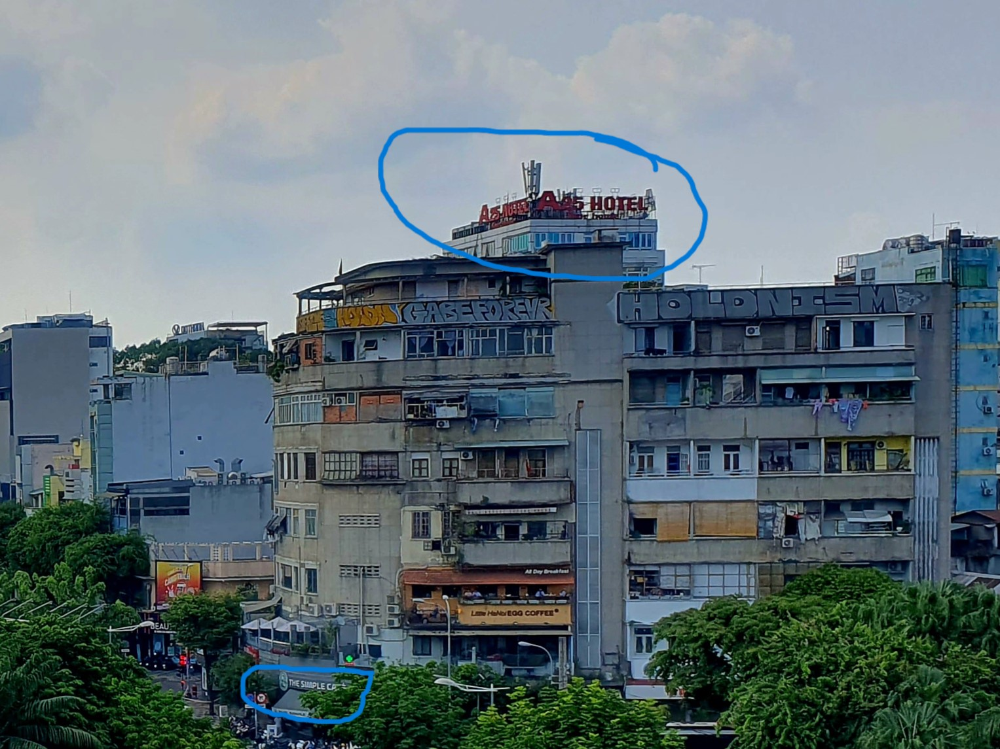
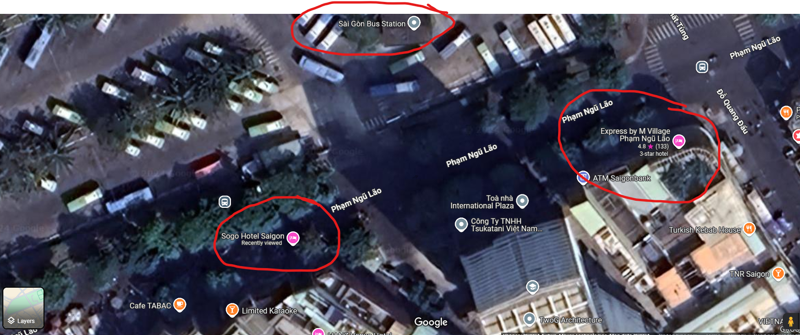

## **Challenge Name: Trackdown 2**

### **Solves**
- **Solves**: 341  
- **Points**: 100  

---

### **Description**
We didn't get him in time 😫 Thankfully, we don't believe he's fled the country yet. He uploaded another photo this morning, it's as if he's taunting us! This may be our last chance—do you know where he is right now?

**Flag format**: `INTIGRITI{Location_Name}`

---

### **Approach**

1. **Initial Reverse Image Search**:
   - Performing a reverse image search on the provided photo returned a related match: **Sogo Hotel Saigon**. While this wasn’t the exact answer, it confirmed that the location was nearby.

2. **Analyzing Visible Clues**:
   - The image contained two visible names:
     - **The Simple Cafe**  
     - **A25 Hotel**  
   - I searched for **The Simple Cafe** and found its location close to **A25 Hotel**.  

   

3. **Considering Additional Context**:
   - A **bus stop** is visible on the left side of the image. This confirmed that the location must be near both **The Simple Cafe** and a public transport stop.

4. **Refining the Search**:
   - By iterating between **Google Maps** and **Street View**, I pinpointed the exact location as **Express by M Village Phạm Ngũ Lão**.  
   - This spot is very close to **Sogo Hotel Saigon**, confirming its proximity.

   

---

### **Flag**
```
INTIGRITI{Express by M Village Phạm Ngũ Lão}
```

---