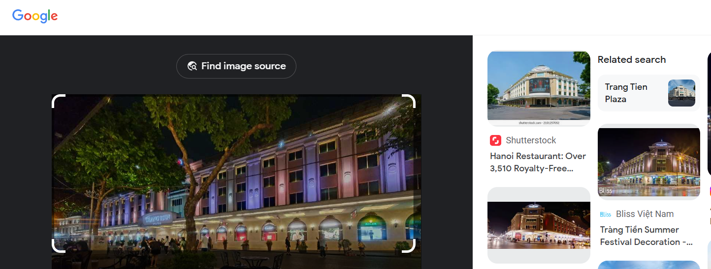
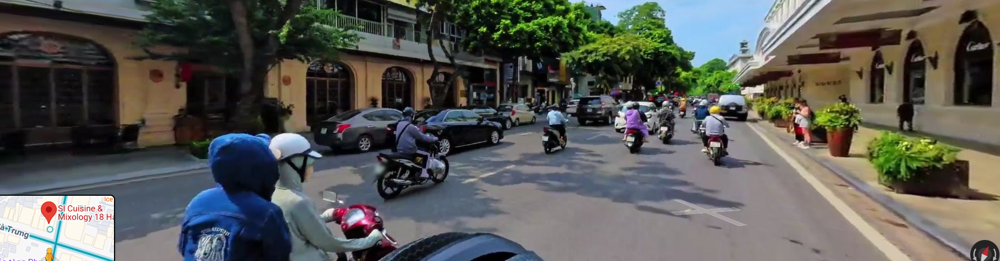

## **Challenge Name: Trackdown**

### **Solves**
- **Solves**: 392  
- **Points**: 100  

---

### **Description**
There's a fugitive on the loose, and we need to track him down! He posted this to social media recently. Do you know where the photograph was taken from? If you can provide the precise building, we can move in immediately. 🚔

**Flag format**: `INTIGRITI{Location_Name}`

---

## **Attachments** : [trackdown.jpg](Resources/trackdown.jpg)

### **Approach**

1. **Reverse Image Search**:
   - I performed a reverse image search using the provided photograph. The results indicated that the building in the image was **Trang Tien Plaza**.

   

2. **Analyzing the Area**:
   - The fugitive appeared to be close to Trang Tien Plaza. I switched to **Google Maps** and enabled **Street View** to narrow down the precise location.
   - After scanning the area around Trang Tien Plaza, I noticed some **round tables and chairs** that matched the ones in the photograph.

   

3. **Identifying the Location**:
   - Based on the tables, chairs, and the exact street view, I determined the location to be **Si Lounge Hanoi**, which is in front of Trang Tien Plaza.

---

### **Flag**
```
INTIGRITI{Si Lounge Hanoi}
```

---