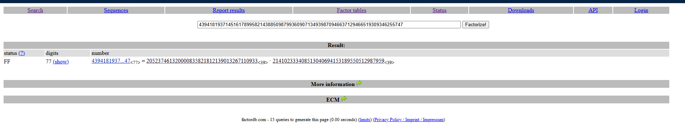
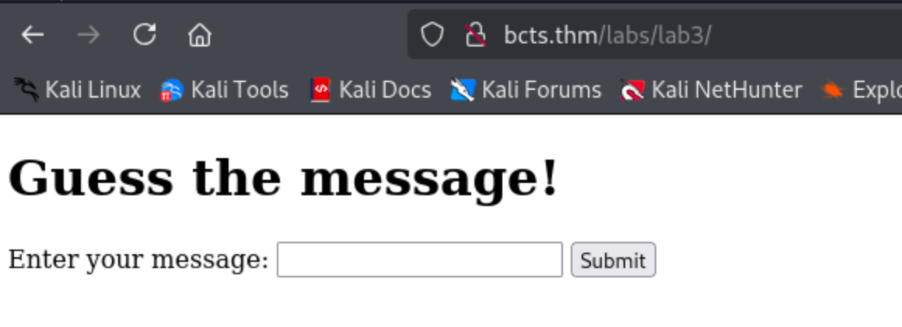
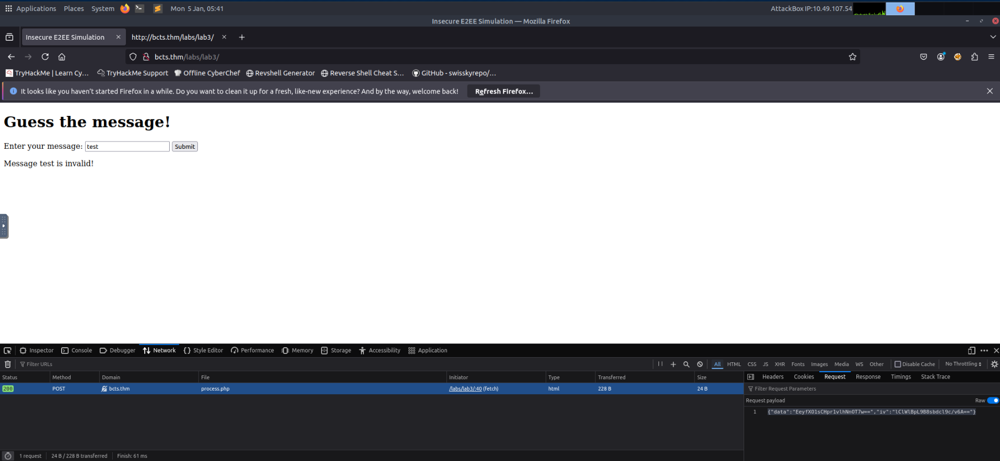
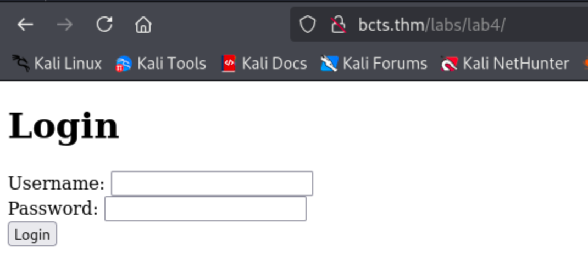
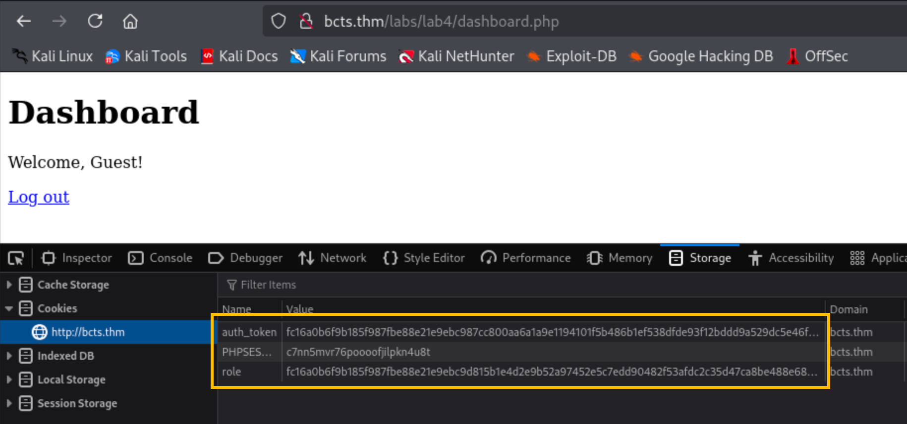
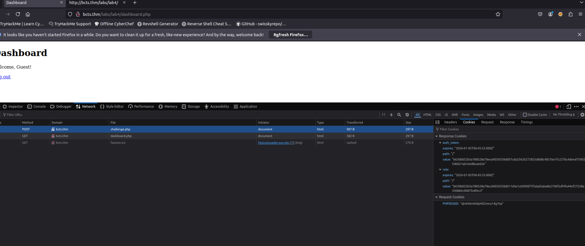

# Task 1 | Introduction

## Overview

Cryptography is designed to protect sensitive data, but it's only effective when implemented correctly. Even small mistakes in how cryptographic systems are set up can open the door for attackers. These mistakes are surprisingly common and often become "quick wins" during penetration testing or real-world attacks.

For example, using a weak encryption key or a predictable random number generator can make encryption easier to break. Similarly, exposing secrets like API keys in client-side code gives attackers everything they need to bypass cryptographic protections. The key takeaway here is that it's not always the algorithm itself that's flawed—it's how it's used.

## Learning Objectives

By the end of this room, you will:

- Understand why cryptographic mistakes occur and their impact on security
- Recognize and exploit vulnerabilities like weak encryption keys and poorly configured algorithms
- Learn how to identify and exploit issues like exposed keys
- Understand how to secure cryptographic systems by avoiding these mistakes

## Initial Setup

Before starting the room, add the target machine to your hosts file:

```bash
echo "10.49.188.155   bcts.thm" >> /etc/hosts
```

This ensures that when you navigate to `bcts.thm`, your system resolves it to the correct IP address.

---

# Task 2 | Brute-forcing Keys

## Challenge Overview

In this task, we'll explore how weak RSA key generation can lead to vulnerabilities. RSA encryption relies on the mathematical difficulty of factoring large numbers, but when keys are poorly generated, this security assumption breaks down.

**Question:** What is the flag?

**Answer:** `THM{Psssss_4nd_Qsssssss}`

## Understanding RSA Mathematics

RSA encryption, named after its inventors Rivest, Shamir, and Adleman, is based on the difficulty of factoring large numbers.

### Public Key Components

A public key consists of:

- **n = p × q**: The product of two large prime numbers, `p` and `q`
- **e**: A small public exponent (commonly `e = 65537`)

### Private Key Components

The private key is derived from:

- **φ(n) = (p - 1) × (q - 1)**: Where φ is Euler's totient function
- **d**: The modular inverse of `e` modulo `φ(n)`, satisfying `e × d ≡ 1 (mod φ(n))`

### Security Assumption

The security of RSA depends on the difficulty of factoring `n` into its prime components `p` and `q`. However, if `p` or `q` is poorly generated or shared across keys, this foundational assumption breaks down.

## Exercise: Breaking Weak RSA

### Challenge Details

Using the provided `c`, `n`, and `e` values, which are crucial components of the RSA encryption process, we need to recover the hidden plaintext. The challenge assumes `n` is a product of two weakly generated primes `p` and `q`.

**Given Values:**
- **Public Key (n):** `43941819371451617899582143885098799360907134939870946637129466519309346255747`
- **Exponent (e):** `65537`
- **Ciphertext (c):** `9002431156311360251224219512084136121048022631163334079215596223698721862766`

Your task is to recover the plaintext by factoring `n` and deriving the private key.

### Step 1: Factoring the Modulus

Since `n` is the product of two large primes (`p` and `q`), factorization is the first step. Modern factoring tools, like MSIEVE or YAFU, can be used for this purpose. However, for educational purposes, you can use Python and a library like `sympy`.

**Note:** This computation takes a lot of processing power, so if you are using the AttackBox, we strongly recommend that you skip this step and follow along.

Here's the Python code to factor `n` into `p` and `q`:

```python
from sympy import factorint
from Crypto.Util.number import inverse, long_to_bytes

# Given values
n = 43941819371451617899582143885098799360907134939870946637129466519309346255747

# Factor n
factors = factorint(n)
p, q = factors.keys()
print("Prime factors:")
print("p =", p)
print("q =", q)
```

**Expected Output:**
The script will compute:
- `p = 205237461320000835821812139013267110933`
- `q = 214102333408513040694153189550512987959`

### Step 2: Computing φ(n)

Using the two primes, calculate `φ(n)`, where:

```python
phi_n = (p - 1) * (q - 1)
print("Phi(n) =", phi_n)
```

### Step 3: Finding the Private Key

The private key exponent `d` is the modular inverse of `e` modulo `φ(n)`:

```python
from sympy import factorint
from Crypto.Util.number import inverse, long_to_bytes

e = 65537
d = inverse(e, phi_n)
print("Private key (d):", d)
```

### Step 4: Decrypting the Ciphertext

Now that you have `d`, decrypt the given ciphertext `c`:

```python
c = 9002431156311360251224219512084136121048022631163334079215596223698721862766

plaintext = pow(c, d, n)
flag = long_to_bytes(plaintext)
print(flag.decode())
print("Decrypted Plaintext:", flag)
```

## Key Takeaways from Broadcast RSA

- **Avoid small public exponents** like `e = 3`; instead, use larger values like `e = 65537`
- **Ensure encrypted messages are padded** with random data (e.g., PKCS#1 or OAEP) to prevent mathematical attacks
- **Use different plaintexts for different recipients** to avoid the conditions that make CRT attacks possible

## My Solution

I used the following approach to solve this challenge:

**Given:**
- `n = 43941819371451617899582143885098799360907134939870946637129466519309346255747`
- `c = 9002431156311360251224219512084136121048022631163334079215596223698721862766`

### Step 1: Factorization

First, I factorized `n` using [FactorDB](https://factordb.com/), an online database of factorized numbers.



### Step 2: Decryption Script

Then, I recovered the plaintext using this script: [solve.py](./Resources/rsa-solve.py)

```bash
PS D:\Documents > python3 .\rsa-solve.py
THM{Psssss_4nd_Qsssssss}
Decrypted Plaintext: b'THM{Psssss_4nd_Qsssssss}'
```

**Flag:** `THM{Psssss_4nd_Qsssssss}`

---

# Task 3 | Breaking Hashes

## Challenge Overview

In this task, we'll explore vulnerabilities in hash-based authentication systems, specifically focusing on HMAC (Hash-based Message Authentication Code) implementations with weak secret keys.

**Question:** What is the secret used to encrypt the message?

**Answer:** `sunshine`

## Understanding Hashing

Hashing is a cryptographic process that transforms an input (e.g., a password or a message) into a fixed-size string, often called a hash. The transformation is one-way, meaning it's not feasible to reverse the hash to recover the original input.

### Common Uses of Hashing

1. **Password Storage**: Instead of storing plaintext passwords, systems store their hashes. During login, the input password is hashed and compared to the stored hash.
2. **Data Integrity**: Hashes verify that data has not been altered during transmission.
3. **Message Authentication (HMAC)**: Hashes combined with a secret key verify that a message hasn't been tampered with.

## Common Vulnerabilities in Hashing

### Weak Hash Algorithms

Older algorithms like MD5 and SHA-1 are considered insecure due to their susceptibility to collisions (two inputs producing the same hash). Attackers can exploit this to craft malicious data with the same hash.

### Lack of Salting

When the same input consistently produces the same hash, attackers can use precomputed databases (rainbow tables) to reverse the hash to its original value. Salting—adding a unique, random value to each input before hashing—prevents this.

### Insecure HMACs

Hash-based Message Authentication Codes (HMACs) rely on a hash function combined with a secret key to ensure message authenticity. Weaknesses arise when:

- The hash function is insecure
- The key is short, predictable, or reused

## Challenge: Breaking HMAC-SHA1

### Problem Statement

HMAC (Hash-based Message Authentication Code) is a cryptographic method used to verify the integrity and authenticity of a message. It combines a cryptographic hash function (in this case, SHA-1) with a secret key. If an attacker can determine the secret key, they can forge valid HMACs and manipulate messages.

In this challenge, you are given a message along with its HMAC-SHA1 digest. However, the secret key used for signing is weak. Your objective is to recover the key.

**Given:**
- **Message:** `CanYouGuessMySecret`
- **SHA1-Digest:** `1484c3a5d65a55d70984b4d10b1884bda8876c1d`

### Solution Approach

Hashcat is a powerful tool for cracking hashes and HMAC keys. Since we know the format is HMAC-SHA1, we will use mode `150`. Mode 150 targets HMAC-SHA1 based on Hashcat's documentation.

### Step 1: Prepare the Hash File

Save the hash and message into a file in the format required by Hashcat:

```bash
root@ip-10-49-107-54:~# echo -n "1484c3a5d65a55d70984b4d10b1884bda8876c1d:CanYouGuessMySecret" > digest.txt
```

The format is: `hash:message`

### Step 2: Run Hashcat

Run Hashcat with the RockYou wordlist:

```bash
root@ip-10-49-107-54:~# hashcat -a 0 -m 150 digest.txt /usr/share/wordlists/rockyou.txt
```

**Command Breakdown:**
- `-a 0`: Dictionary attack mode
- `-m 150`: HMAC-SHA1 mode
- `digest.txt`: Input file containing the hash and message
- `/usr/share/wordlists/rockyou.txt`: Wordlist to use for brute-forcing

### Step 3: Results

```bash
---SNIP---
Dictionary cache building /usr/share/wordlists/rockyou.txt: 33553435 bytes (23.9%)
Dictionary cache building /usr/share/wordlists/rockyou.txt: 67106875 bytes (47.9%)
Dictionary cache building /usr/share/wordlists/rockyou.txt: 100660309 bytes (71.8%)
Dictionary cache building /usr/share/wordlists/rockyou.txt: 134213745 bytes (95.9%)
Dictionary cache built:
* Filename..: /usr/share/wordlists/rockyou.txt
* Passwords.: 14344391
* Bytes.....: 139921497
* Keyspace..: 14344384
* Runtime...: 14 secs

1484c3a5d65a55d70984b4d10b1884bda8876c1d:CanYouGuessMySecret:sunshine                                       
---SNIP--- 
```

**Secret Key Found:** `sunshine`

---

# Task 4 | Exposed Keys

## Understanding the Risk

Exposing cryptographic keys in client-side code is a common yet critical mistake. When keys are included in code that runs in the user's browser (e.g., JavaScript), anyone with access to the application can retrieve and misuse those keys. This defeats the purpose of encryption and authentication, as the attacker gains direct access to the mechanism meant to protect the data.

### Key Risks Include:

- **Unauthorized Access**: Exposed keys can be used to decrypt sensitive data or interact with backend APIs as an authenticated user
- **Data Tampering**: An attacker can use the keys to generate signed payloads or modify encrypted messages, bypassing integrity checks
- **API Abuse**: Hardcoded API keys may allow attackers to access privileged API endpoints without authorization

## Common Scenarios of Key Exposure

### Hardcoded API Keys in JavaScript

Developers often embed API keys in front-end code for convenience, forgetting that anyone can view this code using browser developer tools.

### Encryption Keys in Client-Side Frameworks

Encryption keys are sometimes included in front-end libraries or scripts to encrypt/decrypt data locally. These keys can be easily extracted and used maliciously.

### Unsecured Configuration Files

Configuration files embedded in web applications may contain sensitive credentials or keys in plain text.

## Exercise: Exploiting Exposed Keys

### Step 1: Access the Lab

Navigate to `http://bcts.thm/labs/lab3`.



### Step 2: Inspect Network Traffic

Open your developer tools (F12), navigate to the Network tab, and try submitting a message.



**Observed Request Payload:**
```json
{"data":"EeyfXO1sCHpr1vlhNnOT7w==","iv":"lClWlBpL9B8sbdcl9c/v6A=="}
```

### Step 3: Analyze Client-Side Code

In the source code of the webpage, we can see JavaScript being used for encrypting these values:

```javascript
<script>
    const encryptionKey = CryptoJS.enc.Utf8.parse("1234567890123456"); // 16-byte key
    const iv = CryptoJS.lib.WordArray.random(16); // Random 16-byte IV

    function encryptMessage(message) {
        const encrypted = CryptoJS.AES.encrypt(message, encryptionKey, {
            iv: iv,
            mode: CryptoJS.mode.CBC,
            padding: CryptoJS.pad.Pkcs7,
        });
        return {
            ciphertext: encrypted.ciphertext.toString(CryptoJS.enc.Base64),
            iv: iv.toString(CryptoJS.enc.Base64),
        };
    }

    document.getElementById("secureForm").addEventListener("submit", async (e) => {
        e.preventDefault();
        const message = document.getElementById("message").value;

        const { ciphertext, iv } = encryptMessage(message);

        const response = await fetch("process.php", {
            method: "POST",
            headers: { "Content-Type": "application/json" },
            body: JSON.stringify({ data: ciphertext, iv: iv }),
        });

        const result = await response.text();
        document.getElementById("response").innerText = result;
    });
</script>
```

### Step 4: Understanding the Vulnerability

Since the encryption key used to encrypt the message is hardcoded in the JavaScript code (`1234567890123456`), it is possible for an attacker to create a script that will brute-force for the correct message using the hardcoded `encryptionKey` value.

To simplify this, a wordlist containing the possible messages is available on the server at `http://bcts.thm/labs/lab3/wordlist.txt`.

### Step 5: Automating the Attack

However, directly brute-forcing the application will not work since the request is encrypted, so we must automate this using Python.

[Here is the Python script](./Resources/crack.py) that uses the available `wordlist.txt` on the server.

### Step 6: Download the Wordlist

```bash
root@ip-10-49-107-54:~# wget http://bcts.thm/labs/lab3/wordlist.txt
--2026-01-05 05:44:08--  http://bcts.thm/labs/lab3/wordlist.txt
Resolving bcts.thm (bcts.thm)... 10.49.188.155
Connecting to bcts.thm (bcts.thm)|10.49.188.155|:80... connected.
HTTP request sent, awaiting response... 200 OK
Length: 1423 (1.4K) [text/plain]
Saving to: 'wordlist.txt'

wordlist.txt        100%[===================>]   1.39K  --.-KB/s  in 0s      

2026-01-05 05:44:08 (165 MB/s) - 'wordlist.txt' saved [1423/1423]
```

### Step 7: Execute the Brute-Force Script

```bash
root@ip-10-49-107-54:~# python3 bruteforce.py
Trying: jadmxqtideg
Response: Message jadmxqtideg is invalid!

---SNIP---

Trying: wdjdzzsx
Response: Message wdjdzzsx is invalid!
Trying: ankhzljjgu
Response: Access granted! Here's your flag: THM{3nD_2_3nd_is_n0t_c0mpl1c4ted}
[+] Found the correct message: ankhzljjgu
```

**Flag:** `THM{3nD_2_3nd_is_n0t_c0mpl1c4ted}`

---

# Task 5 | Bit Flipping Attacks

## Understanding Unauthenticated Encryption

Unauthenticated encryption refers to encryption that does not include a mechanism to verify the integrity or authenticity of the ciphertext. This means that an attacker can modify encrypted data that is in transit, and the system will still accept and process it without detecting any tampering.

When the application decrypts tampered ciphertext without verifying its integrity, an attacker can manipulate the plaintext in predictable ways. This is the root cause of bit-flipping attacks.

### Example: AES-CBC Vulnerability

A classic example is AES in CBC (Cipher Block Chaining) mode without an authentication tag. AES-CBC encrypts data securely but does not ensure integrity. If an attacker can modify the ciphertext, they can manipulate certain bits of the decrypted plaintext without breaking the encryption.

This leads to bit-flipping attacks, where an attacker changes ciphertext in a way that results in controlled modifications in the plaintext.

## Understanding Bit Flipping Attacks

Bit flipping attacks target systems that use unauthenticated encryption, allowing an attacker to modify ciphertext so that the decrypted plaintext is manipulated in predictable ways. This type of attack is particularly dangerous when systems assume that encrypted data is inherently safe to trust without verifying its integrity.

### How CBC Mode Works

Encryption schemes like AES-CBC (Cipher Block Chaining) are vulnerable to bit flipping when no integrity check, such as a Message Authentication Code (MAC), is applied. In CBC mode:

- The plaintext is XORed with the previous ciphertext block before encryption
- If an attacker alters bits in a ciphertext block, it changes the corresponding plaintext block during decryption

### Example Scenario

For example, consider an encrypted payload:

```json
{"role":"0"}
```

If this ciphertext is tampered with, the role could be escalated to `"1"`. Without integrity protection, the system would accept the manipulated plaintext as legitimate.

## Exercise: Exploiting Bit Flipping

### Step 1: Access the Lab

Navigate to `http://bcts.thm/labs/lab4/`.



### Step 2: Understanding the Application Logic

The application accepts any credential as shown in the PHP code below:

```php
if ($_SERVER['REQUEST_METHOD'] === 'POST' && isset($_POST['username'], $_POST['password'])) {
    $username = htmlspecialchars($_POST['username']);
    $password = htmlspecialchars($_POST['password']);

    $message = "username={$username}";
    $role = "0";
    $token = encrypt_data($message, $key, $iv);
    $token2 = encrypt_data($role, $key, $iv);

    setcookie("auth_token", $token, time() + 3600, "/");
    setcookie("role", $token2, time() + 3600, "/");
    header("Location: dashboard.php");
    exit();
}
```

Notice that the `role` is set to `"0"` (likely representing a guest user) and is encrypted separately.

### Step 3: Initial Login

I logged in with `admin:admin` credentials.



As expected, the role is set to `0`, indicating a guest user.

### Step 4: Performing the Bit Flip Attack

[Here's a Python script](./Resources/flip-role.py) that will flip the `role=0` to `role=1`.

**Encrypted role token:** `b630b852b5a788528a78ecd4059258d011d4a1c60906f1f5dad2aba8e2706f2df4fa44ef27238a330884c90879c8fec3`

### Step 5: Execute the Script

```bash
root@ip-10-49-107-54:~# python3 flip.py b630b852b5a788528a78ecd4059258d011d4a1c60906f1f5dad2aba8e2706f2df4fa44ef27238a330884c90879c8fec3

[DEBUG] Original IV (First 16 Bytes): b630b852b5a788528a78ecd4059258d0
[DEBUG] Modifying byte at offset 0: 0xb6 XOR 0x1

[DEBUG] Modified IV (First 16 Bytes): b730b852b5a788528a78ecd4059258d0

Modified Token:
b730b852b5a788528a78ecd4059258d011d4a1c60906f1f5dad2aba8e2706f2df4fa44ef27238a330884c90879c8fec3

Use this token as the new 'role' cookie in your browser to log in as admin.
root@ip-10-49-107-54:~# 
```

### Step 6: Update the Cookie and Retrieve the Flag

Update the `role` cookie value in your browser with the modified token and hit refresh to get the flag.



**Question:** What is the flag?

**Answer:** `THM{flip_n_flip}`

---

# Recap: Key Concepts and Best Practices

## Summary of Cryptographic Mistakes

In this room, we've explored common cryptographic mistakes that developers often make, along with practical demonstrations of how these errors can be exploited. Let's summarize the critical concepts and vulnerabilities you've encountered:

### 1. Brute-forcing Keys

Weak or predictable keys, such as those derived from timestamps or short alphanumeric strings, can be cracked using brute-force attacks with tools like Hashcat or John the Ripper.

### 2. Breaking Hashes

- Outdated hash functions like MD5 and SHA-1 are vulnerable to attacks such as collision and preimage attacks
- Lack of salting enables attackers to use rainbow tables to reverse hashes into plaintext

### 3. Keys Exposed in Client-Side Code

- Hardcoding encryption keys or API secrets in front-end code exposes them to anyone with access to the application
- This allows attackers to decrypt sensitive data or impersonate users

### 4. Bit Flipping Attacks

- Unauthenticated encryption (e.g., AES-CBC without a MAC) enables attackers to modify ciphertext, resulting in controlled changes to decrypted plaintext

## Best Practices for Avoiding Cryptographic Mistakes

To secure cryptographic implementations and prevent the vulnerabilities explored in this room, follow these best practices:

### Use Strong Keys and Secure Algorithms

- Generate keys with sufficient entropy and length (e.g., AES-256 for symmetric encryption)
- Use modern, secure algorithms such as AES-GCM, RSA-2048, and SHA-256
- Regularly update cryptographic libraries to protect against newly discovered vulnerabilities

### Avoid Exposing Keys in Client-Side Code

- Never hardcode encryption keys, API secrets, or sensitive credentials in JavaScript or other client-side files
- Store secrets securely on the server side and use environment variables or key management systems like AWS KMS or Azure Key Vault

### Implement Authenticated Encryption

- Always pair encryption with integrity checks using authenticated encryption modes like AES-GCM or AES-CCM
- Ensure that any data transmitted over untrusted channels is encrypted and includes integrity protection

### Secure RSA Implementations

- Use larger public exponents (`e = 65537`) and ensure that encrypted messages include padding (e.g., OAEP or PKCS#1)
- Avoid encrypting the same plaintext for multiple recipients with the same public exponent

### Educate Developers

- Ensure that development teams understand secure cryptographic practices and the risks of misconfigurations
- Conduct regular training and code reviews to identify and fix potential issues before deployment

---

## Conclusion

This room has demonstrated that cryptographic security is not just about using strong algorithms—it's about implementing them correctly. Common mistakes like weak keys, exposed secrets, and unauthenticated encryption can completely undermine the security of a system. By understanding these vulnerabilities and following best practices, you can help build more secure applications and better protect sensitive data.

---