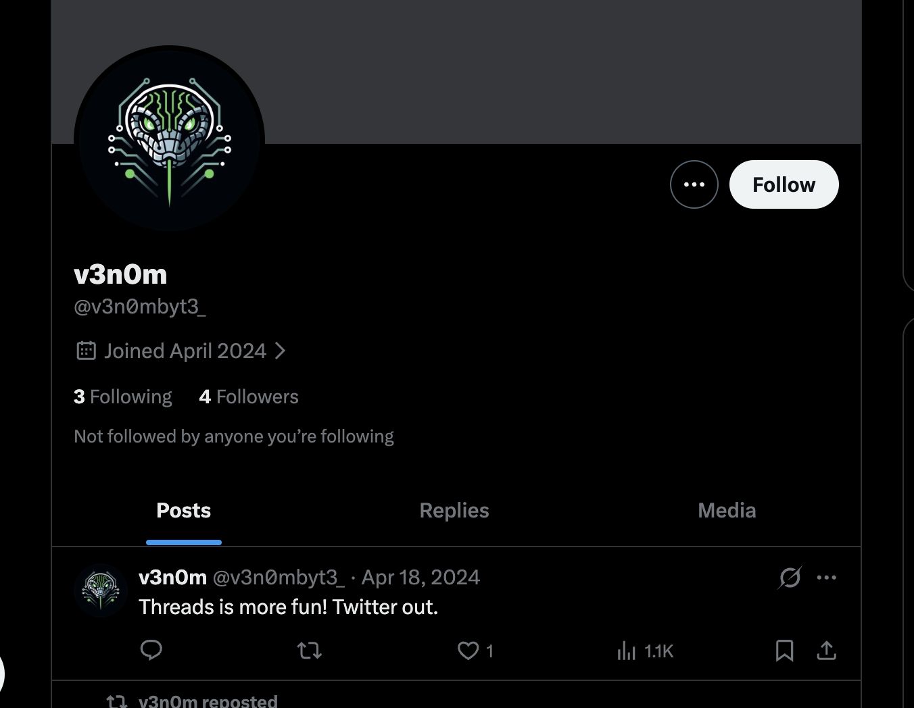
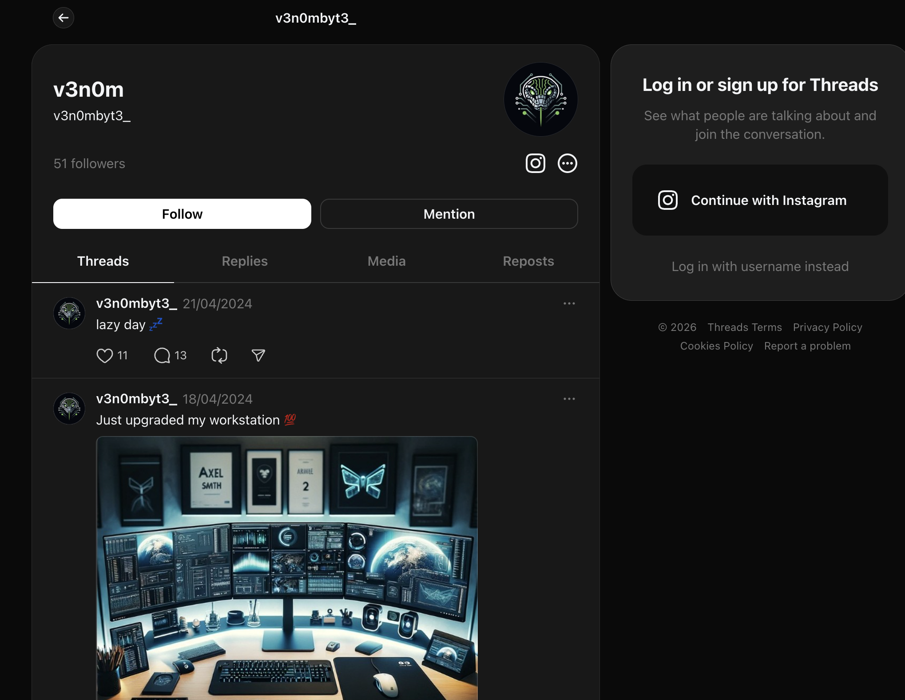
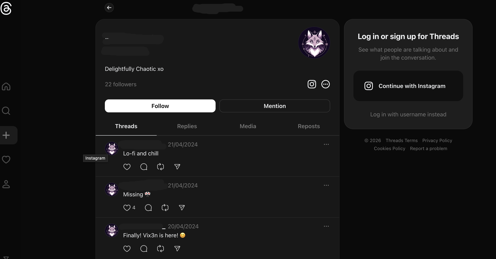
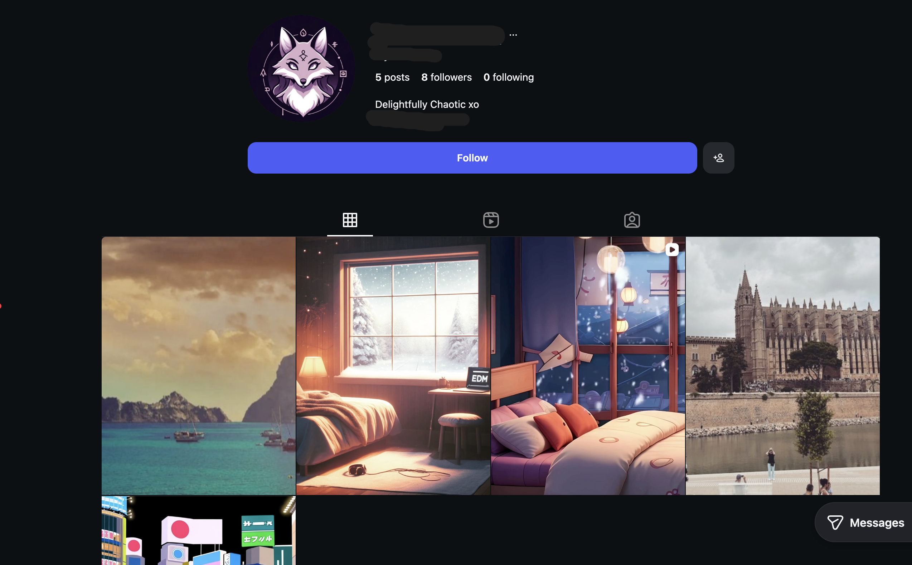
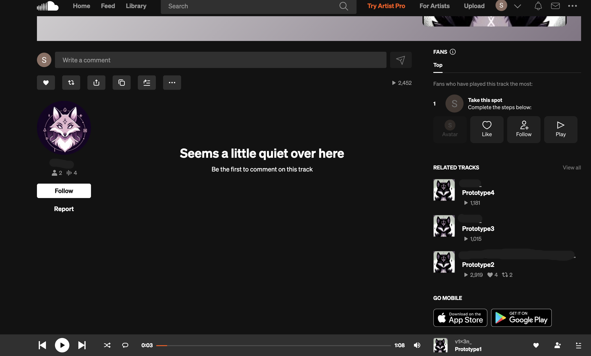
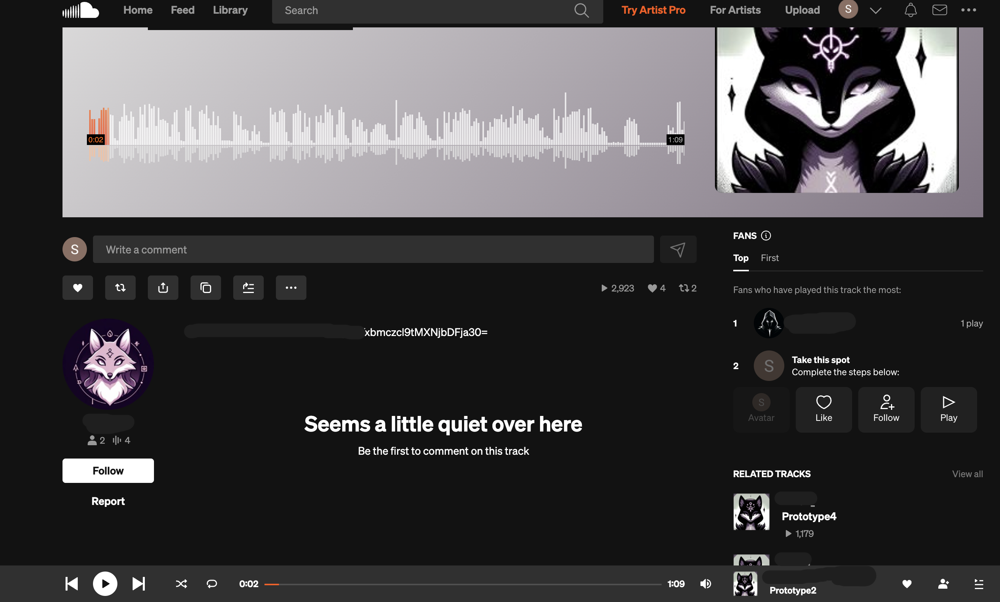
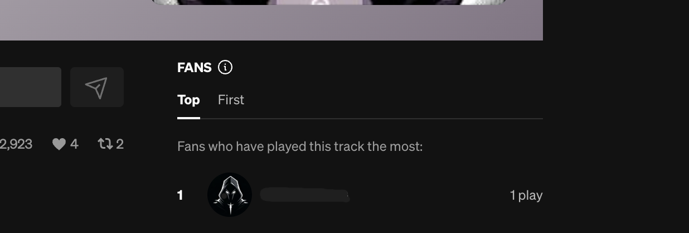
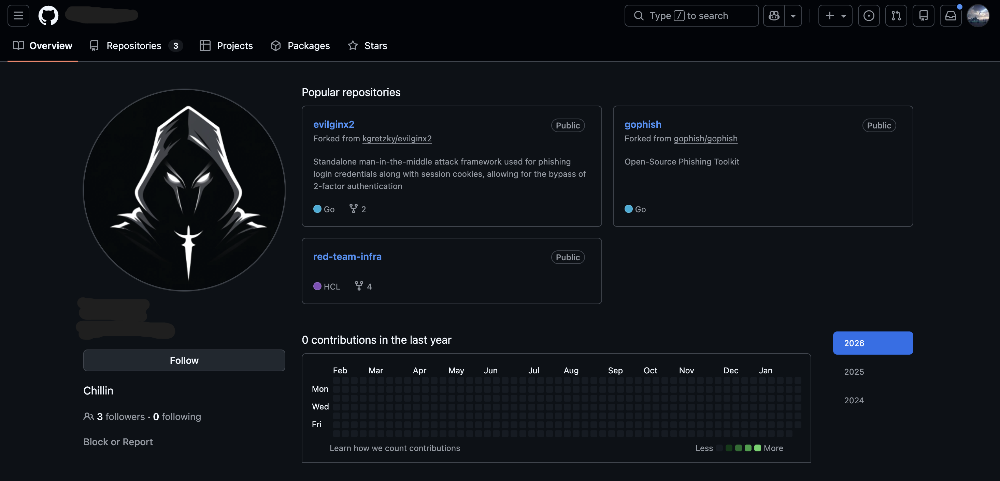
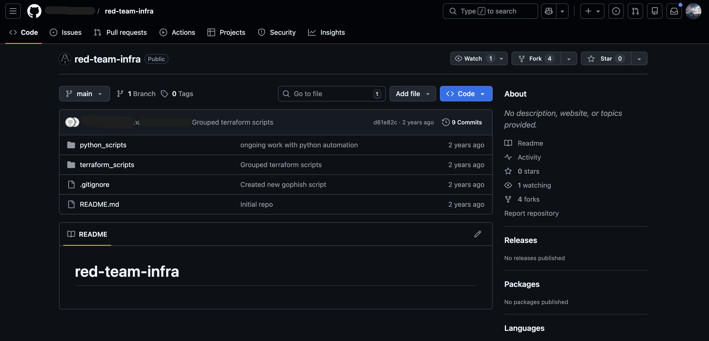

## TryHackMe Room - [Operation Slither](https://tryhackme.com/room/operationslitherIU)

Follow the leads and find who's behind this operation.

**Difficulty:** Easy–Medium (OSINT)  
**Focus:** Username reconnaissance, cross-platform correlation, metadata and content analysis.

Each task reveals another operator through indirect associations and reused handles.

---

## Task 1 — The Leader

### Objective

Identify information related to the **leader of the Sneaky Viper group** using a leaked forum post.

### Initial Clue

We got access to a hacker forum and found our company's info on sale. The post contains:

```
Full user database TryTelecomMe on sale!!!

As part of Operation Slither, we've been hiding for weeks in their network and have now started to exfiltrate information.
This is just the beginning. We'll be releasing more data soon. Stay tuned!

@v3n0mbyt3_
```

The only actionable data here is the username: **`v3n0mbyt3_`**.

### Reconnaissance Process

**1. Username enumeration**

We already know the user exists on Twitter/X. Visit their profile:

```
https://x.com/v3n0mbyt3_
```



**2. Key tweet discovered**

On their timeline we find a status mentioning:

```
Threads is more fun! Twitter out.
```

This strongly suggests they are active on **Threads**. That answers the first question (other platform used: **threads**).

**3. Threads profile**

Search for the same handle on Threads:

```
https://www.threads.net/@v3n0mbyt3_
```



**4. Replies section**

Explore their Threads profile, especially the **replies** section. A reply contains a **Base64-encoded string**:

```
VEhNexxxxxxxxxxxxxxxxxxxxxxxxxxxxxxxxxxxxxxxxxwbDEzcyF9
```

### Decoding the Flag

Decode the Base64 string (e.g. with `echo '<string>' | base64 -d` or an online decoder):

```bash
echo 'VEhNexxxxxxxxxxxxxxxxxxxxxxxxxxxxxxxxxxxxxxxxxwbDEzcyF9' | base64 -d
```

The decoded value is the **flag** for Task 1.

---

## Task 2 — The Sidekick

### Objective

Identify the **second operator** communicating with `v3n0mbyt3_`. A second forum message was posted, but our forum account was deleted, so we must follow the crumbs from Task 1.

### Lead From Task 1

From the Threads replies in Task 1, another username appears: **`REDACTED`**. This is the user who replied with the Base64 flag.

### Reconnaissance Process

**1. Threads profile**

Check their Threads profile:

```
https://www.threads.net/@<REDACTED>
```



There may be minimal visible activity, but the handle is confirmed.

**2. Instagram enumeration**

Many users reuse the same handle across platforms. Search on Instagram:

```
https://www.instagram.com/<REDACTED>/
```



**3. Interesting Instagram post**

Browse their Instagram posts. One post contains a **SoundCloud link** in the description:

```
https://www.instagram.com/p/xxxxxxxxxxx/
```


Note the SoundCloud profile URL (e.g. `https://soundcloud.com/xxxxx-195859753`) and open it.

**4. SoundCloud profile and tracks**

On their SoundCloud profile, list their tracks. One track is particularly relevant—**prototype2**:

```
https://soundcloud.com/xxxxx-195859753/prototype2
```



- The audio includes a conversation about executing the operation.
- The **track description or page content** contains another **Base64-encoded string**, which is the flag for Task 2.



### Decoding the Flag

Decode the Base64 string found on the SoundCloud page to get the Task 2 flag.

---

## Task 3 — The Last Operator

### Objective

Identify the **third operator** and uncover details related to the infrastructure used for the attack, using past discoveries.

### Pivot From Task 2

While reviewing the SoundCloud track or profile from Task 2, look at **comments, likes, or linked accounts**. A **fan account** or commenter stands out:

**`REDACTED`**



This is the handle of the third operator.

### Reconnaissance Process

**1. Platform enumeration**

Use the hints: *"Extend reconnaissance into developer or technical platforms"* and *"Analyse activity history (such as repositories or commits)."*

Search for **REDACTED** on **GitHub**:

```
https://github.com/REDACTED
```



That answers the question about the other platform: **github**.

**2. Repository analysis**

On their GitHub profile, identify the **only non-forked repository**: **`red-team-infra`**. Open it.



**3. Commit history**

Open the **commit history** of `red-team-infra`. Inspect recent commits; one commit contains sensitive data.

Example commit (your target may differ):

```
https://github.com/REDACTED/red-team-infra/commit/78de1f17cxxxxxxxxxxxxxxxxxxxxxxc31a0e7f7
```

### Embedded Secret

Inside the commit diff, look for JSON or config that includes a field like:

```json
"shadow-password": {
  "value": "VExxxxxxxxxxxxxxxxxxxxxxxxlfcHd9",
  "type": "string"
}
```

The **value** is again **Base64-encoded**.

### Decoding the Flag

Decode the Base64 string to get the final flag for the room.

---

## Summary

| Task   | Lead / Method                                    | Key platform(s)                | Flag location                      |
| ------ | ------------------------------------------------ | ------------------------------ | ---------------------------------- |
| Task 1 | Forum username → Twitter → Threads → replies     | Twitter/X, Threads             | Base64 in Threads reply            |
| Task 2 | Reply author → Threads → Instagram → SoundCloud  | Threads, Instagram, SoundCloud | Base64 in SoundCloud track         |
| Task 3 | SoundCloud fan/commenter → GitHub → repo commits | SoundCloud, GitHub             | Base64 in commit (shadow-password) |

---

## Answers

### Task 1 — The Leader

1. **Aside from Twitter / X, what other platform is used by v3n0mbyt3_? (Answer in lowercase.)**

   **Ans.** `threads`

2. **What is the value of the flag?**

   **Ans.** `<REDACTED>`

### Task 2 — The Sidekick

1. **What is the username of the second operator talking to v3n0mbyt3_ from the previous platform?**

   **Ans.** `REDACTED`

2. **What is the value of the flag?**

   **Ans.** `<REDACTED>`

### Task 3 — The Last Operator

1. **What is the handle of the third operator?**

   **Ans.** `REDACTED`

2. **What other platform does the third operator use? (Answer in lowercase.)**

   **Ans.** `github`

3. **What is the value of the flag?**

   **Ans.** `<REDACTED>`
