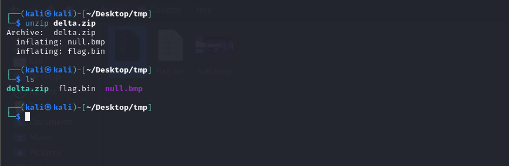
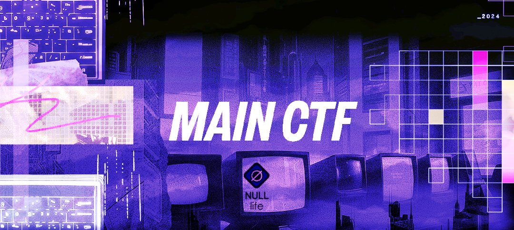
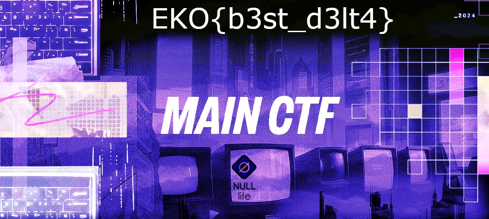

## **Challenge Name: Delta**

### **Solves**

- **Solves**: 69
- **Points**: 387

### **Description**

A cryptic data file has surfaced, carrying hidden information that once belonged elsewhere. Only by understanding its origin can you recover the secret it holds. Will you be able to decipher its true meaning and uncover the flag?

**File provided**: [](Resources/delta.zip)

---

### **Approach**

Upon extracting **delta.zip**, we were provided with two files: **null.bmp** and **flag.bin**.



1. **Identifying the Flag Binary**:
   We ran the `file` command on **flag.bin** and found that it was a **VCDIFF binary** file. This suggested that it was intended to be used for a **binary diffing or patching** operation.

2. **Examining the BMP File**:
   Opening **null.bmp** showed that it did not contain the flag, implying that the file needed modification or patching using **flag.bin**.

   

3. **Merging the Files**:
   We used **xdelta3**, a tool designed to handle VCDIFF patches, to merge the two files. The following command was used:

   ```bash
   xdelta3 -d -s null.bmp flag.bin output.bmp
   ```

   This command applied the patch from **flag.bin** to **null.bmp**, resulting in a new image file: **output.bmp**.

   

4. **Revealing the Flag**:
   Opening **output.bmp** revealed the hidden flag.

**Flag**: `EKO{b3st_d3lt4}`

---