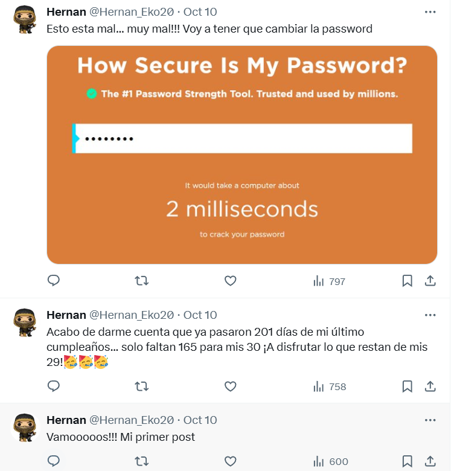
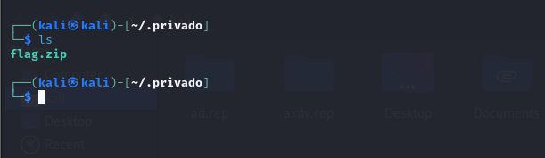
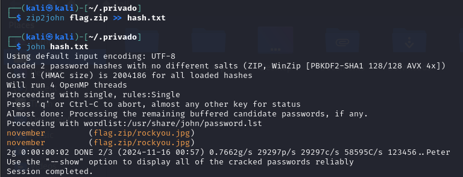
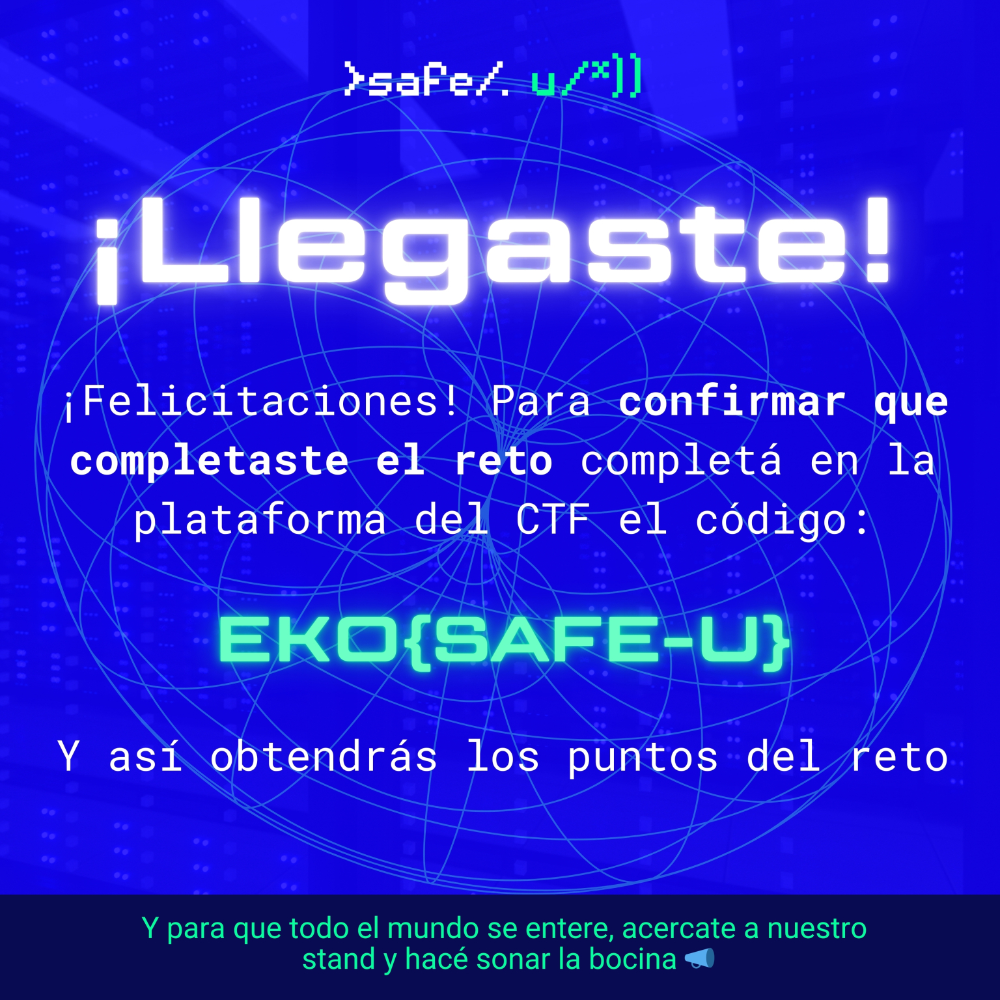

## **Challenge Name: Safe-U**  

**Category**: OSINT/Misc

**Points**: 306

**Solves**: 118

---

### **Challenge Description**  
This year, Safe-U presents a new CTF designed to challenge the most agile minds in cybersecurity.

Get ready for an adventure full of hidden tracks, mysterious passwords, and intriguing archives.

It begins in the account of **X**, where **Hernan_Eko20** has left a trail of enigmas waiting to be solved.  

> _Hope the best!_

---

### **Approach**

---

#### **Step 1: Analyze Hernan_Eko20’s Account**  
- The account contains **4 posts**:  

  **Post 1:**  
  > "First post" (no useful information).  

  **Post 2:**  
  > "I just realized that it's been 201 days since my last birthday... only 165 days until I turn 30. Let's enjoy the rest of my 29! 🥳🥳🥳"  

  - **Posted on October 10, 2024 (IST)**.  
  - Calculations:  
    - 201 days prior to October 10, 2024, is **March 21, 2024** (29th birthday).  
    - Birth year: **1995** (turns 30 in 2025).  
    - Potential password: **22031995** (DDMMYYYY format).  

  **Post 3:**  
  > Mentions a weak password that can be cracked in 2ms.  

  **Post 4:**  
  > Indicates a file uploaded using `sftp` to `admin@200.58.100.246`.  

  **Screenshot of Account Posts:**  
    
  

---

#### **Step 2: Crack the Password**  
- Used **rockyou.txt** to confirm the password:  
  **22031995**.  

---

#### **Step 3: Access the Server**  
- Logged in to the server using:  
  ```bash
  sftp admin@200.58.100.246
  ```  
- Ran `ls -la` and found a `.privado` file.  
- Downloaded the directory using:  
  ```bash
  get -r .privado
  ```  

  **Screenshot of Server Login and Directory Listing:**  
  

---

#### **Step 4: Extract the Encrypted ZIP File**  
- Navigated into the `.privado` directory.  
- Found a `flag.zip` file.  
- Used `zip2john` to generate a hash for the ZIP file.  

  **Screenshot of ZIP Extraction:**  
  

---

#### **Step 5: Crack the ZIP File Password**  
- Cracked the hash using `john` with the `rockyou.txt` wordlist.  
- Found the passphrase:  
  **november**.  

---

#### **Step 6: Extract the Flag**  
- Extracted the ZIP file using:  
  ```bash
  7z x flag.zip
  ```  
- Revealed the flag.  

  **Screenshot of Flag Extraction:**  
  

---

### **Flag**  
**`EKO{SAFE-U}`**  

--- 
