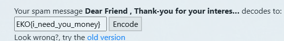

## **Challenge Name: Spammer**

### **Solves**

- **Solves**: 46
- **Points**: 425

### **Description**

While going through all my email folders, I came across a message that seems to come from a great "negotiator". Do you understand what the message is trying to say?

**Attachments**: spammer.zip

---

### **Approach**

1. **Extracting the Files**: Upon unzipping the `spammer.zip` file, we found a file named `spammer.txt`.

   File: [spammer.txt](Resources/spammer.txt)

2. **Recognizing the Pattern**: The text in the `spammer.txt` file seemed familiar—it was a message that appeared to be encoded in a format commonly used on the website **[spammimic.com](https://www.spammimic.com/)**, a platform known for its decoding tool.

3. **Using Spammimic**: We visited the website **[Spammimic](https://www.spammimic.com/)** and went to the **Decode** page.

   

4. **Decoding the Message**: After entering the message into the Spammimic decode tool, we received the flag.

   

**Flag**: `EKO{i_need_you_money}`

---
