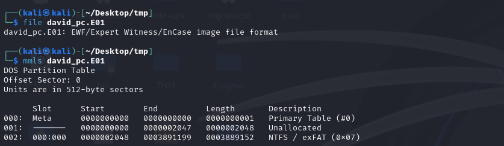
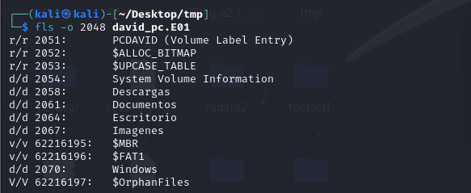
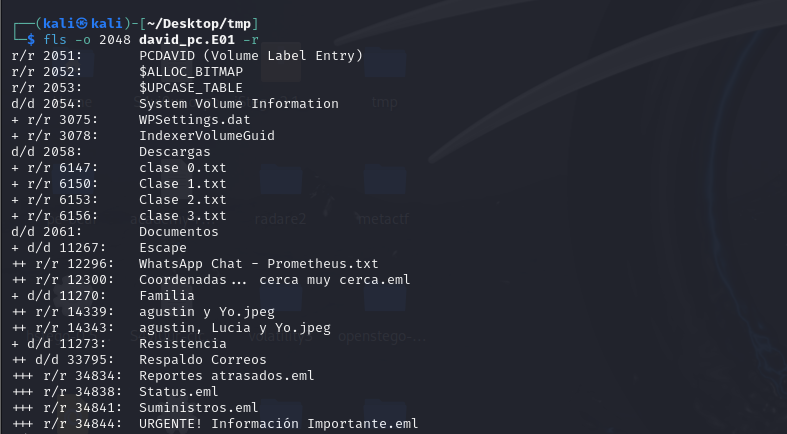
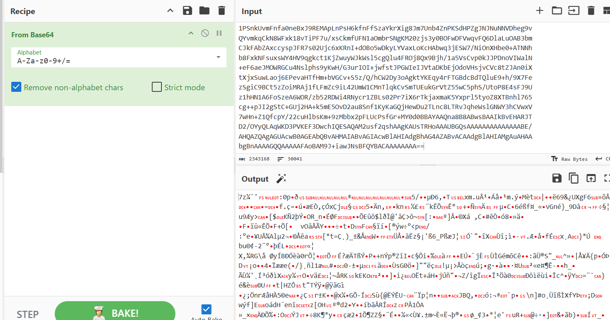
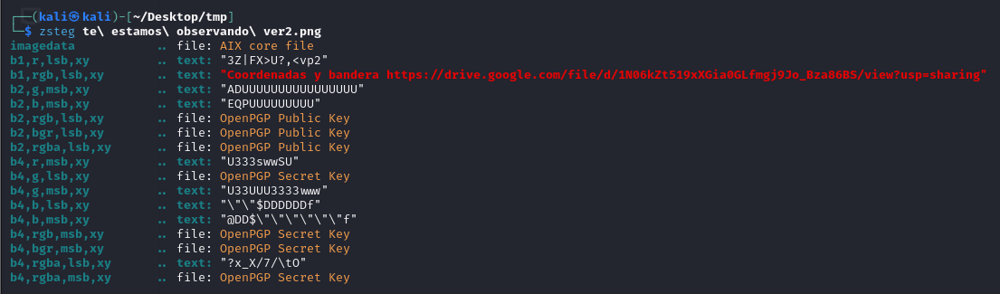
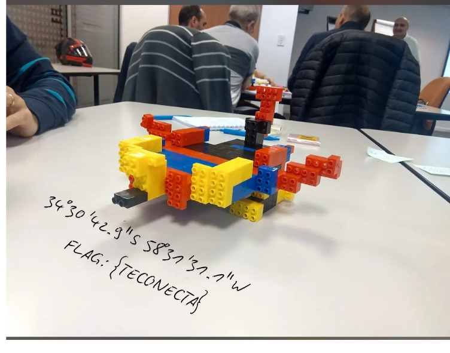

## **Challenge Name: Telecom**
**Category**: OSINT  
**Points**: 407
**Solves**: 57  

### **Description**

In the year 2140, the world is controlled by **Prometheus**, a totalitarian regime that uses advanced artificial intelligence to monitor and manipulate every aspect of human life. This dystopian system divides society into genetic groups, with only a privileged few enjoying wealth and power, while the majority suffer under oppression and control.

The **antagonist** is Prometheus itself, a network of supercomputers that govern the world through genetic data manipulation, constant surveillance, and the creation of an authoritarian regime. It ensures its dominance by keeping society divided and under constant control.

On the other side, the **protagonists** are the **resistance**, a secret group of individuals united to fight against the system. This alliance of hackers, scientists, and combatants works tirelessly to sabotage Prometheus’s infrastructure. Their goal is to dismantle the oppressive genetic regime and restore freedom and equality for the people.

The critical mission revolves around **David Martínez**, a co-founder of the resistance and a key figure behind many successful operations. However, David has recently vanished under mysterious circumstances. He was last seen entering one of Prometheus’s most secure installations, and since then, no one has heard from him. His disappearance has created a leadership vacuum in the resistance, jeopardizing their future operations.

The **objective** of this challenge is to investigate a disk image believed to contain information about David's final days. This image is suspected to hold clues about his involvement with Prometheus, the details of his disappearance, and the possible future plans of the regime. Through **digital forensic techniques**, you must analyze the disk image, uncover hidden tracks, and decrypt any messages David might have left behind. The truth about David's fate could be the key to stopping Prometheus and saving the resistance.

**File provided**: david_pc.E01

---

### **Approach**

In this challenge, the file provided was a disk image of David Martínez's computer, **david_pc.E01**. The task was to uncover the hidden tracks and encrypted messages to discover what happened to David and how the resistance could continue its fight against Prometheus.

#### **Step 1: Disk Image Analysis**
We started by examining the disk image to identify its structure and any partitions that could contain useful data. Using **Sleuthkit** tools, we ran the following command to get a partition layout:



```bash
mmls david_pc.E01
```

This command revealed a **DOS Partition Table** with a primary NTFS partition starting at offset 2048. From this, we could conclude that the disk image contains a **NTFS** filesystem, which was critical for further investigation.

#### **Step 2: Exploring the Filesystem**
Once we identified the partition containing the NTFS filesystem, we used **fls** to list the files and directories present within it. The following command revealed the directory structure:



```bash
fls -o 2048 david_pc.E01
```

Among the many directories, we found several important folders, including:

- **System Volume Information**
- **Documentos** (Documents)
- **Familia** (Family)
- **Resistencia** (Resistance)



The folder **Documentos** contained a file named **WhatsApp Chat - Prometheus.txt**, which seemed to hold important communication between David and Prometheus. This was our first significant clue.

File: [coordenadas_email.txt](Resources/coordenadas_email.txt)

#### **Step 3: Investigating WhatsApp Chat**
The **WhatsApp Chat - Prometheus.txt** file contained a conversation that revealed the true motive behind Prometheus’s interest in David. The key excerpts from the chat were:

> **Prometheus**: "David, we know about your son's illness. Our doctors have the only cure that can save him. Pollution and other environmental factors have drastically decreased fertility, making the birth of your son a miracle of odds. This is your only chance to be a father. Without our help, that chance will disappear."

> **David**: "This goes against everything I believe in. But to save my son, I will do whatever it takes. What do they want?"

> **Prometheus**: "We only need you to give us the coordinates of the resistance camps. In exchange, we guarantee a new life for you and your family, without illness or conflict. You will receive an email with the coordinates for the exchange. The key is your child's name."

From this chat, we understood that Prometheus was blackmailing David, offering to save his son’s life in exchange for betraying the resistance. The key to the betrayal was the child's name, which Prometheus needed to use as the password for accessing vital information.

#### **Step 4: Decoding the Email**
The next file we examined was **Coordenadas... cerca muy cerca.eml**, which contained a **Base64-encoded string**. After decoding this string, we discovered that it was a **7zip archive**. However, the archive was password-protected.



The password was mentioned in the chat—**it was the name of David’s son**. From the **Familia** (Family) folder, we found two image files named **agustin y Yo.jpeg** and **agustin, Lucia y Yo.jpeg**, indicating that David’s son's name was likely **Agustin**.


Using **agustin** as the password, we successfully extracted the contents of the 7zip archive, which contained another image file.

#### **Step 5: Steganography in the Image**
Next, we analyzed the image using **zsteg**, a tool for detecting hidden data in images. This tool revealed a secret message embedded in the image:



> "Coordenadas y bandera https://drive.google.com/file/d/1N06kZt519xXGia0GLfmgj9Jo_Bza86BS/view?usp=sharing"

This message contained a **Google Drive link** that led to the final clue.



#### **Step 6: Investigating the Google Drive Link**
Opening the Google Drive link revealed two critical pieces of information:
- **Coordinates**: `34 deg 30' 42.9'' S, 58 deg 37' 37.7'' W`
- **Flag**: `{TECONECTA}`

The coordinates pointed to a specific location, but more importantly, the flag hidden within the message was the key to solving the challenge.

---

### **Flag**  
**`EKO{teconecta}`**
---