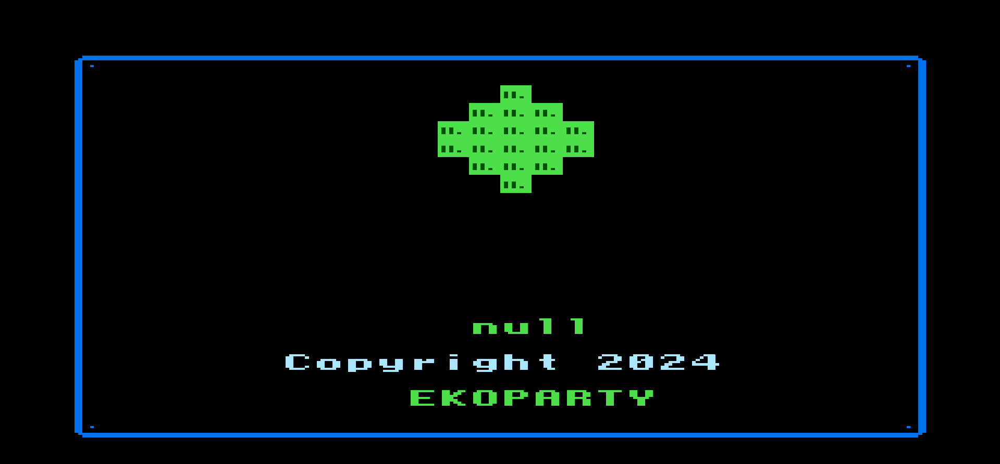
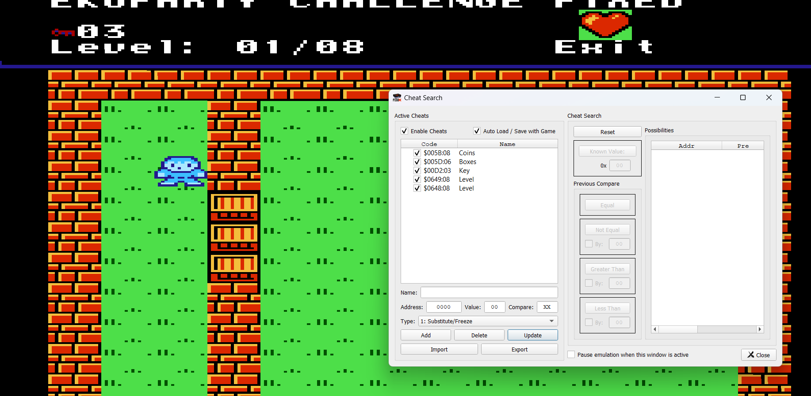

## **Challenge Name: Toretto**

### **Solves**

- **Solves**: 96
- **Points**: 342

### **Description**

Found this old thing laying around. Is it worth anything?

**File provided**: 

---

### **Approach**

To solve this challenge, we used **qfceux**, a software emulator, to analyze the provided file. By loading the game in the emulator, we were able to locate specific values tied to the game's progression. Additionally, we utilized the **cheats provided** to access and manipulate key variables, such as **coins**, **boxes**, **keys**, and **level**. With these cheats, we were able to bypass certain obstacles and quickly gather the necessary items to progress through the game.

After successfully clearing **8 stages**, we obtained the flag.

**Flag**: `EKO{A_HIGHER_POWER}`

---