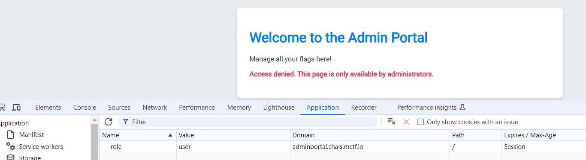
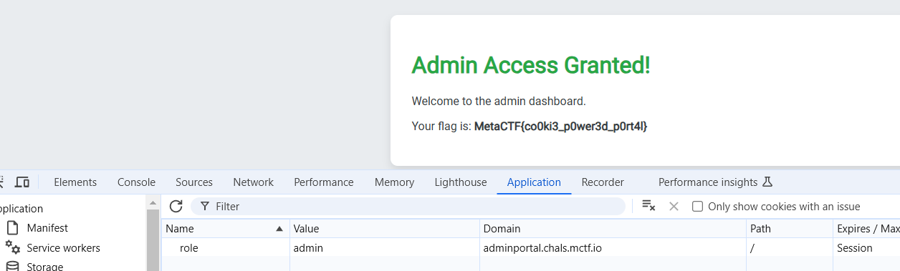

## **Challenge Name: Admin Portal**
### **Solves**
- **Solves**: 280
- **Points**: 150  

### **Description**  
I'm writing a webpage for admins to check on their flags, can you do me a favor and check it out to make sure there aren't any issues?

**URL**: http://adminportal.chals.mctf.io/

---

### **Approach**

1. **Initial Observation**:
   - Visited the portal and noticed the message: *"Only admins can see the page."*

2. **Inspecting the Source Code**:
   - Used the browser's developer tools (`Inspect Element`) to examine the HTML, CSS, and JavaScript source code.
   - Found nothing suspicious or helpful in the source code.

3. **Checking Cookies**:
   - Navigated to the browser's cookie storage using developer tools.
   - Observed that the `role` cookie was set to `user`.

        

4. **Exploiting the Cookie**:
   - Edited the `role` cookie value from `user` to `admin`.
   - Refreshed the page, which granted access to the admin section.

        

5. **Flag Retrieval**:
   - The flag was displayed on the admin page:
     ```plaintext
     MetaCTF{co0ki3_p0wer3d_p0rt4l}
     ```

---

### **Flag**
```
MetaCTF{co0ki3_p0wer3d_p0rt4l}
```