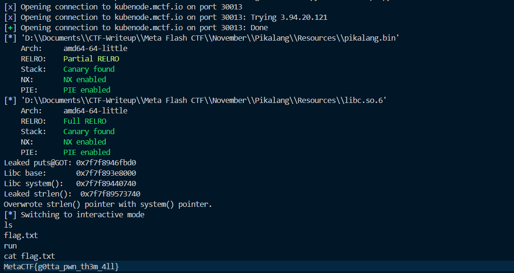

## **Challenge Name: Pikalang**

### **Solves**
- **Solves**: 2  
- **Points**: 300  

---

### **Description**  
I just heard about this cool new esoteric programming language called Pikalang!

It has no silly strcpy()'s or heaps, so it must be *super effective* against hackers.

**Challenge Details**:  
- Download the interpreter [here](Resources/pikalang.zip).  
- Test some Pikalang code by connecting to: `nc kubenode.mctf.io 30013`.

---

### **Approach**

This challenge introduced **Pikalang**, an esoteric programming language based on **Brainfuck**. To tackle the challenge, it was essential to understand how Pikalang operates and exploit its quirks.

#### **Step 1: Understand Pikalang Syntax**

Pikalang follows Brainfuck’s principles, where memory manipulation and control flow are achieved using a limited set of instructions. Here's the translation table:

| **Brainfuck** | **Pikalang** | **Description**                                                 |  
|---------------|--------------|-----------------------------------------------------------------|  
| `>`           | `pipi`       | Move the pointer to the right                                   |  
| `<`           | `pichu`      | Move the pointer to the left                                    |  
| `+`           | `pi`         | Increment the memory cell under the pointer                    |  
| `-`           | `ka`         | Decrement the memory cell under the pointer                    |  
| `.`           | `pikachu`    | Output the character signified by the cell at the pointer       |  
| `,`           | `pikapi`     | Input a character and store it in the cell at the pointer       |  
| `[`           | `pika`       | Jump past the matching `chu` if the cell under the pointer is 0 |  
| `]`           | `chu`        | Jump back to the matching `pika`                               |  

To solve this challenge, we needed to exploit the **Pikalang interpreter** provided.

---

#### **Step 2: Inspect the Challenge Files**

Upon extracting `pikalang.zip`, we found the following files:

- [Dockerfile](Resources/Dockerfile)
- [flag.txt](Resources/flag.txt)
- [helloworld.pika](Resources/helloworld.pika)
- [libc.so.6](Resources/libc.so.6)
- [pikalang.bin](Resources/pikalang.bin)


`flag.txt` contained the flag we needed to retrieve.  
`helloworld.pika` demonstrated how Pikalang works by printing `Hello, World!`.  
`pikalang.bin` was the binary for the Pikalang interpreter.  

---

#### **Step 3: Research Exploitation Approaches**

The ultimate goal was to exploit the Pikalang interpreter to print the contents of `flag.txt`. Initial efforts included:
1. **Analyzing the interpreter**: Attempted to reverse-engineer `pikalang.bin` for vulnerabilities.  
2. **Testing inputs via `nc`**: Interacted with the remote service using Pikalang commands.  
3. **Crafting Pikalang code**: Tried creating Pikalang scripts to directly read and output `flag.txt`.  

Despite significant effort, these approaches did not yield the desired results during the competition.

---

#### **Step 4: Post-Challenge Solution**

After the challenge concluded, the [official writeup](https://metactf.com/blog/flash-ctf-pikalang/) provided a detailed explanation. Here's a summary of the exploit:

1. **Memory Manipulation**:  
   The exploit script leveraged Pikalang’s memory operations to manipulate pointers and overwrite key areas of memory.  

2. **Arbitrary Code Execution**:  
   Using crafted Pikalang code, the script triggered a vulnerability in the interpreter, allowing the execution of arbitrary shell commands.  

3. **Command Injection**:  
   The final payload executed a command to read the contents of `flag.txt` and send it back to the user.

---

#### **The Exploit Script**

The official writeup included an exploit script (`script.py`), which automated the process of crafting the malicious Pikalang payload and interacting with the remote server. The script successfully extracted the flag:



**Flag Output**:  
```
MetaCTF{g0tta_pwn_th3m_4ll}
```

---

#### **Reflection**

While I wasn’t able to solve the challenge during the competition, reviewing the solution was incredibly insightful. The challenge demonstrated the complexity and creativity involved in exploiting custom interpreters. I'm still working on fully understanding the intricate steps of the exploit and hope to improve my skills in binary exploitation and reverse engineering through similar challenges.

---

### **Flag**
```
MetaCTF{g0tta_pwn_th3m_4ll}
```

---