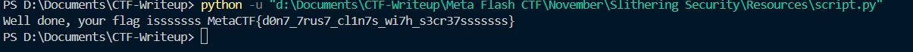

## **Challenge Name: Slithering Security**

### **Solves**
- **Solves**: 329  
- **Points**: 100  

### **Description**  
Help me test my sssecurity, can you get the flag from this ssssecure sssscript?  

**Attachment**: [chal.py](Resources/chal.py)  

---

### **Approach**

1. **Analyzing the Script**:
   - Read through the provided Python script (`chal.py`).
   - Observed that the script compares a user-provided password to a stored **MD5 hash**.
   - If the password is correct, the flag is decoded from a **Base64 string** and printed.

2. **Bypassing Authentication**:
   - Instead of brute-forcing or cracking the hash, we directly removed the authentication section from the script.
   - Focused only on decoding the stored Base64-encoded flag.

3. **Decoding the Flag**:
   - Used the modified script ([script.py](Resources/script.py)) to decode the Base64 string:


    ```python
    SECRET_FLAG=b"\x54\x57\x56\x30\x59\x55\x4e\x55\x52\x6e\x74\x6b\x4d\x47\x34\x33\x58\x7a\x64\x79\x64\x58\x4d\x33\x58\x32\x4e\x73\x4d\x57\x34\x33\x63\x31\x39\x33\x61\x54\x64\x6f\x58\x33\x4d\x7a\x59\x33\x49\x7a\x4e\x33\x4e\x7a\x63\x33\x4e\x7a\x63\x33\x4e\x39"
    from base64 import b64decode
    def main():
        print(f"Well done, your flag isssssss {b64decode(SECRET_FLAG).decode()}")

    main()
     ```
   
   - The script printed the flag:

      
     
     ```
     Well done, your flag isssssss MetaCTF{d0n7_7rus7_cl1n7s_wi7h_s3cr37sssssss}
     ```

---

### **Flag**
```
MetaCTF{d0n7_7rus7_cl1n7s_wi7h_s3cr37sssssss}
```
