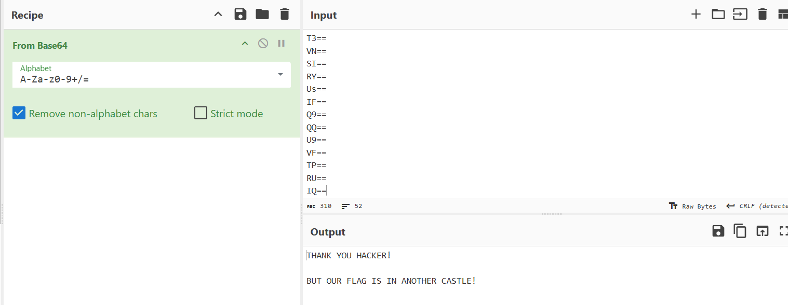
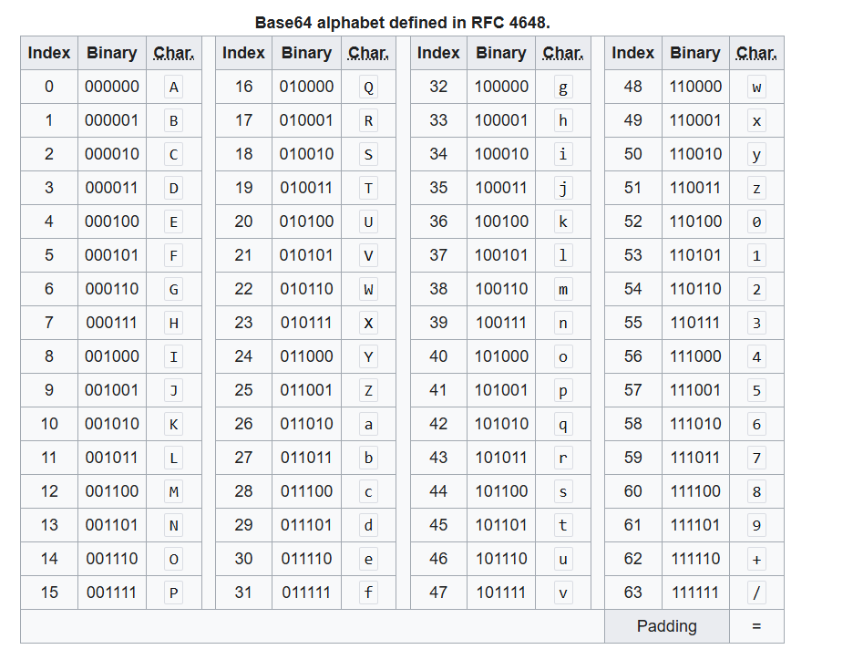
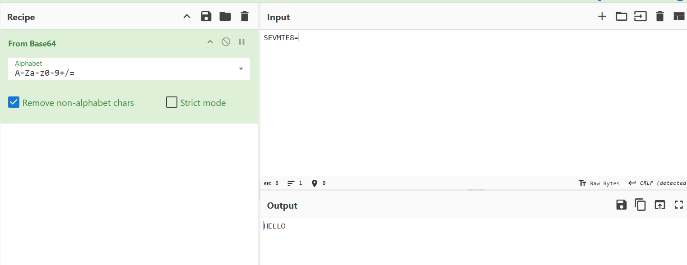
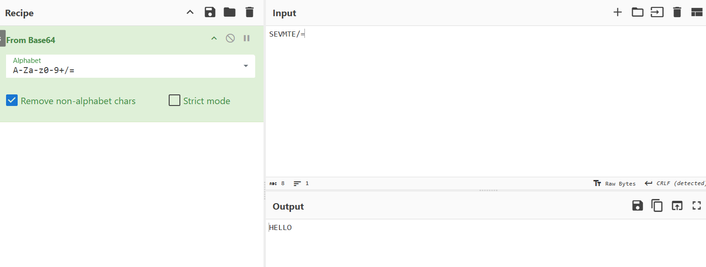
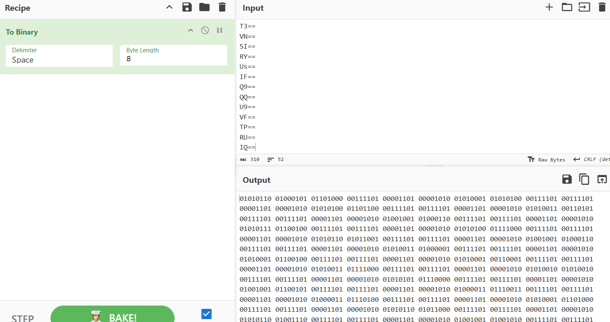
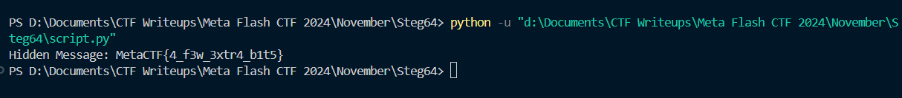

## **Challenge Name: Steg64**

### **Solves**
- **Solves**: 41  
- **Points**: 200  

### **Description**  
You've heard of Base64, but I present to you Steg64!

**Attachment**: [steg64.txt](Resources/steg64.txt)

---

### **Approach**

This challenge involved Base64-encoded data that was manipulated in such a way that the padding characters (`=`) were used to embed additional hidden data. At first glance, the Base64 string seemed to be ordinary, but after deeper analysis, we discovered that hidden information was cleverly encoded in the padding. Here's how we solved it.

#### **Step 1: Decoding the Provided Base64 String**

The first step was to decode the provided Base64 string. This was straightforward using a tool like **CyberChef**.

- We pasted the Base64 string into CyberChef and decoded it. The result was:

  ```
  THANK YOU HACKER!
  
  BUT OUR FLAG IS IN ANOTHER CASTLE!
  ```

  At this point, it was clear that the flag wasn't immediately apparent and was hidden in some other way.

    

#### **Step 2: Understanding How Base64 Works**

Before diving deeper into the hidden data, we needed to understand how Base64 encoding works. Base64 encoding is used to convert binary data into ASCII characters by grouping bits into sets of 6. Each 6-bit group is then mapped to a Base64 alphabet.

- A **Base64** character represents **6 bits** (or **sextets**), not the usual 8-bit bytes (which are used in standard ASCII encoding).
- This means we can encode **256 values** (with 8-bit bytes) into just **64 values** (with 6-bit sextets), which is why Base64 has an alphabet of 64 characters.

        
    
  
Let's break this down further by looking at how a string is converted into Base64:

#### **Step 3: Analyzing Base64 Encoding with an Example**

Let's take the example of the word **"HELLO"** and understand how Base64 encoding works step-by-step.

1. **Convert the characters to binary**:

   Each letter is represented by a byte (8 bits), so:

   ```
   H -> 01001000
   E -> 01000101
   L -> 01001100
   L -> 01001100
   O -> 01001111
   ```

2. **Combine the bits into one long string**:

   ```
   0100100001000101010011000100110001001111
   ```

3. **Group the binary stream into 6-bit chunks** (Base64 uses 6 bits per character):

   ```
   010010 000100 010101 001100 010011 000100 1111
   ```

   Notice that when we convert 8-bit bytes into 6-bit chunks, we end up with extra bits. To address this, Base64 uses **padding** with the `=` character to fill out these incomplete bits.

   
   ```
   010010 000100 010101 001100 010011 000100 111100
   ```

4. **Base64 Encoding**:

   After splitting into 6-bit chunks, we look up each chunk in the **Base64 alphabet table**:

   ```
   010010 -> 18 -> S
   000100 -> 4  -> E
   010101 -> 21 -> V
   001100 -> 12 -> M
   010011 -> 19 -> T
   000100 -> 4  -> E
   111100 -> 60 -> 8 (padding)
   ```

   Hence, the Base64-encoded string becomes:

   ```
   SEVMTE8=
   ```

   **Note**: The trailing `=` symbol is padding to ensure that the encoded string is a multiple of 4 characters long.

    

#### **Step 4: What Happens with Padding?**

Padding in Base64 encoding is used when the length of the input data is not a multiple of 3 bytes. The padding character `=` ensures that the encoded string’s length is always a multiple of 4 characters. But here's the twist: instead of simply filling the extra bits with `00`, we can use this padding area to hide additional data.

This got us thinking: *What if the padding characters were used to encode extra information?*

#### **Step 5: Manipulating Padding for Hidden Data**

Base64 encoding typically uses `=` for padding. However, in this challenge, the padding values could be altered to store hidden information.

If we replace the typical `00` padding with binary `11` (instead of `00`), we can store extra information without breaking the Base64 decoding process. The decoded result would still be the same plaintext, but now the padding itself contains hidden data.

Let's see an example:

1. **Original padding**: 
   ```
   010010 000100 010101 001100 010011 000100 111100
   ```

2. **Manipulating the padding**:  
   Instead of using `00` for the last chunk, we replace it with `11`:

   ```
   010010 000100 010101 001100 010011 000100 111111
   ```

3. **Base64-encoded result with modified padding**:  
   ```
   SEVMTE/= (instead of SEVMTE8=)
   ```

   When decoded, we still get the same result as before, but the padding has been altered to encode hidden data!

   **This is the key insight**: we could now encode bits in the padding and still decode the original message without affecting the validity of the Base64 string.

    

#### **Step 6: Analyzing the Given Base64 String**

After understanding this concept, we went back to the provided Base64 string. By converting it to binary and inspecting the padding, we noticed something odd in the binary representation of certain Base64 chunks.
    

For example, for the first chunk `VEh=`, we observed the following binary string using Base64 character table:

```
010101 000100 100001
```

Breaking it down into octets:

```
01010100 01001000 01
```

Notice that the padding value here was `01` instead of the usual `00`. This indicated that hidden data was stored in the padding, confirming our hypothesis.

#### **Step 7: Extracting Hidden Data**

With this understanding, we wrote a Python script to extract the hidden bits encoded in the padding and convert them into ASCII text.

- The script went through each Base64 chunk, analyzed the padding, and extracted the hidden bits.
- Once extracted, we decoded those bits into ASCII characters, revealing the hidden flag.

You can check out the Python script used to extract the hidden bits in [script.py](Resources/script.py).

#### **Step 8: Getting the Flag**

After running the Python script and extracting the hidden information from the padding, we successfully obtained the flag:

```
MetaCTF{4_f3w_3xtr4_b1t5}
```

  

---

### **Flag**
```
MetaCTF{4_f3w_3xtr4_b1t5}
```

---

This challenge was a great exercise in understanding Base64 encoding, padding manipulation, and steganography. By using the padding to hide extra data, I was able to uncover the flag!