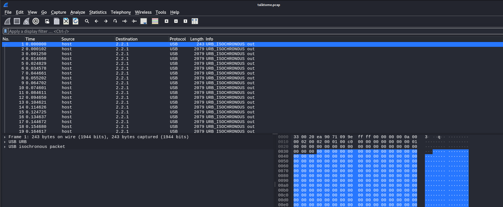
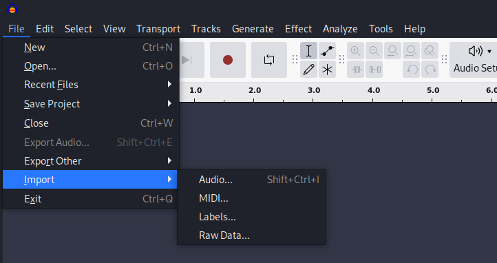

## **Challenge Name: Talk to Me**

### **Solves**
- **Solves**: 28  
- **Points**: 250  

### **Description**  
We managed to tap the headphones of a member of a prolific cyber actor group. Can you listen to their secret plan?

**Attachment**: [talktome.pcap](Resources/talktome.pcap)

---

### **Approach**

This challenge provided us with a **PCAP** file, `talktome.pcap`, which I had to analyze to uncover a hidden message. The PCAP file contained **USB isochronous** packets, which are typically used for **streaming audio or video**. Our task was to process these packets, extract the audio data, and listen to it to uncover the flag.

#### **Step 1: Opening the PCAP File in Wireshark**

The first step was to open the provided PCAP file in **Wireshark**, a popular tool for analyzing network traffic and packet capture files.

I opened the file with the following command:

```
wireshark talktome.pcap
```

In Wireshark, I observed a continuous stream of **URB_ISOCHRONOUS** packets using the **USB protocol** from start to finish. 



#### **Step 2: Understanding the URB_ISOCHRONOUS Packets**

The term **URB_ISOCHRONOUS** refers to a type of USB transfer that is used for real-time data, such as audio or video, that must be transmitted at a constant rate. This is a good indication that the data in the packets was audio, which matched the challenge's description.

ISO data packets are used to transport audio or video streams and require constant, predictable timing. In this case, since the challenge was titled "Talk to Me," I suspected it involved audio data.

#### **Step 3: Extracting the ISO Data**

Next, I needed to extract the **ISO data** from each packet and combine them into an audio file. For this, I used **Tshark**, the command-line version of Wireshark, to extract the USB isochronous data.


I used the following command:

```
tshark -r talktome.pcap -T fields -e usb.iso.data | tr -d '\n' | xxd -r -p > audio.raw
```

This command did the following:
1. **`-r talktome.pcap`**: Read the PCAP file.
2. **`-T fields -e usb.iso.data`**: Extract the USB isochronous data (which contained the audio data).
3. **`tr -d '\n'`**: Remove newline characters to get a continuous stream of data.
4. **`xxd -r -p`**: Convert the hexadecimal data into raw binary form.
5. **`> audio.raw`**: Save the output to a raw audio file called `audio.raw`.

This command essentially reassembled the audio stream from the captured USB packets.

#### **Step 4: Importing the Audio File**

After extracting the raw audio data, I tried to open the `audio.raw` file in an audio editing tool to verify its contents. Initially, when importing the file as a regular audio file, it didn't work, and the tool flagged it as an **incorrect format**. 

However, I could import it as a **raw audio file**, bypassing the need for the file to have a specific header or format.



I used **Audacity** (though tools like **Sonic Visualizer** could also be used) to open the file:

- Open Audacity.
- Import the `audio.raw` file.
- Choose the raw format during the import process.

#### **Step 5: Listening to the Audio**

Once the raw file was successfully imported, I noticed that the audio sounded **slowed down**. This was a clue indicating that the audio was either distorted or needed adjustment.

I adjusted the **speed** of the audio to normalize it, and as soon as I did, I could clearly hear a message hidden in the audio.


#### **Step 6: Extracting the Flag**

After speeding up the audio to a suitable level, I could finally hear the message. The **flag** was revealed as:

```
metactf{4_l1ttl3_b1rd_t0ld_m3}
```

This was the hidden message that the USB isochronous packets had encoded for us.

---

### **Flag**
```
metactf{4_l1ttl3_b1rd_t0ld_m3}
```

---